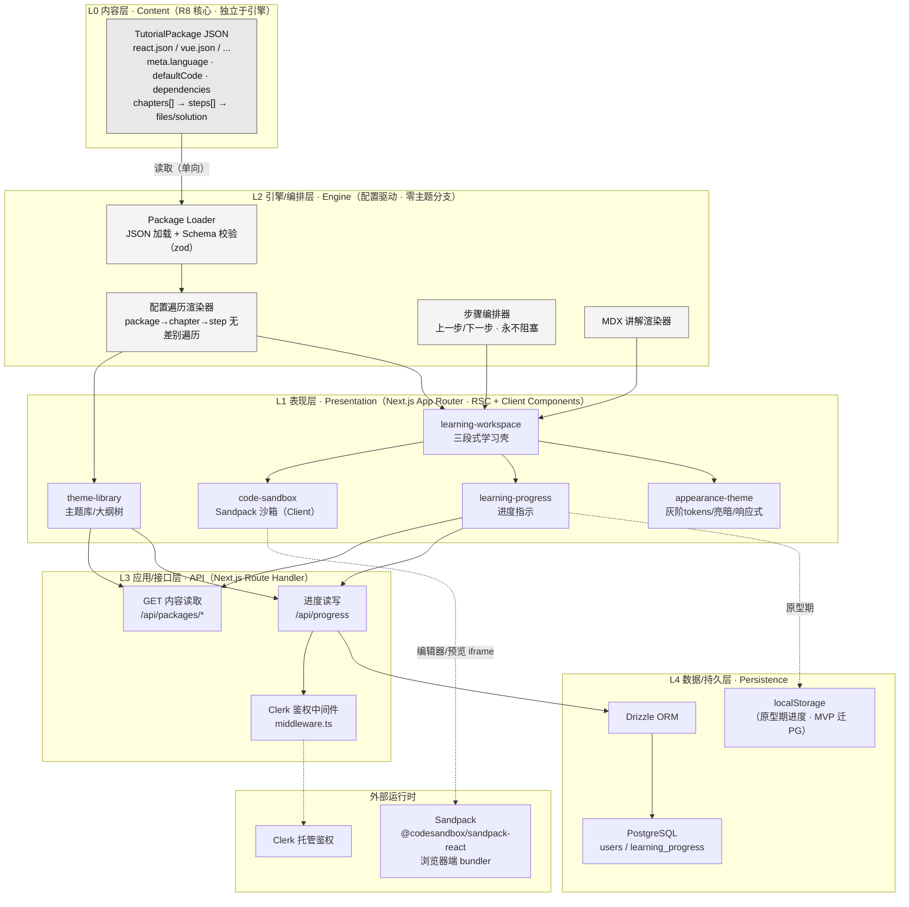
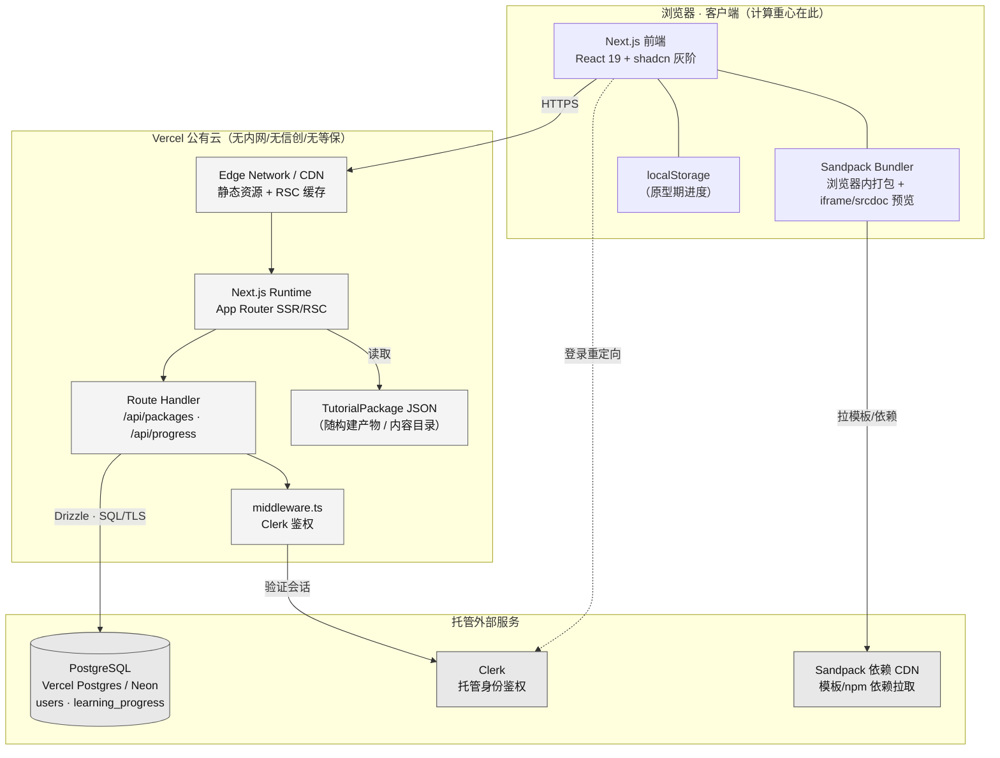

# 总体架构设计

> 阶段③设计 · 首席架构师产出。上游唯一真源：`00-系统设计总览.md`、原型 specs（`02-原型-v2/specs/`）、`manifest.proto.json`、`01-需求/` 与 `99-会议与决策/`。
> 产品：**互动式技术教程平台（ITTP）**——内容与引擎分离、以 JSON 配置（`TutorialPackage`）驱动的「左讲解 + 右可运行 Sandpack 沙箱」内部自用自主学习工具。
> 范式基线：2026-07-17 决策 D4/D5 生效版本——忠于 Vue3 官方互动教程「左讲解 + 右沙箱、靠内容引导、全程不拦人」；已砍 R3/R4/R5（高亮/等待/聚光灯）。

---

## 一、架构总纲与首要目标

本架构服务于一个明确且被反复强调的成败判据 —— **R8：新增一个 `vue.json` 即可跑通新主题、引擎代码零改动**。因此架构的第一性原理不是性能、不是高可用，而是**内容与引擎的彻底解耦**：

> 引擎是一台「解释器」，`TutorialPackage` JSON 是喂给它的「程序」。引擎里不允许出现任何 `if (theme === 'react')` / `switch(language)` 之类的主题分支；一切主题差异都必须外移到 JSON 配置里，由引擎无差别遍历渲染。

其余一切都据此让位：

| 维度 | 结论 | 依据 |
|---|---|---|
| 部署形态 | **分层单体**（Next.js 15 全栈单体），不拆微服务/中台 | 内部小工具、并发个位数~两位数，微服务是过度设计 |
| 首要非功能目标 | **主题可扩展性**（R8），而非性能/高可用 | nfrDrivers：压力在扩展不在性能 |
| 计算重心 | **客户端**（Sandpack 浏览器内 bundler 打包运行），服务端只做页面渲染 + 进度读写 | 服务端无实时/计算压力 |
| 合规基线 | **公有云 Vercel**，无信创/无内网/无等保/无数据不出域 | techConstraints 明确排除政企约束，下游禁止误套 |

「内容与引擎分离」是**模块边界与配置驱动原则**，落在代码目录与依赖方向上，**不是**部署层面的服务拆分——这一点必须贯穿所有下游设计维度。

---

## 二、系统逻辑分层

自顶向下五层，依赖方向严格单向（上层依赖下层，内容层反向由引擎层读取，永不反向耦合）：

### 分层职责边界

| 层 | 职责 | 明确不做 |
|---|---|---|
| **L0 内容层** | 承载全部主题差异：语言模板、依赖、章节步骤、初始代码 `files`、答案 `solution`。以 JSON 文件形态存在，独立于引擎代码演进 | 不含任何渲染逻辑、不感知引擎实现 |
| **L1 表现层** | 5 个功能模块的 UI 组件（RSC 优先，沙箱等交互部分 Client Component）。纯灰阶 shadcn 视觉 | 不写死主题分支、不含业务持久化逻辑 |
| **L2 引擎/编排层** | 配置驱动的遍历渲染 + 步骤编排 + MDX 渲染 + JSON 加载/校验。**R8 的物理落点** | 严禁 `if(theme)`；不做鉴权/持久化 |
| **L3 接口层** | Route Handler 暴露内容读取与进度读写；Clerk middleware 保护进度接口 | 不承担代码打包（那是客户端 Sandpack 的事） |
| **L4 持久层** | Drizzle + PostgreSQL 存 users/progress；原型期 progress 暂存 localStorage | 内容不强制入库（JSON 文件即真源，可选内容表） |

---

## 三、R8 架构级证明（内容-引擎分离硬约束）

R8 是成败判据，必须给出**结构性证明**而非口头承诺。证明由三条架构约束共同保证：

1. **依赖方向单向且收敛于一个入口**：所有主题差异只能经 `Package Loader` 进入引擎。引擎所有渲染函数的入参类型是 `TutorialPackage`，不存在第二条注入主题信息的通道。新增 `vue.json` 走的是同一条数据通道，引擎代码不感知。

2. **语言/模板由数据决定，而非代码分支**：沙箱 `template` 恒等于 `meta.language`（`react`/`vanilla`/`vue`），依赖恒等于 `meta.dependencies`。组件内**不允许**出现主题字面量判断。这一条在 code-sandbox spec F5/约束7 已锁死，架构侧升级为 CI 静态门禁（见下）。

3. **Schema 是唯一契约**：`Package Loader` 用 zod 依据 `TutorialPackage` Schema 校验任何新 JSON；只要新主题 JSON 通过 Schema 校验，即保证可被引擎无差别渲染。Schema 即「引擎能吃什么」的形式化定义。

**可验收门禁（CI 强制）**：

| 门禁 | 手段 | 通过判据 |
|---|---|---|
| 零主题分支 | 静态扫描引擎目录（`lib/engine/**`、`components/**`）正则命中 `react\|vue\|vanilla` 字面量分支 | 命中数 = 0 |
| 新增 JSON 零改动 | 放入一个最小 `vue.json`，仅跑构建与渲染冒烟，不改任何 `.ts/.tsx` | 构建通过、主题可渲染、git diff 仅新增 JSON |
| Schema 契约 | zod 校验全部 package JSON | 全部通过 |

---

## 四、技术选型

选型全部为 techConstraints「既定技术选型」，本节固化版本倾向与在本架构中的定位。**无信创/无内网/无国产化替代要求**（公有云内部工具，如实记录以免下游误套）。

| 层 | 选型 | 版本倾向 | 定位与理由 |
|---|---|---|---|
| 前端框架 | **Next.js（App Router）+ React** | Next 15 / React 19 | 全栈单体骨架；RSC 减少客户端负担，内容页可静态/服务端渲染 |
| 语言 | **TypeScript** | 5.x | 全栈类型；`TutorialPackage` Schema 类型即 R8 契约 |
| 样式 | **Tailwind CSS + shadcn/ui** | Tailwind v4 / shadcn latest | 落地 D5 shadcn neutral 灰阶 design tokens、亮暗双主题、WCAG AA |
| 沙箱运行时 | **Sandpack（@codesandbox/sandpack-react）** | latest | **客户端** bundler：CodeMirror 编辑器 + iframe/srcdoc 预览；多文件、手动 Run、语言随 `meta.language` 切换、R10 看答案 |
| 后端运行时 | **Next.js Route Handler** | 同框架 | 无独立后端服务；进度读写 + 内容读取，负载轻 |
| ORM | **Drizzle ORM** | latest | 类型安全、迁移可控；契合「幂等迁移」偏好 |
| 数据库 | **PostgreSQL** | 15/16（Vercel Postgres / Neon 兼容） | 存 users/progress，数据量可忽略 |
| 鉴权 | **Clerk** | latest | MVP 引入（Q5）；托管身份，`middleware.ts` 保护进度接口；`userId` 即进度归属主体 |
| 内容存储 | **JSON 文件（随仓库）** | — | `TutorialPackage` 以文件为真源；内容量小、天然版本化，无需内容 CMS |
| 网关/边缘 | **Vercel Edge/CDN（平台自带）** | — | 无独立 API 网关；Vercel 路由 + 边缘缓存即足够 |
| 缓存 | **HTTP/CDN 缓存 + RSC 静态化**，无 Redis | — | 内容只读且量小、并发极低，独立缓存中间件属过度设计 |
| 消息队列 | **无** | — | 非异步/调度类，无解耦需求，引入 MQ 是过度设计 |
| 部署 | **Vercel 公有云** | — | 平台默认可用性即满足；无 SLA 硬约束 |
| 内容工程（离线） | 小满zs-react 笔记 / MDX → steps | — | 构建期/离线内容管道，非运行时集成 |

**刻意不引入**（按简洁守则「删 > 加」明确记录，防止下游顺手加）：Redis、消息队列、独立 API 网关、微服务、BFF、内容 CMS、WebContainer（Sandpack 已足够）、feature flag 兼容垫片。

---

## 五、核心组件职责与边界

| 组件 | 所属层 | 职责 | 边界（不做） |
|---|---|---|---|
| **Package Loader** | L2 | 加载 `TutorialPackage` JSON、zod Schema 校验、类型收敛为引擎入参。R8 唯一注入通道 | 不渲染、不判断主题 |
| **配置遍历渲染器** | L2 | 无差别遍历 package→chapter→step 生成大纲树与步骤内容 | 无主题分支、无进度判断 |
| **步骤编排器** | L2 | 上一步/下一步导航；步骤永远可点、不阻塞；切步复位沙箱为「我的代码」态 | **禁 waitFor/门禁**（D4） |
| **MDX 渲染器** | L2 | 渲染 step.description（含代码块语法高亮） | 不做交互逻辑 |
| **学习工作台壳** | L1 | 三段式：顶部信息条 + 左讲解 + 右沙箱容器 + 底部步骤导航；编排其余模块 | 不重复实现沙箱/进度内部逻辑 |
| **代码沙箱（Client）** | L1↔EXT | 用 step.`files` 初始化 Sandpack；手动 Run；`template=meta.language`；R10：快照 `currentFiles`→填入 `solution`→自动 Run→可切回 | 不感知「第几步」、不做进度判断；`solution` 缺失则按钮置灰不报错 |
| **进度指示 + 记忆** | L1/L3 | 当前步/总步数、进度条、目录打勾、完成度%；断点 + completedSteps；原型 localStorage → MVP `/api/progress` | **不做 waitFor 门禁**；不阻塞跳转 |
| **外观与主题** | L1（横切） | shadcn 灰阶 tokens、亮/暗+跟随系统+记忆、375/768/1440 三档响应式、移动端讲解/沙箱 Tab 切换 | 禁高饱和撞色（D5）；对比度须 WCAG AA |
| **进度 Route Handler** | L3 | `GET/PUT /api/progress`：读写单用户单主题断点与完成集合，经 Clerk 鉴权 | 不做代码打包 |
| **Clerk middleware** | L3 | 保护进度接口，注入 `userId` | 内容读取接口可匿名 |

### 沙箱与工作台的解耦边界（组件级 R8 落点）

工作台在进入某步时，仅把该步 `files` 交给沙箱；沙箱是纯「受控组件」，只响应 `初始化文件 / Run / 看答案 / 切回我的代码` 四类指令。切步时**完整替换**文件集合（不做跨步增量合并，避免上一步残留污染），并强制退出看答案态。这保证沙箱本身零主题耦合、零进度耦合。

---

## 六、部署拓扑

**拓扑要点**：

- **单一部署单元**：整个应用是一个 Vercel 项目（Next.js 单体），前端、SSR、Route Handler 同源同部署，无跨服务网络调用。
- **计算下沉客户端**：代码打包/运行全部在浏览器 Sandpack 内完成，服务端零编译压力；Vercel Runtime 仅承担页面渲染与进度读写。
- **内容随构建**：`TutorialPackage` JSON 作为内容目录随仓库/构建产物走，读取走 RSC/静态化，可被 Edge/CDN 缓存。
- **托管依赖**：PostgreSQL（Vercel Postgres 或 Neon）、Clerk、Sandpack 依赖 CDN 均为托管服务，无自建中间件。
- **合规如实**：公有云、数据可出域、无等保定级——**下游安全/运维设计不得套用内网/信创/专网模板**。

---

## 七、关键数据流

**内容渲染流（只读，R8 主通道）**：
`vue.json/react.json` → Package Loader（zod 校验）→ 配置遍历渲染器 → 大纲树/步骤 → 工作台壳 → 沙箱以 `files` 初始化 → 用户手动 Run → Sandpack 浏览器内打包 → iframe 预览。

**看答案流（R10）**：
点「给我看答案」→ 快照 `currentFiles` 为 `ownCodeSnapshot` → 用 `solution` 完整替换 → 自动 Run → `isShowingAnswer=true` → 点「切回我的代码」→ 恢复快照。`solution` 缺失则按钮置灰。

**进度流（分期）**：
- 原型期：进度指示 → localStorage（断点 + completedSteps）。
- MVP：进度指示 → `PUT /api/progress` → Clerk 鉴权注入 `userId` → Drizzle → PostgreSQL；跨端读取 `GET /api/progress`。**一次做全套后端，不留半吊子**（Q5 决策）。

---

## 八、关键技术决策与取舍

| # | 决策 | 取舍 / 被否方案 | 理由 |
|---|---|---|---|
| D-A | **分层单体（Next.js 全栈）**，前后端同部署 | 否决微服务/BFF/独立后端 | 内部工具、并发个位数~两位数；「内容-引擎分离」是模块边界不是服务拆分 |
| D-B | **引擎零主题分支 + zod Schema 契约 + CI 静态门禁** 落地 R8 | 否决「靠约定/code review 保证」 | R8 是成败判据，必须结构性可验收，不能靠自觉 |
| D-C | **内容存 JSON 文件（随仓库）**，不入 CMS/不强制入库 | 否决内容表/Headless CMS | 内容量小、天然版本化；JSON 即真源，减一层基础设施 |
| D-D | **计算下沉客户端 Sandpack**，服务端不打包 | 否决服务端沙箱/WebContainer 自建 | Sandpack 浏览器端 bundler 已满足；服务端零编译负载 |
| D-E | **无 Redis / 无 MQ / 无独立网关** | 否决「预留缓存/消息层」 | 只读小数据 + 极低并发，独立中间件是过度设计（删 > 加） |
| D-F | **进度分期：localStorage → PostgreSQL 一次做全** | 否决长期双写/兼容垫片 | 不留半吊子（Q5）；避免自作主张的向后兼容层 |
| D-G | **Clerk 托管鉴权**，仅保护进度接口，内容可匿名 | 否决自建用户体系 | 内部工具，托管身份最省；内容只读无需登录 |
| D-H | **公有云 Vercel，如实记录无信创/无内网/无等保** | 否决套用政企内网/国产化模板 | 与典型政企项目相反，防止下游误套约束 |
| D-I | **禁 waitFor/门禁/蒙层/聚光灯（D4）· 禁高饱和撞色（D5）** | 否决 R3/R4/R5 交互 | 忠于 Vue3 不拦人范式；shadcn 灰阶 + WCAG AA |

---

## 九、技术基线（techBaseline · 供下游所有维度统一引用）

> 数据库 / 数据流 / 接口 / 安全 / 运维 / 非功能性 / 集成 各维度**必须**严格遵循本基线，确保全套选型一致。

- **架构风格**：分层单体（Next.js 15 全栈单体，App Router）。「内容-引擎分离」为模块边界与配置驱动原则，**非服务拆分**。引擎层零主题分支，主题差异全外移到 `TutorialPackage` JSON，经唯一入口 Package Loader（zod 校验）注入——此为 R8 成败判据的物理落点，须 CI 静态门禁强制。
- **前端**：Next.js 15 + React 19 + TypeScript 5 + Tailwind v4 + shadcn/ui；RSC 优先、沙箱等交互为 Client Component；视觉锁定 shadcn neutral 灰阶 + 亮暗双主题 + WCAG AA + 375/768/1440 三档响应式；严禁蒙层/聚光灯/高亮框/waitFor 阻塞（D4）与高饱和撞色（D5）。
- **后端**：无独立后端服务，用 Next.js Route Handler（`/api/packages` 只读内容、`/api/progress` 进度读写）；服务端不承担代码打包。
- **沙箱运行时**：Sandpack（@codesandbox/sandpack-react），**客户端**浏览器内 bundler，`template = meta.language`、依赖 = `meta.dependencies`，组件零主题字面量；R10 看答案走「快照→填 solution→自动 Run→切回」。
- **数据库**：PostgreSQL（Vercel Postgres / Neon 兼容）+ Drizzle ORM；仅 `users` 与 `learning_progress` 两类核心数据，量级可忽略；迁移幂等可重复跑。
- **缓存**：仅 HTTP/CDN 缓存 + RSC 静态化，**无 Redis**。
- **消息**：**无消息队列**（非异步/调度类）。
- **网关**：**无独立 API 网关**，用 Vercel Edge/CDN + Next.js 路由；鉴权用 Clerk `middleware.ts` 保护进度接口，内容接口可匿名。
- **鉴权**：Clerk 托管身份（MVP 引入，Q5），`userId` 为进度归属主体。
- **内容存储**：`TutorialPackage` JSON 文件随仓库/构建产物为唯一真源，不入 CMS。
- **部署形态**：单一 Vercel 项目（前端 + SSR + Route Handler 同源同部署）；PostgreSQL/Clerk/Sandpack 依赖 CDN 为托管外部服务。
- **合规基线**：公有云、内部自用、**无信创/无内网/无专网/无等保定级/无数据不出域**——下游安全与运维设计禁止套用政企内网模板。
- **进度分期**：原型 localStorage → MVP PostgreSQL 一次做全套，不留半吊子、不做长期双写兼容垫片。
- **非功能首要目标**：主题可扩展性（R8），非性能/高可用；计算重心在客户端，服务端负载轻，Vercel 默认可用性即满足。
