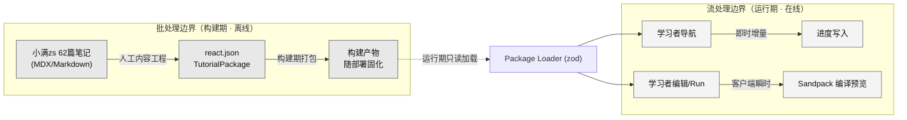
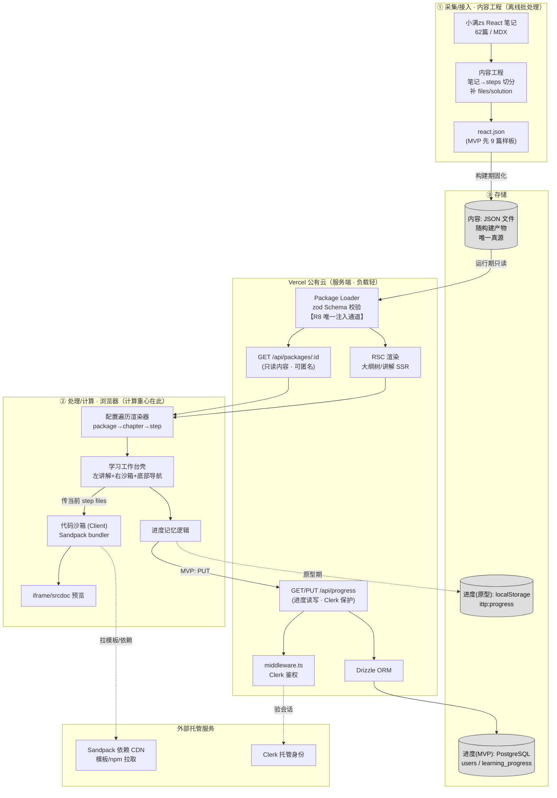
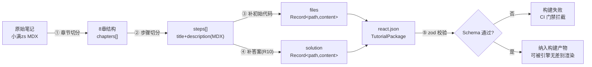
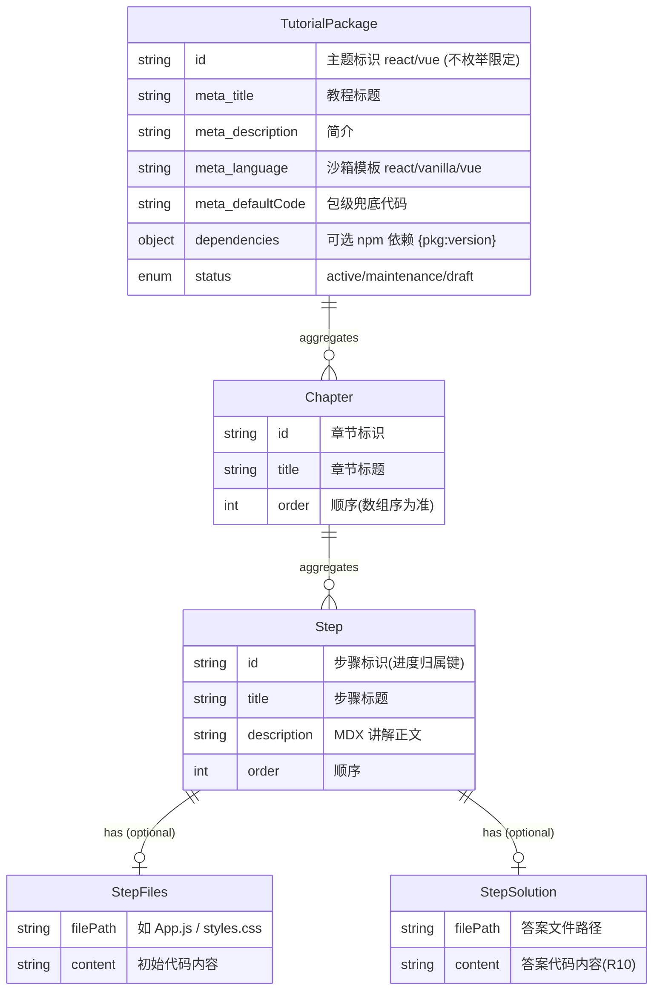
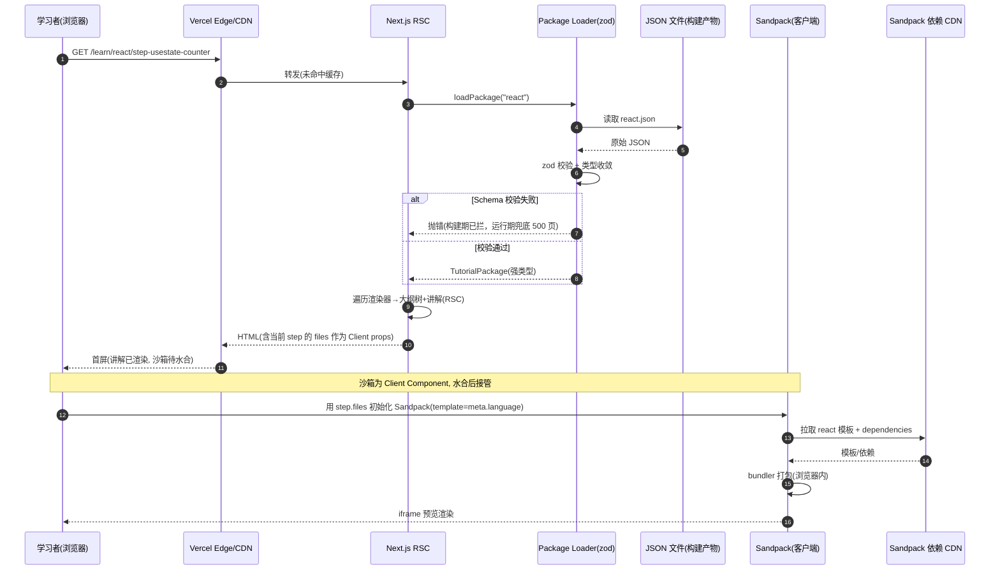
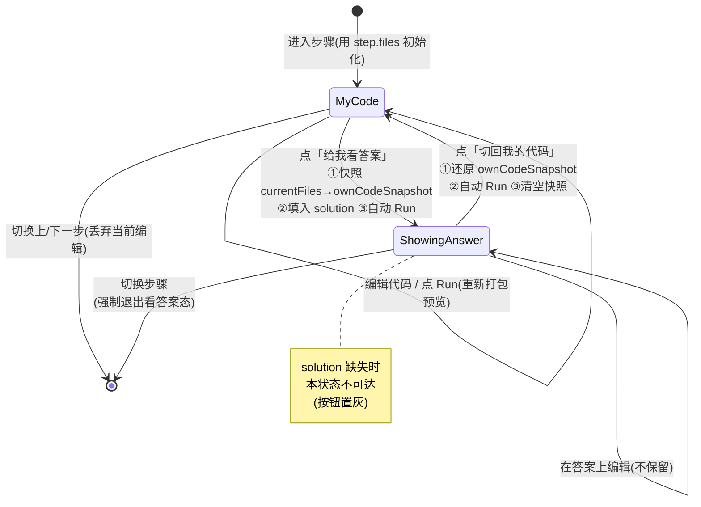
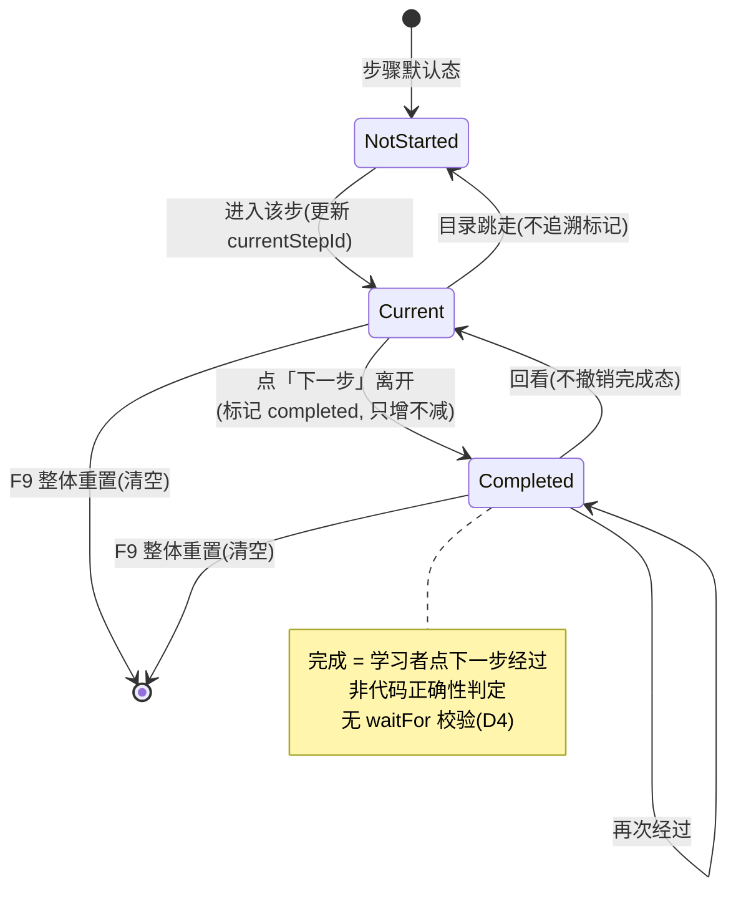
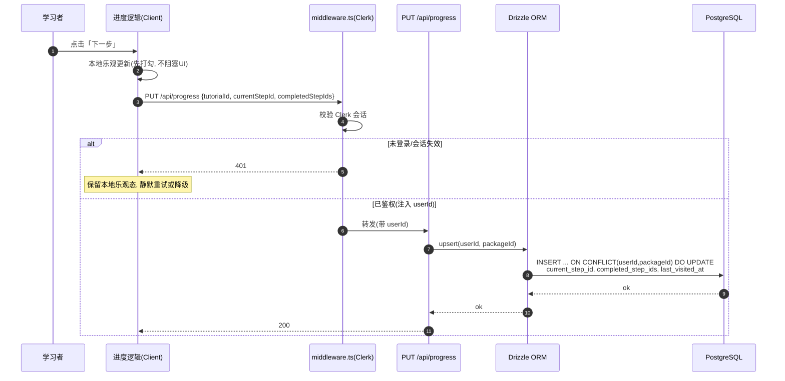

# 数据流设计

> 阶段③设计 · 资深系统设计专家产出。上游唯一真源：`00-系统设计总览.md`、`01-architecture.md`、原型 specs（`02-原型-v2/specs/`）、`manifest.proto.json`、`99-会议与决策/`。
> 产品：**互动式技术教程平台（ITTP）**——内容与引擎分离、以 JSON 配置（`TutorialPackage`）驱动的「左讲解 + 右可运行 Sandpack 沙箱」内部自用自主学习工具。
> 范式基线：2026-07-17 决策 **D4/D5** 生效版本——忠于 Vue3 官方互动教程「左讲解 + 右沙箱、靠内容引导、全程不拦人」；已砍 R3/R4/R5（高亮/等待/聚光灯），Schema 已删 `selector`/`waitFor`、`codeSnippet`→多文件 `files`、新增 `solution`。

---

## 一、数据流总纲

本系统的数据流有一条与常规业务系统不同的基线：**计算重心在客户端，服务端几乎不承载业务计算**。代码打包运行发生在浏览器内的 Sandpack bundler，服务端只做「页面渲染 + 内容读取 + 进度读写」三件轻活。因此本设计不追求高吞吐/低延迟，而是围绕三条数据主线把「谁产生、经谁处理、落到哪、被谁消费」讲清楚。

### 1.1 三条数据主线（数据域划分）

| 数据域 | 内容 | 产生方 | 存储 | 消费方 | 处理模式 |
|---|---|---|---|---|---|
| **内容域 Content** | `TutorialPackage` JSON（meta/chapters/steps/files/solution） | 内容维护者（离线内容工程：小满zs 笔记 → MDX → steps） | 仓库内 JSON 文件（随构建产物），**非入库** | 引擎层遍历渲染 + 沙箱初始化 | **批处理**（构建期一次性固化，运行期只读） |
| **进度域 Progress** | 断点 `currentStepId` + 已完成集合 `completedStepIds` + `lastVisitedAt` | 学习者的导航行为（下一步/跳转） | 原型：`localStorage`；MVP：PostgreSQL `learning_progress` | 进度指示器、目录树打勾、课程库卡片完成度 | **流式增量**（每次导航即时写，只增不减） |
| **沙箱运行时域 Sandbox** | `currentFiles` / `activeFile` / `isShowingAnswer` / `ownCodeSnapshot` 等 | 学习者的编辑与「Run/看答案」交互 | **纯前端内存态，不持久化** | Sandpack bundler → iframe 预览 | **流式瞬态**（会话内存，切步即弃） |

三域的**边界清晰、耦合极弱**：内容域是只读输入，进度域只记「学到哪」，沙箱域完全瞬态。这种弱耦合正是 R8「内容-引擎分离」在数据层的体现——引擎不缓存主题状态，一切主题差异随内容域 JSON 流入，用完即走。

### 1.2 批处理 / 流处理边界



- **批处理侧**：内容工程是离线人工管道（非运行时集成），产出的 `react.json` 在**构建期一次性固化**进部署产物，运行期绝不动态生成/修改内容。这条边界保证内容是「编译进系统的常量」，可静态化、可 CDN 缓存。
- **流处理侧**：进度写入与沙箱编译都是运行期的**增量/瞬时**事件，无批量聚合、无定时任务、无消息队列——事件规模是「单人每分钟几次点击」，直接同步处理即可，引入流式中间件属过度设计。

---

## 二、全局数据流拓扑

一张图看清「采集/接入 → 处理/计算 → 存储 → 消费/展示」的完整路径。注意左半是**客户端计算重心**，右半 Vercel 服务端只做轻量读写。



**读数据流（消费主路径）**：`JSON 文件 → Package Loader(zod) → RSC/API → 遍历渲染器 → 工作台 → 沙箱`，全程只读、可缓存。
**写数据流（仅进度一条）**：`学习者导航 → 进度逻辑 → localStorage（原型）/ PUT /api/progress → Drizzle → PostgreSQL（MVP）`。
**沙箱运行流（纯客户端闭环）**：`step.files → Sandpack bundler（拉 CDN 依赖）→ iframe 预览`，**服务端零参与**。

---

## 三、内容域数据流（批处理 · 只读）

### 3.1 内容生命周期：从笔记到可渲染配置



**关键点**：内容工程是**人工离线管道**，不是运行时服务；`react.json` 一旦生成即为静态资产。新增 `vue.json` 走的是同一条 ⑤ zod 校验通道进入引擎——这是 R8「新增 JSON 零改动引擎」的数据层落点：引擎只认 Schema，不认主题。

### 3.2 TutorialPackage 数据结构（唯一真源 · ER 视图）



### 3.3 真实样板数据（React · useState 计数器步骤）

以下是一条**真实可信**的 step 形态（非占位），对应「小满zs」React 笔记中的 `useState` 章节，用于校准下游设计：

```json
{
  "id": "react",
  "meta": {
    "title": "React 从入门到上手",
    "description": "跟着 62 篇笔记，边读边跑，把 React 核心概念一次学通。",
    "language": "react",
    "defaultCode": "export default function App(){ return <h1>Hello</h1> }"
  },
  "chapters": [
    {
      "id": "ch-hooks",
      "title": "第三章 · 状态与 Hooks",
      "steps": [
        {
          "id": "step-usestate-counter",
          "title": "用 useState 做一个计数器",
          "description": "## useState\n\n`useState` 返回一个「当前值」和一个「更新函数」。点击按钮修改 count，React 会自动重渲染。试着把初始值改成 10，点 Run 看变化。",
          "files": {
            "/App.js": "import { useState } from 'react';\n\nexport default function App() {\n  const [count, setCount] = useState(0);\n  return (\n    <button onClick={() => setCount(count + 1)}>\n      点了 {count} 次\n    </button>\n  );\n}\n",
            "/styles.css": "button{padding:8px 16px;font-size:16px}"
          },
          "solution": {
            "/App.js": "import { useState } from 'react';\n\nexport default function App() {\n  const [count, setCount] = useState(10);\n  return (\n    <button onClick={() => setCount(count + 1)}>\n      点了 {count} 次\n    </button>\n  );\n}\n",
            "/styles.css": "button{padding:8px 16px;font-size:16px}"
          }
        }
      ]
    }
  ]
}
```

字段口径说明：

| 字段 | 是否必填 | 缺失降级 |
|---|---|---|
| `meta.language` | 必填 | —（决定 Sandpack `template`，R8 硬绑定） |
| `meta.defaultCode` | 必填 | —（`files` 缺失时的沙箱兜底） |
| `dependencies` | 可选 | 无则不加载额外 npm 包 |
| `step.description` | 必填 | 空则讲解区留白（不崩） |
| `step.files` | 可选 | 用 `meta.defaultCode` 兜底 |
| `step.solution` | 可选 | 「给我看答案」按钮置灰（正常态，非异常） |
| `chapters` = `[]` | — | 课程库卡片置灰、禁用点击（`draft`） |

---

## 四、内容读取时序（打开教程 → 渲染 → 学习）

服务端只做 zod 校验 + RSC 渲染，`GET /api/packages` 可匿名、可 CDN 缓存。



**要点**：
- 讲解区（MDX）由 **RSC 服务端渲染**，首屏无需等待 JS；沙箱是 **Client Component**，水合后才发起 Sandpack 编译。
- `template` 恒等于 `meta.language`、依赖恒等于 `meta.dependencies`——组件内**零主题字面量**（R8 静态门禁校验点）。
- Sandpack 拉模板/依赖走**客户端 → Sandpack CDN**，不经 Vercel 服务端，服务端无编译压力。

---

## 五、沙箱运行时数据流（客户端闭环 · R10 看答案）

### 5.1 沙箱状态机（我的代码 ↔ 看答案）

沙箱是纯受控组件，只响应四类指令：`初始化 / Run / 看答案 / 切回`。核心是「看答案」时的**快照-还原**机制。



### 5.2 R10「给我看答案」时序

```mermaid
sequenceDiagram
    autonumber
    participant U as 学习者
    participant SB as 沙箱组件(Client)
    participant SP as Sandpack bundler
    participant IF as iframe 预览

    Note over SB: 当前 isShowingAnswer=false, currentFiles=用户编辑内容
    U->>SB: 点击「给我看答案」
    alt step.solution 未声明
        SB-->>U: 按钮置灰不可点(正常态, 不报错)
    else solution 存在
        SB->>SB: ownCodeSnapshot = {...currentFiles} (快照)
        SB->>SB: currentFiles = {...step.solution} (完整替换)
        SB->>SB: isShowingAnswer = true
        SB->>SP: 用 solution 重新打包
        SP->>IF: 刷新预览(答案效果)
        IF-->>U: 看到"正确写法"
    end
    U->>SB: 点击「切回我的代码」
    SB->>SB: currentFiles = ownCodeSnapshot (还原, 丢弃答案上的编辑)
    SB->>SB: isShowingAnswer=false; ownCodeSnapshot=null
    SB->>SP: 用还原内容重新打包
    SP->>IF: 刷新预览(回到自己的代码)
    IF-->>U: 回到编辑前状态
```

### 5.3 沙箱状态字段（前端内存态 · 不持久化）

| 字段 | 类型 | 生命周期 | 说明 |
|---|---|---|---|
| `currentFiles` | `Record<path,content>` | 步骤内存活，切步重置 | 编辑区实际内容 |
| `activeFile` | string | 步骤内 | 当前选中文件 Tab |
| `isShowingAnswer` | boolean | 步骤内 | 是否看答案态；切步强制 false |
| `ownCodeSnapshot` | `Record<path,content>` \| null | 看答案期间 | 看答案前的用户快照，供还原 |
| `isRunning` / `hasError` / `errorMessage` | — | 单次 Run | 运行反馈；报错展示 Sandpack 原生堆栈，不吞错 |
| `theme` | `light`\|`dark` | 跟随平台 | 联动明暗，无独立开关 |

**边界处理**（切步即弃，不做草稿持久化）：

| 场景 | 处理 |
|---|---|
| 未点 Run 就切步 | 未运行编辑内容随切步丢弃，不自动存草稿 |
| 切步时处于看答案态 | 强制退出，用新步 `files` 渲染，不带入上一步状态 |
| `files`/`solution` 格式非法 | 保留上一步状态，控制台告警，不弹用户错误 |
| Sandpack 编译失败 | iframe 展示原生错误堆栈，Run 可再点 |
| 依赖加载失败/离线 | 预览区提示"无法加载运行环境"，编辑区仍可编辑 |

---

## 六、进度域数据流（唯一的写路径 · 分期）

进度是全系统**唯一的持久化写数据**。分两期：原型 `localStorage` → MVP `PostgreSQL`，**一次切换、不做长期双写垫片**（遵循分期基线）。

### 6.1 进度状态流转：步骤完成判定（对齐 D4「不拦人」）



**判定口径**（源自 learning-progress spec 3.2）：
- 步骤完成 = 点「下一步」离开该步，**不校验代码正确性、不判断沙箱运行结果**。
- 目录树直接跳转仅更新 `currentStepId`，**不追溯补全**中间跳过步骤的完成标记（避免「跳着看」被误判学完）。
- `completedStepIds` **只增不减**，回看不撤销；仅 F9 整体重置才清空。
- `currentStepId`（续学定位）与 `completedStepIds`（完成率）是**两个独立字段**。

### 6.2 原型期：localStorage 时序

```mermaid
sequenceDiagram
    autonumber
    participant U as 学习者
    participant WS as 工作台
    participant PR as 进度逻辑
    participant LS as localStorage(ittp:progress)

    U->>WS: 点击「下一步」(从 stepA→stepB)
    WS->>PR: onStepChange(from:stepA, to:stepB)
    PR->>PR: completedStepIds += stepA (去重)
    PR->>PR: currentStepId = stepB; lastVisitedAt = now
    PR->>LS: 写 ittp:progress[tutorialId] (乐观更新)
    Note over PR,LS: 目录树立即打勾, 不等任何确认
    LS-->>PR: (localStorage 同步返回)
    alt localStorage 不可用(隐私模式/超限)
        PR->>PR: 降级为会话内存态
        Note over PR: 当次指示正常, 刷新后续学/完成度不生效, 不报错
    end
```

存储结构（按 `tutorialId` 隔离，F10）：

```json
// key: "ittp:progress"
{
  "react": {
    "currentStepId": "step-usestate-counter",
    "completedStepIds": ["step-jsx-intro", "step-props-basic"],
    "lastVisitedAt": 1721376000000
  },
  "vue": {
    "currentStepId": "step-ref-basic",
    "completedStepIds": ["step-template-syntax"],
    "lastVisitedAt": 1721289600000
  }
}
```

### 6.3 MVP 期：PostgreSQL + Clerk 时序



**读进度**（进入教程 / 课程库卡片）：`GET /api/progress?tutorialId=react` → 经 Clerk 取 `userId` → 查 `learning_progress` → 返回断点与完成集合 → 驱动「继续学习」提示与卡片完成度。

### 6.4 进度表结构（MVP · Drizzle/PostgreSQL）

| 表 | 关键列 | 说明 |
|---|---|---|
| `users` | `id`（Clerk userId 映射）, `created_at` | 身份由 Clerk 托管，本表仅存归属主体引用 |
| `learning_progress` | `user_id`, `package_id`, `current_step_id`, `completed_step_ids`(jsonb/text[]), `last_visited_at`, 唯一约束 `(user_id, package_id)` | 单用户单主题一条；`completed_step_ids` 存 stepId 数组 |

- 数据量级可忽略（每用户每主题一行），**无分区/索引优化需求**，唯一约束 `(user_id, package_id)` 即支撑 upsert。
- 迁移幂等：`CREATE TABLE IF NOT EXISTS` + 容错 ALTER，可重复跑。

### 6.5 原型 → MVP 迁移边界

| 维度 | 原型（localStorage） | MVP（PostgreSQL） |
|---|---|---|
| 归属主体 | 当前浏览器（无 userId） | Clerk `userId` |
| 存储 | `ittp:progress` 单 key | `learning_progress` 表 |
| 跨端 | 不支持（清缓存即丢，可接受代价） | 跨端同步 |
| 切换方式 | **一次性切换**，不双写、不留兼容垫片 | Q5 决策一次做全套后端 |
| 数据迁移 | 原型进度**不迁移**（原型级本地数据丢弃可接受） | 从零开始记录 |

---

## 七、数据生命周期总表

| 数据 | 创建 | 流转/更新 | 存储位置 | 归档/销毁 |
|---|---|---|---|---|
| TutorialPackage JSON | 内容工程离线产出 | 版本随 git 演进；运行期**只读不改** | 仓库 / 构建产物 | 主题下线 = 删 JSON 文件；`status=maintenance` 软置灰 |
| 沙箱 currentFiles | 进入步骤时由 `files` 初始化 | 学习者编辑 / Run / 看答案切换 | 前端内存 | **切步即销毁**，永不持久化 |
| ownCodeSnapshot | 点「看答案」时快照 | 「切回」时消费 | 前端内存 | 切回或切步即清空 |
| 进度 currentStepId | 首次进入某步 | 每次导航更新 | localStorage → PG | F9 重置 / 清缓存 / 换设备 |
| 进度 completedStepIds | 首次完成某步 | 只增不减 | localStorage → PG | 仅 F9 整体重置清空 |
| Clerk 会话 | 登录 | 会话有效期内 | Clerk 托管 | 登出 / 过期 |

---

## 八、一致性、并发与失败处理

| 议题 | 策略 | 依据 |
|---|---|---|
| 进度写一致性 | **乐观更新**：本地先打勾，再异步落库，不阻塞 UI | 内部工具、并发个位数，无需强一致 |
| 多标签并发写同一进度 | **最后写入者生效**，不加锁 | 轻量数据竞争可接受，加锁属过度设计 |
| localStorage 不可用 | 降级为**会话内存态**，指示仍工作，续学/完成度失效，不报错 | learning-progress 3.5 |
| 教程结构变更致 stepId 失效 | 失效 stepId 不参与完成率、不触发续学，**静默忽略** | 不报错、不阻断 |
| Schema 校验失败 | **构建期 CI 门禁拦截**为主；运行期 Loader 兜底错误页 | R8 唯一注入通道 |
| 沙箱编译失败 | iframe 展示 Sandpack 原生堆栈，**不吞错**，Run 可重试 | code-sandbox F11 |
| 进度接口鉴权失败(401) | 保留本地乐观态，静默处理，不打断学习 | 进度非关键路径 |

---

## 九、数据流对 R8 的支撑（架构级收口）

数据流层面，R8「新增 JSON 零改动引擎」由三条数据约束共同保证，与 `01-architecture.md` 第三节的架构证明一一对应：

1. **单一注入通道**：所有主题数据只经 `Package Loader`（zod）流入，引擎渲染函数入参恒为 `TutorialPackage`，无第二条主题注入通道 → 新 `vue.json` 与 `react.json` 走**完全相同的数据路径**。
2. **数据决定行为，非分支决定**：沙箱 `template = meta.language`、依赖 `= meta.dependencies`，运行时行为由数据字段驱动，引擎代码零主题字面量 → CI 静态扫描 `lib/engine/**`、`components/**` 命中 `react|vue|vanilla` 分支数必须为 0。
3. **Schema 即契约**：只要新主题 JSON 通过 zod 校验，即保证可被引擎无差别遍历渲染，无需改一行 `.ts/.tsx`（门禁：放入最小 `vue.json` 跑构建冒烟，`git diff` 仅新增 JSON）。

> 一句话收口：**内容是流入引擎的数据，不是编译进引擎的分支**。这就是本系统数据流设计与 R8 成败判据的物理绑定点。
