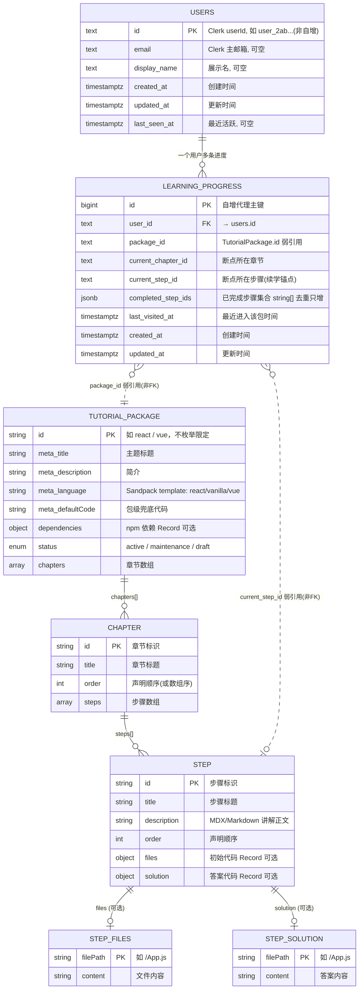
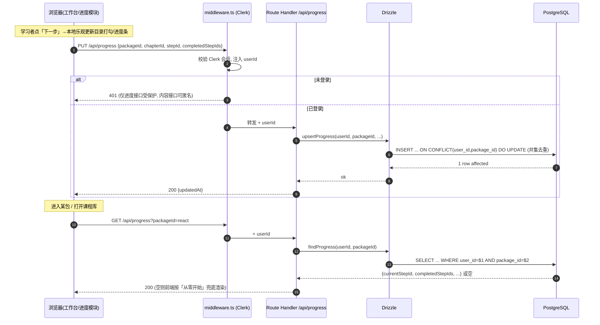
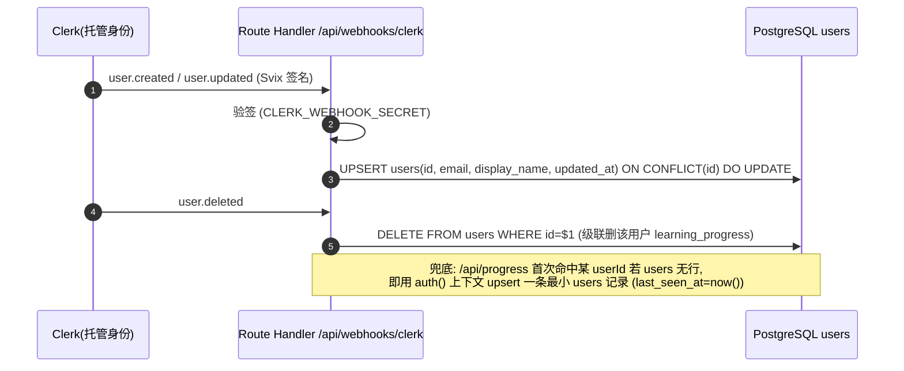
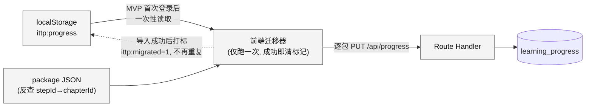

# 数据库设计

> 阶段③设计 · 数据库维度。上游唯一真源：`00-系统设计总览.md`、`01-architecture.md`、原型 specs（`02-原型-v2/specs/`：code-sandbox / learning-progress / theme-library / learning-workspace）、`manifest.proto.json`。
> 产品：**互动式技术教程平台（ITTP）**——内容与引擎分离、以 `TutorialPackage` JSON 驱动的「左讲解 + 右可运行 Sandpack 沙箱」内部自用自主学习工具。
> 技术基线锁定：PostgreSQL（Vercel Postgres / Neon 兼容）+ Drizzle ORM，**仅 `users` 与 `learning_progress` 两类核心数据**，迁移幂等；进度分期：原型 localStorage → MVP PostgreSQL 一次做全套。

---

## 一、设计第一性原理：内容不入库

本维度最重要的一条约束，来自 R8（内容-引擎分离）与 D-C（内容存 JSON 文件、不入 CMS/不强制入库）：

> **`TutorialPackage` / `Chapter` / `Step` / `StepFiles` / `StepSolution` 五个内容侧实体，全部以 JSON 文件（`content/react.json` 等）为唯一真源，随仓库/构建产物走，不落任何数据库表。**

因此本系统的「领域实体」与「物理数据表」是**两个不重合的集合**：

| 领域实体 | 承载形态 | 是否入库 | 理由 |
|---|---|---|---|
| TutorialPackage 教程包 | JSON 文件（`content/*.json`） | ❌ 否 | R8 唯一注入通道是 Package Loader 读 JSON；入库会多一层与「JSON 即真源」冲突的写入面 |
| Chapter 章节 | JSON 内嵌 `chapters[]` | ❌ 否 | 章节是包的子结构，随包一起版本化 |
| Step 步骤 | JSON 内嵌 `chapters[].steps[]` | ❌ 否 | 同上 |
| StepFiles 初始代码 | JSON 内嵌 `step.files` | ❌ 否 | Sandpack 多文件 `Record<path,content>`，内容工程产物 |
| StepSolution 答案代码 | JSON 内嵌 `step.solution` | ❌ 否 | R10 答案，内容工程产物 |
| **User 用户** | **PostgreSQL `users` 表** | ✅ **是** | Clerk 身份的本地镜像，进度归属主体 |
| **LearningProgress 学习进度** | **PostgreSQL `learning_progress` 表** | ✅ **是** | 唯一需要跨端持久化的可变业务数据 |

**为什么不给内容也建表？**（简洁守则「三问」自检）

- 哪个角色/场景在用？——没有。内容读取走 RSC 静态化读 JSON，管理靠 git（内部工具，Owner 即内容维护者）。
- 不做会怎样？——不会怎样。内容量小（React 62 篇/MVP 9 篇）、天然版本化、只读。
- 以后好删吗？——建了反而难删（要维护迁移、同步 JSON↔表两份真源）。

结论：**内容侧零表**。这不是偷懒，是让 JSON 保持唯一真源、避免「JSON 与内容表双写」这类假修（用户明令禁止的反模式）。数据量级验证见 §八。

> 数据量级佐证（nfrDrivers）：内容侧 62 篇/8 章（MVP 9 篇）纯只读小文件；进度侧「每用户每主题一条断点 + 已完成步骤集合」，DB 量可忽略——完全不构成建内容表的性能理由。

---

## 二、领域实体与 ER 模型

ER 图同时表达两个域：**内容域（JSON，虚线框，不落库）** 与 **持久域（PostgreSQL，实线框，落库）**。两域通过「弱引用」相连——`learning_progress` 里存的 `package_id / chapter_id / step_id` 都是**指向 JSON 内标识的字符串**，**不建数据库外键**（跨越了「表↔文件」边界，无法也不应建 FK）。



**读图要点**：
- 虚线关系 `}o..||`（`LEARNING_PROGRESS` → `TUTORIAL_PACKAGE`/`STEP`）表示**跨域弱引用**：进度表里的 `package_id`、`current_step_id`、`completed_step_ids` 都是 JSON 里的标识字符串，**数据库层不建外键**。引擎侧读进度时以 JSON 结构为准做校验；JSON 里已不存在的 stepId 静默忽略（对齐 learning-progress spec §3.5）。
- 实线关系 `||--o{`（`USERS` → `LEARNING_PROGRESS`）是**唯一的真·数据库外键**。
- `STEP_FILES` / `STEP_SOLUTION` 在 JSON 里是 `Record<path, content>` 的对象，ER 里拆成实体只为表达「一步多文件」的结构，**物理上不是表、不是行**。

---

## 三、物理数据表设计

### 3.1 `users`（用户 · Clerk 身份本地镜像）

Clerk 托管身份是权威源；本表是**轻量镜像**，存在的唯一理由是给 `learning_progress.user_id` 提供一个可建外键的本地锚点，并便于按用户聚合查询与展示（内部工具无需重复用户资料）。经 Clerk Webhook 同步（见 §六）。

| 字段 | 类型 | 约束 | 说明 |
|---|---|---|---|
| `id` | `text` | **PK** | Clerk `userId`（形如 `user_2ab...`）。**非自增**——直接用 Clerk 的 id 做主键，天然全局唯一，避免多一层映射 |
| `email` | `text` | NULL 允许 | Clerk 主邮箱，仅展示/排障用；不做登录凭证（登录归 Clerk） |
| `display_name` | `text` | NULL 允许 | 展示名，可空 |
| `created_at` | `timestamptz` | NOT NULL, DEFAULT `now()` | 首次同步入库时间 |
| `updated_at` | `timestamptz` | NOT NULL, DEFAULT `now()` | Webhook 更新时间 |
| `last_seen_at` | `timestamptz` | NULL 允许 | 最近一次访问进度接口的时间；可空 |

**索引**：仅主键 `users_pkey (id)`。用户量极小（内部单人/小团队），`email` 无需唯一索引（Clerk 已保证），也无按 email 查询的接口 → 不建。

> ⚠️ 合规如实记录：本表**不存**任何 PII 加密字段、不存密码/token；`email` 是内部同事邮箱、公有云可出域场景（无信创/无等保/无数据不出域约束）。下游禁止套用政企内网的字段级加密/脱敏模板。

### 3.2 `learning_progress`（学习进度 · 唯一核心可变业务表）

一个用户 × 一个教程包 = **一行**。断点（`current_*`）与完成集合（`completed_step_ids`）是两个独立职责的字段（对齐 learning-progress spec §3.3）。

| 字段 | 类型 | 约束 | 说明 |
|---|---|---|---|
| `id` | `bigint` | **PK**, GENERATED ALWAYS AS IDENTITY | 自增代理主键 |
| `user_id` | `text` | **NOT NULL**, **FK → `users(id)` ON DELETE CASCADE** | 进度归属主体（Clerk userId） |
| `package_id` | `text` | **NOT NULL** | `TutorialPackage.id`（如 `react`）；弱引用 JSON，**无 FK** |
| `current_chapter_id` | `text` | NULL 允许 | 断点所在章节 id；续学定位/大纲自动展开用 |
| `current_step_id` | `text` | NULL 允许 | 断点所在步骤 id（续学锚点）。首访无记录时为 NULL |
| `completed_step_ids` | `jsonb` | NOT NULL, DEFAULT `'[]'::jsonb` | 已完成步骤 id 数组，**去重、只增不减**（仅整体重置清空）。应用层保证去重 |
| `last_visited_at` | `timestamptz` | NOT NULL, DEFAULT `now()` | 最近进入该包时间；多包「继续学习」排序用 |
| `created_at` | `timestamptz` | NOT NULL, DEFAULT `now()` | 首次为该包建进度的时间 |
| `updated_at` | `timestamptz` | NOT NULL, DEFAULT `now()` | 每次写进度更新 |

**约束与索引**：

| 名称 | 类型 | 定义 | 服务的查询 |
|---|---|---|---|
| `learning_progress_pkey` | PK | `(id)` | 主键 |
| `uq_progress_user_package` | **UNIQUE** | `(user_id, package_id)` | **核心**：保证「一用户一包一行」；同时作为 `GET /api/progress?packageId=` 的覆盖索引；其 btree 前缀 `user_id` 直接服务「列出我的全部进度」（课程库卡片），故**无需**再单建 `user_id` 单列索引 |
| `fk_progress_user` | FK | `user_id → users(id) ON DELETE CASCADE` | 用户删除级联清进度 |

**为什么 `completed_step_ids` 用 `jsonb` 数组、而不是拆 `progress_step` 明细表？**

| 方案 | 单包完成步骤规模 | 读写形态 | 结论 |
|---|---|---|---|
| **jsonb 数组（选用）** | ≤62（MVP≤9） | 单行 UPSERT 一次落全部；读单行拿全集，零 JOIN | ✅ 数据量微小，一行装得下；进度是「整体读写」而非「按步骤查询」，无需明细行 |
| 明细表 `progress_step(user_id,package_id,step_id)` | 每完成一步一行 | 每步 INSERT，读需聚合 | ❌ 过度规范化：为「勾选一个集合」引入一张表 + JOIN，违背简洁守则「删 > 加」 |

在本量级下 jsonb 数组是正解；**何时才该重构成明细表**——当出现「按 step_id 跨用户聚合统计」这类分析需求时（当前明确 out-of-scope：进度不对外暴露、不分析，见 learning-progress spec §0）。当场标注为潜在技术债，不预留、不空建。

> `jsonb` 而非 `text[]` 的取舍：Drizzle 对 jsonb 的类型映射（`string[]`）更顺滑、跨 Vercel Postgres/Neon 行为一致、未来若需存「完成时间戳」等富信息可平滑演进为对象数组；当前只存 `string[]`。数据量小，jsonb 的存储/查询开销可忽略。

### 3.3 不做的事（显式记录，防下游顺手加）

| 不做 | 理由 |
|---|---|
| 内容表（package/chapter/step/files/solution） | JSON 即真源（§一），入库=双写假修 |
| 分库 / 分表 / 分区 | 单表数据量以「用户数 × 主题数」计，个位数～数十行，谈不上分（§八） |
| 读写分离 / 只读副本 | 并发个位数~两位数，Vercel Postgres 单实例足够 |
| Redis / 物化视图 / 缓存表 | 完成度是本地/单行即时计算，无预聚合需求（对齐架构 D-E 无 Redis） |
| 软删除 `deleted_at` | 「从头开始」语义是**真删该包进度行或清空集合**，不是留墓碑；留墓碑反而违反 spec「二次确认后清空」 |
| 审计日志表 | 内部工具、进度非敏感，无审计要求 |
| `guest_id` / 匿名进度表 | 原型期进度只在 localStorage（无身份）；MVP 起进度必属登录用户，无匿名落库态（对齐进度分期，不留半吊子/双写垫片） |

---

## 四、字典与编码

系统里的枚举值**几乎全在内容 JSON 侧**（不入库），DB 侧无 enum 列——如实记录，避免下游误建 enum 类型表。

| 编码 | 取值 | 归属 | 是否入库 |
|---|---|---|---|
| `TutorialPackage.status` | `active`（可进入）/ `maintenance`（维护中，卡片置灰）/ `draft`（筹备中，章节为空，置灰） | 内容 JSON | ❌ |
| `TutorialPackage.meta.language`（Sandpack `template`） | `react` / `vanilla` /（未来）`vue`——**不枚举限定死**，新主题可扩（R8） | 内容 JSON | ❌ |
| 大纲节点 `displayState` | `done`（对勾）/ `current`（高亮）/ `idle`（空心圆）——**无 `locked` 态**（D4 不拦人） | 前端派生态 | ❌（由 `completed_step_ids` + `current_step_id` 实时派生） |
| `id` 命名规约（`package_id`/`chapter_id`/`step_id`） | 小写短横线 slug，如 `react` / `ch-jsx` / `st-first-component`；**字符串、不枚举限定**（R8 要求新主题零改动） | 跨域约定 | 进度表存字符串 |
| 时间 | 全部 `timestamptz`，UTC 存储，展示层按 UTC+8 渲染 | DB | ✅ |

**`displayState` 派生规则**（前端计算，不落库，对齐 theme-library spec §6）：

```
displayState(step) =
  step.id === progress.current_step_id           → "current"
  else step.id ∈ progress.completed_step_ids      → "done"
  else                                            → "idle"   // 永不 "locked"
```

---

## 五、读写模式与冷热数据

### 5.1 访问路径一览

| 场景 | 触发 | SQL 形态 | 频度 | 命中索引 |
|---|---|---|---|---|
| 读单包进度（进入工作台/续学提示） | `GET /api/progress?packageId=react` | `SELECT ... WHERE user_id=$1 AND package_id=$2` | 低（每次进包一次） | `uq_progress_user_package` |
| 读全部进度（课程库卡片完成度） | `GET /api/progress` | `SELECT ... WHERE user_id=$1` | 低（进主题库一次） | `uq_progress_user_package`（前缀 `user_id`） |
| 写进度（前进/后退/跳转/勾选完成） | `PUT /api/progress` | **UPSERT**（见 5.2） | 中低（步骤导航时，前端防抖后写） | `uq_progress_user_package`（冲突键） |
| 从头开始 / 重新学习（重置） | `DELETE /api/progress?packageId=` | `DELETE ... WHERE user_id=$1 AND package_id=$2` | 极低 | `uq_progress_user_package` |
| 用户同步 | Clerk Webhook | `users` UPSERT / DELETE | 极低 | `users_pkey` |

写多于读的场景不存在；即便步骤导航频繁，前端对 `PUT /api/progress` 做**防抖**（对齐 learning-progress spec：本地乐观更新、不等服务端确认），落库压力可忽略。

### 5.2 进度写 = 幂等 UPSERT（核心写路径）

`current_*` 用最新值覆盖；`completed_step_ids` 用**并集去重**（只增不减，对齐 spec F3）。用 `INSERT ... ON CONFLICT` 一句完成，天然幂等（重复写同一步不产生副作用）：

```sql
INSERT INTO learning_progress
  (user_id, package_id, current_chapter_id, current_step_id, completed_step_ids, last_visited_at, updated_at)
VALUES ($1, $2, $3, $4, $5::jsonb, now(), now())
ON CONFLICT (user_id, package_id) DO UPDATE SET
  current_chapter_id = EXCLUDED.current_chapter_id,
  current_step_id    = EXCLUDED.current_step_id,
  -- 已完成集合取并集去重，绝不因回看/倒退而缩小
  completed_step_ids = (
    SELECT COALESCE(jsonb_agg(DISTINCT e), '[]'::jsonb)
    FROM jsonb_array_elements_text(
           learning_progress.completed_step_ids || EXCLUDED.completed_step_ids
         ) AS e
  ),
  last_visited_at    = now(),
  updated_at         = now();
```

> 「最后写入者生效、不加锁」是既定策略（多标签页并发轻量竞争可接受，spec §3.5）——UPSERT 语义天然满足，无需行锁/乐观版本号。

进度读写时序：



### 5.3 冷热数据

数据整体是「温」的小数据集，**无冷热分层需求**：

- **热**：当前登录用户正在学的那 1~N 条 `learning_progress`（N=主题数，≤4）。全部走主键/唯一索引单行命中，PG 缓存页即覆盖。
- **温**：历史用户的进度行——量级仍是「用户数 × 主题数」，几十到几百行，不需要归档。
- **冷**：无。不设归档表、不设 TTL 清理（进度是断点续学资产，删了就是「换设备从头学」，属可接受但不主动做）。

数据量级估算见 §八，结论是「单表一屏 `SELECT *` 就能看完」，任何分区/冷热策略都是过度设计。

---

## 六、Clerk 身份同步（users 表如何有数据）

`users` 表不由业务代码直接写，而是 Clerk Webhook 驱动，保证与 Clerk 权威源最终一致；进度接口首次访问时兜底 upsert（防 Webhook 漏发）。



> `ON DELETE CASCADE`：Clerk 删用户 → `users` 行删 → 该用户全部 `learning_progress` 自动级联清除。符合「用户即进度归属主体、无孤儿进度」。

---

## 七、Drizzle Schema 与幂等迁移

### 7.1 Drizzle Schema（`db/schema.ts`）

```ts
import {
  pgTable, text, bigint, jsonb, timestamp, unique, index,
} from "drizzle-orm/pg-core";

export const users = pgTable("users", {
  id: text("id").primaryKey(),                    // Clerk userId, 非自增
  email: text("email"),
  displayName: text("display_name"),
  createdAt: timestamp("created_at", { withTimezone: true }).notNull().defaultNow(),
  updatedAt: timestamp("updated_at", { withTimezone: true }).notNull().defaultNow(),
  lastSeenAt: timestamp("last_seen_at", { withTimezone: true }),
});

export const learningProgress = pgTable(
  "learning_progress",
  {
    id: bigint("id", { mode: "number" }).primaryKey().generatedAlwaysAsIdentity(),
    userId: text("user_id").notNull()
      .references(() => users.id, { onDelete: "cascade" }),
    packageId: text("package_id").notNull(),       // 弱引用 JSON, 无 FK
    currentChapterId: text("current_chapter_id"),
    currentStepId: text("current_step_id"),
    completedStepIds: jsonb("completed_step_ids")
      .$type<string[]>().notNull().default([]),
    lastVisitedAt: timestamp("last_visited_at", { withTimezone: true }).notNull().defaultNow(),
    createdAt: timestamp("created_at", { withTimezone: true }).notNull().defaultNow(),
    updatedAt: timestamp("updated_at", { withTimezone: true }).notNull().defaultNow(),
  },
  (t) => ({
    uqUserPackage: unique("uq_progress_user_package").on(t.userId, t.packageId),
  }),
);
```

### 7.2 幂等迁移 SQL（`drizzle/0000_init.sql`）

用户偏好「幂等迁移」：全部 `IF NOT EXISTS`，可重复跑不报错。Drizzle Kit 生成后人工确认为幂等形态：

```sql
-- users: Clerk 身份本地镜像
CREATE TABLE IF NOT EXISTS users (
  id           text        PRIMARY KEY,
  email        text,
  display_name text,
  created_at   timestamptz NOT NULL DEFAULT now(),
  updated_at   timestamptz NOT NULL DEFAULT now(),
  last_seen_at timestamptz
);

-- learning_progress: 一用户一包一行
CREATE TABLE IF NOT EXISTS learning_progress (
  id                 bigint      GENERATED ALWAYS AS IDENTITY PRIMARY KEY,
  user_id            text        NOT NULL,
  package_id         text        NOT NULL,
  current_chapter_id text,
  current_step_id    text,
  completed_step_ids jsonb       NOT NULL DEFAULT '[]'::jsonb,
  last_visited_at    timestamptz NOT NULL DEFAULT now(),
  created_at         timestamptz NOT NULL DEFAULT now(),
  updated_at         timestamptz NOT NULL DEFAULT now()
);

-- 外键: 用户删除级联清进度 (容错: 已存在则跳过)
DO $$ BEGIN
  ALTER TABLE learning_progress
    ADD CONSTRAINT fk_progress_user
    FOREIGN KEY (user_id) REFERENCES users(id) ON DELETE CASCADE;
EXCEPTION WHEN duplicate_object THEN NULL;
END $$;

-- 唯一约束: 一用户一包一行 (兼作 (user_id[,package_id]) 查询索引)
DO $$ BEGIN
  ALTER TABLE learning_progress
    ADD CONSTRAINT uq_progress_user_package UNIQUE (user_id, package_id);
EXCEPTION WHEN duplicate_object THEN NULL;
END $$;
```

> 迁移只有一支 `0000_init`；两表结构稳定，后续演进（如 `completed_step_ids` 升级为对象数组）再走增量迁移，同样以 `IF NOT EXISTS` / `ADD COLUMN IF NOT EXISTS` 保持幂等。

---

## 八、数据量级与容量测算（论证「无需任何扩展性设计」）

| 表 | 行数模型 | 悲观估算 | 单行大小 | 表总大小 |
|---|---|---|---|---|
| `users` | = 内部用户数 | ~20 人 | ~0.2 KB | **~4 KB** |
| `learning_progress` | 用户数 × 主题数 | 20 × 4 = 80 行 | ~1 KB（含 62 元素 jsonb 数组约 0.9 KB） | **~80 KB** |

- 全库业务数据 **< 100 KB**，常驻内存、无 I/O 压力；`SELECT * FROM learning_progress` 一次拉全表都无感。
- `completed_step_ids` 最坏情况 = 单包 62 篇全完成 = 62 个短字符串，jsonb < 1 KB，远未触及 TOAST 阈值。
- 并发峰值个位数~两位数写，PG 单实例余量数个数量级。

**结论**：分库分表、分区、读写分离、缓存层、冷热分层——**全部为过度设计，本设计一律不做**（对齐 nfrDrivers「首要目标是主题可扩展性 R8 而非性能」，架构 D-E/§三）。真正要扛的可扩展性在**内容侧 JSON 的 R8 零改动**，与数据库无关。

---

## 九、原型 → MVP 进度迁移（localStorage → PostgreSQL）

进度分期是既定约束：**原型 localStorage → MVP PostgreSQL 一次做全套，不留半吊子、不做长期双写垫片**。迁移是**一次性导入**，不是双写兼容层。

原型侧 localStorage 结构（key `ittp:progress`，来自 learning-progress spec §3.1）：

```json
{
  "react": {
    "currentStepId": "st-props",
    "completedStepIds": ["st-first-component", "st-jsx"],
    "lastVisitedAt": "2026-07-18T10:20:00Z"
  }
}
```

字段映射与一次性导入逻辑：

| localStorage 字段 | → `learning_progress` 字段 | 转换 |
|---|---|---|
| （对象 key）`tutorialId` | `package_id` | 直接取 key |
| `currentStepId` | `current_step_id` | 直接映射 |
| —（localStorage 无 chapterId） | `current_chapter_id` | **由 Package Loader 读 JSON，反查 `currentStepId` 所属章节**回填 |
| `completedStepIds` | `completed_step_ids` | 去重后转 jsonb 数组 |
| `lastVisitedAt` | `last_visited_at` | ISO 字符串 → timestamptz |
| （当前 Clerk 会话） | `user_id` | 取 `auth().userId` |



迁移规则（对齐用户「不留半吊子」偏好）：
- **触发一次**：MVP 上线后用户首次登录，检测 `localStorage.ittp:progress` 存在且未打 `ittp:migrated` 标记 → 逐包调 `PUT /api/progress` 导入 → 成功后打标，**之后进度只读写 PostgreSQL**，localStorage 不再作为进度真源。
- **不双写**：迁移完成即切换，不维护 localStorage↔PG 长期同步（那是被否决的兼容垫片）。
- **降级**：localStorage 无数据/不可用 → 无迁移，直接以 PG 空态从头开始，不报错。

---

## 十、真实样例数据（贴合 React 首主题 · 9 篇样板形态）

内容侧（JSON，**不入库**）——`content/react.json` 节选，体现 `meta` / `chapters[].steps[]` / `files` / `solution` 真实形态：

```json
{
  "id": "react",
  "status": "active",
  "meta": {
    "title": "React 入门",
    "description": "从 JSX 到 Hooks，跟着可运行沙箱学 React。",
    "language": "react",
    "defaultCode": "export default function App(){ return <h1>Hello</h1> }",
    "dependencies": { "react": "^19.0.0", "react-dom": "^19.0.0" }
  },
  "chapters": [
    {
      "id": "ch-jsx", "title": "JSX 与组件", "order": 1,
      "steps": [
        {
          "id": "st-first-component", "title": "你的第一个组件", "order": 1,
          "description": "React 组件就是返回 JSX 的函数。修改下面的文本，点 Run 看变化。",
          "files": { "/App.js": "export default function App(){\n  return <h1>Hello React</h1>\n}" }
        },
        {
          "id": "st-props", "title": "用 Props 传递数据", "order": 2,
          "description": "组件通过 props 接收外部数据。给 <Welcome> 传一个 name 试试。",
          "files": {
            "/App.js": "function Welcome(props){\n  return <h2>Hi, {/* 在此使用 props.name */}</h2>\n}\nexport default function App(){\n  return <Welcome name=\"演示用户\" />\n}"
          },
          "solution": {
            "/App.js": "function Welcome(props){\n  return <h2>Hi, {props.name}</h2>\n}\nexport default function App(){\n  return <Welcome name=\"演示用户\" />\n}"
          }
        }
      ]
    }
  ]
}
```

持久侧（PostgreSQL，**入库**）——对应一条真实进度行：

`users`

| id | email | display_name | last_seen_at |
|---|---|---|---|
| `user_2ab5Kf9QwErTyU` | demo@example.com | 演示用户 | 2026-07-19 09:12:00+08 |

`learning_progress`

| id | user_id | package_id | current_chapter_id | current_step_id | completed_step_ids | last_visited_at |
|---|---|---|---|---|---|---|
| 1 | `user_2ab5Kf9QwErTyU` | `react` | `ch-jsx` | `st-props` | `["st-first-component"]` | 2026-07-19 09:12:00+08 |

由此派生（前端计算，不落库）：
- `st-first-component` → `displayState = done`（对勾）
- `st-props` → `displayState = current`（高亮）
- 章节 `ch-jsx` 完成度 = 1/2 = 50%；包完成度 = 已完成步数 / 总步数（读 JSON 得总步数）。

---

## 十一、设计自检（对齐技术基线与简洁守则）

| 检查项 | 结论 |
|---|---|
| 选型是否符合基线 | ✅ PostgreSQL + Drizzle，仅两表，迁移幂等，无 Redis/MQ/分区 |
| 是否只落 users / learning_progress | ✅ 内容五实体全在 JSON，零内容表 |
| 是否与 R8 内容-引擎分离一致 | ✅ 进度表对内容只做字符串弱引用、无 FK，新增 vue.json 不需任何 DB 改动 |
| 是否触碰 D4 禁令 | ✅ 无 `waitFor`/门禁字段；完成是「经过即勾选」，DB 只记集合不做校验 |
| 是否引入过度设计 | ✅ 已显式列出并拒绝分库分表/软删/审计/匿名进度表（§3.3） |
| 合规基线 | ✅ 公有云、无 PII 加密列、无信创/内网/等保模板；如实记录 email 明文存内部同事邮箱 |
| 进度分期 | ✅ localStorage→PG 一次性导入、不双写垫片（§九） |
| 迁移幂等 | ✅ 全 `IF NOT EXISTS` + `duplicate_object` 容错，可重复跑（§7.2） |
