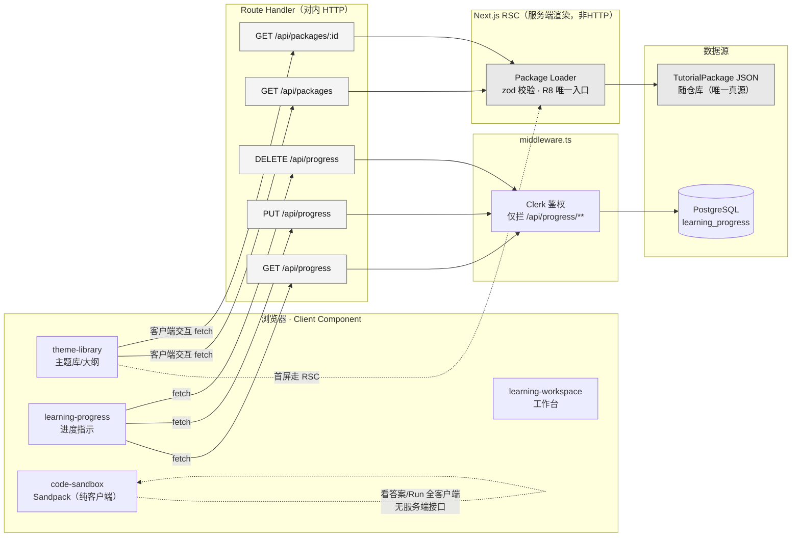
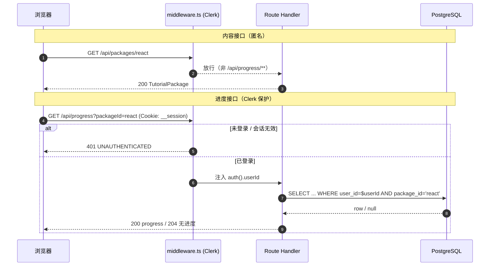
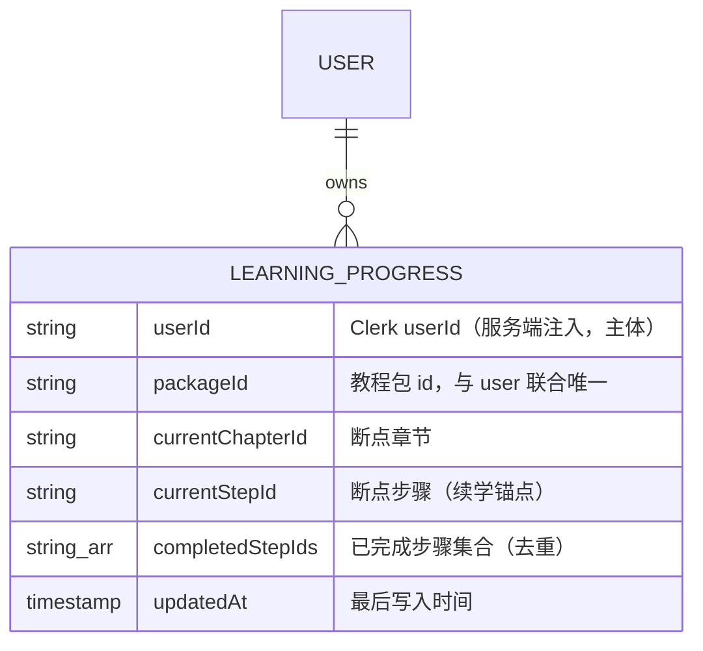
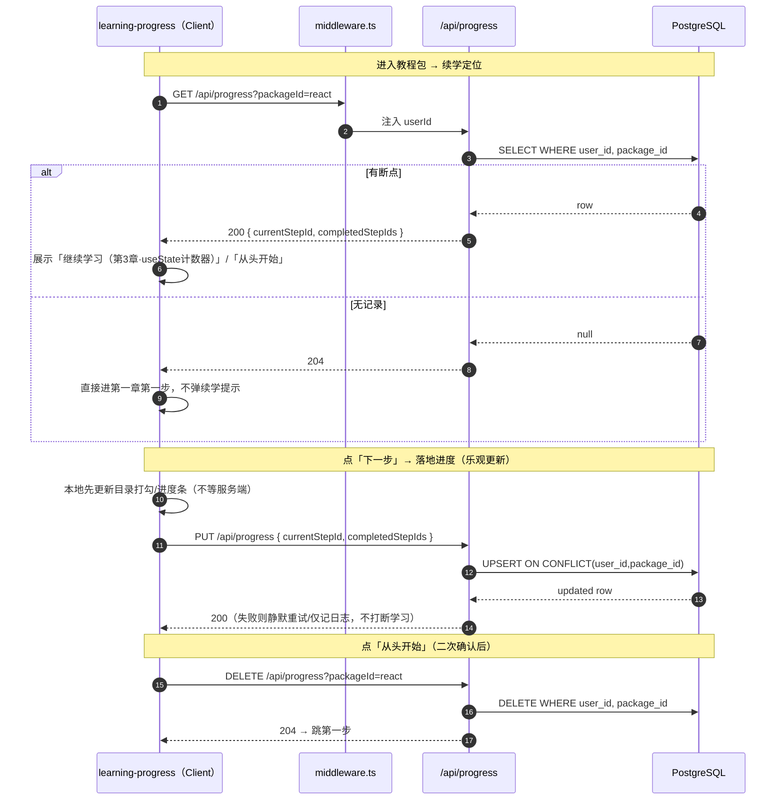
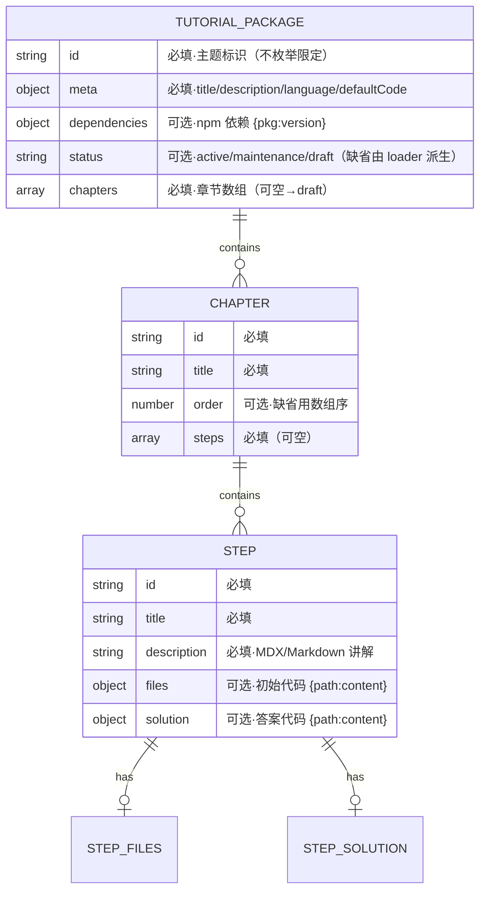
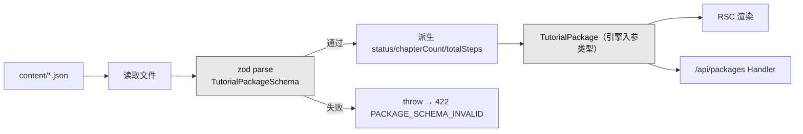

# 接口 / API 设计

> 阶段③设计 · 资深系统设计专家产出。严格遵循 `01-architecture.md` 第九节技术基线与 `00-系统设计总览.md`。
> 产品：**互动式技术教程平台（ITTP）**——内容与引擎分离、以 `TutorialPackage` JSON 驱动的「左讲解 + 右可运行 Sandpack 沙箱」内部自用自主学习工具。
> 本维度只定义**接口契约**（对外 HTTP + 对内引擎契约），不重复架构/数据库设计；数据结构以现行 `TutorialPackage` Schema（已删 `selector`/`waitFor`，`codeSnippet→files`，新增 `solution`）为唯一真源。

---

## 一、设计总纲

### 1.1 接口分层与三类接口

本系统是**分层单体**（Next.js 15 App Router），没有独立后端服务、没有独立 API 网关。全部「接口」落在三个层面，边界必须清晰，否则会误建端点、破坏 R8：

| 类别 | 承载者 | 通信 | 鉴权 | 说明 |
|---|---|---|---|---|
| **A. 对内 HTTP 接口** | Next.js Route Handler（`app/api/**/route.ts`） | REST / JSON over HTTPS，同源 | 内容匿名 · 进度经 Clerk | 前端 Client Component 通过 `fetch` 调用 |
| **B. 对内引擎契约**（最关键） | Package Loader + zod Schema | 进程内函数调用，非网络 | — | `TutorialPackage` Schema 是「引擎能吃什么」的形式化契约，**R8 成败判据的物理落点** |
| **C. 客户端内交互**（**非接口**） | Sandpack / 看答案 R10 / 进度指示 | 浏览器内，**不发服务端请求** | — | 明确记录：这些**没有也不需要**服务端端点，防止下游误建 API |

> ⚠️ **合规如实**：公有云 Vercel、内部自用，**无信创/无内网/无专网/无等保/无数据不出域**。接口设计不套用政企内网网关/加密机/国密模板。

### 1.2 风格与硬性约定

- **风格**：REST（资源 + HTTP 方法），非 RPC。理由：只有「教程包（只读）」与「学习进度（读写）」两类资源，REST 语义天然贴合，无需 RPC 动作爆炸。
- **协议**：HTTPS（Vercel 默认）；请求/响应体一律 `application/json; charset=utf-8`。
- **同源**：前端与 API 同一 Vercel 部署单元，**无跨域**，不需要 CORS 白名单（不对外开放）。
- **无版本前缀**：不加 `/v1`。内部工具、单一消费者（本站前端），破坏性变更直接改，符合用户「不做向后兼容垫片」偏好。若未来真需要，再引入 `/api/v2`，当前**刻意不预留**（删 > 加）。
- **鉴权分区**：内容接口 `/api/packages/**` 匿名可读；进度接口 `/api/progress/**` 由 `middleware.ts` 用 Clerk 强制登录。分区即安全边界。
- **服务端不打包代码**：任何接口都不接收/编译/运行用户代码——代码打包是客户端 Sandpack 的事，服务端零编译端点。

### 1.3 接口全景图



**要点**：内容首屏由 **RSC 直接经 Package Loader 读 JSON**（不走 HTTP，最快、可静态化）；`/api/packages` HTTP 端点服务**客户端运行时**的按需拉取（如切换主题包、大纲抽屉懒加载）。两条路径**共用同一个 Package Loader**，保证 R8 只有一个注入通道。

---

## 二、通用约定

### 2.1 请求 / 响应格式

**成功响应**：直接返回资源体（单资源为对象，集合为数组），不套多余 envelope。内部工具，扁平即可。

**错误响应**：统一信封，便于前端集中处理。

```json
{
  "error": {
    "code": "PACKAGE_NOT_FOUND",
    "message": "找不到 id 为 vue 的教程包"
  }
}
```

| 字段 | 类型 | 说明 |
|---|---|---|
| `error.code` | string | 机器可读错误码（见 §2.4），前端据此分支 |
| `error.message` | string | 人类可读中文说明，可直接展示或写日志 |

### 2.2 HTTP 方法与语义

| 方法 | 语义 | 幂等 | 本系统用于 |
|---|---|---|---|
| `GET` | 读取资源 | 是 | 读教程包、读进度 |
| `PUT` | 整体 upsert（不存在则建，存在则整体替换） | 是 | 写进度（断点 + 完成集合整体覆盖） |
| `DELETE` | 删除资源 | 是 | 重置某主题进度（「从头开始」） |

> **刻意不用 `POST`/`PATCH`**：进度是「单用户单主题一条记录」的整体覆盖语义，`PUT` 幂等最贴合、天然抗多标签页竞争（§业务规则「最后写入者生效」）；不做增量 `PATCH` 合并，避免半吊子合并逻辑。

### 2.3 鉴权



- **保护范围**：`middleware.ts` 的 matcher 只匹配 `/api/progress/**`；`/api/packages/**` 与所有内容页匿名可访问。
- **身份主体**：进度归属主体是 Clerk 的 `userId`（`auth().userId`），由服务端从会话取得，**前端不得传 `userId`**（防越权）。
- **越权隔离**：所有进度 SQL 都以服务端 `userId` 为 `WHERE` 条件，用户只能读写自己的进度，无跨用户访问路径。

### 2.4 错误码约定

| HTTP | `error.code` | 触发场景 | 出现在 |
|---|---|---|---|
| `400` | `VALIDATION_ERROR` | 请求体/查询参数不符合入参 Schema（缺 `packageId`、`completedStepIds` 非数组等） | 进度写入 |
| `401` | `UNAUTHENTICATED` | 访问进度接口但无有效 Clerk 会话 | 进度全部 |
| `404` | `PACKAGE_NOT_FOUND` | 请求的 `packageId` 无对应 JSON 文件 | 内容单包读取 |
| `404` | `NOT_FOUND` | 路由不存在 | 全局 |
| `405` | `METHOD_NOT_ALLOWED` | 对资源用了未定义的方法（如 `POST /api/packages`） | 全局 |
| `422` | `PACKAGE_SCHEMA_INVALID` | JSON 文件存在但过不了 zod 校验（内容维护者配置错误） | 内容读取（`dev`/构建期尤重要） |
| `500` | `INTERNAL_ERROR` | DB 连接失败等未预期异常 | 全局兜底 |

约定：
- `2xx` 只用于真正成功；无进度记录用 `204 No Content`（空体），不是 `404`（区分「查无此人」与「资源不存在」）。
- 服务端不吞错：`500` 记录服务端日志（不回显堆栈给前端），前端只拿到 `INTERNAL_ERROR`。
- `422 PACKAGE_SCHEMA_INVALID` 是 R8 的运行时护栏——非法内容包在**读取即拒**，绝不半渲染。

### 2.5 分页 / 过滤 / 排序约定

**明确不做分页**。理由（三问自检通过才砍）：教程包总量个位数（React + 预留 Vue/JS/算法），单包章节/步骤最多 62 篇，`GET /api/packages` 一次返回全量列表、`GET /api/packages/:id` 返回整包，数据量 KB~百 KB 级，分页/游标是过度设计。

- **列表排序**：以 JSON 配置声明顺序（数组顺序 / 显式 `order`）为准，服务端不重排。
- **过滤**：`/api/packages` 不提供 `?status=` 等过滤参数——前端拿全量后本地按 `status` 分组展示（`active`/`maintenance`/`draft`）。
- **未来若单主题步骤数暴涨**再引入分页，当前刻意不预留参数（删 > 加）。

### 2.6 缓存约定

| 接口 | 缓存策略 | 说明 |
|---|---|---|
| `GET /api/packages`、`GET /api/packages/:id` | `Cache-Control: public, max-age=0, s-maxage=3600, stale-while-revalidate` | 内容只读、随构建产物固定；走 Vercel Edge/CDN 缓存，发版后 CDN 失效 |
| 内容 RSC 路径 | Next.js 静态化 / `revalidate` | 首屏 RSC 直读 JSON，天然可静态化 |
| `GET/PUT/DELETE /api/progress` | `Cache-Control: private, no-store` | 用户私有、随时变更，绝不缓存 |

无 Redis、无自建缓存中间件（架构基线：仅 HTTP/CDN + RSC 静态化）。

---

## 三、内容接口（Content · 只读 · 匿名）

内容真源是随仓库的 `TutorialPackage` JSON（如 `content/react.json`），经 Package Loader 加载 + zod 校验后返回。**引擎零主题分支**：Handler 内不出现任何 `react`/`vue` 字面量判断，纯按 `id` 定位文件、无差别返回。

### 3.1 接口清单

| # | 方法 | 路径 | 鉴权 | 用途 | 承载需求 |
|---|---|---|---|---|---|
| C1 | `GET` | `/api/packages` | 匿名 | 列出全部教程包的**轻量元信息**（不含 steps 正文/代码），供主题选择页卡片 | R8、theme-library F1/F2 |
| C2 | `GET` | `/api/packages/{packageId}` | 匿名 | 取单个教程包**完整结构**（chapters→steps→files/solution），供工作台与大纲 | R1/R8、learning-workspace F2/F3 |

> 设计取舍：C1 返回**裁剪版**（去掉 `steps[].description/files/solution` 等重字段）而非全量，避免主题选择页拉下所有步骤正文；C2 才返回整包。这是唯一的「投影」优化，不引入 GraphQL/字段选择器（过度设计）。

### 3.2 C1 · GET /api/packages

**请求**：无参数。

**响应 `200`**（数组，每项为裁剪版 `TutorialPackageSummary`）：

```json
[
  {
    "id": "react",
    "meta": {
      "title": "React 从入门到实践",
      "description": "以小满 zs 的 React 笔记为蓝本，从组件与 JSX 讲到 Hooks 与状态管理。",
      "language": "react"
    },
    "status": "active",
    "chapterCount": 8,
    "totalSteps": 62
  },
  {
    "id": "vue",
    "meta": { "title": "Vue 3 响应式实战", "description": "组合式 API 与响应式原理。", "language": "vue" },
    "status": "draft",
    "chapterCount": 0,
    "totalSteps": 0
  }
]
```

| 字段 | 类型 | 说明 |
|---|---|---|
| `id` | string | 教程包标识，不枚举限定 |
| `meta.title` / `meta.description` / `meta.language` | string | 标题 / 简介 / 沙箱语言模式 |
| `status` | `active`\|`maintenance`\|`draft` | `draft`/`maintenance` 前端置灰不可点（theme-library F2/F3） |
| `chapterCount` | number | 章节数（服务端由 `chapters.length` 派生） |
| `totalSteps` | number | 总步数（服务端由 `Σ chapters[].steps.length` 派生） |

> **注意**：`status`/`chapterCount`/`totalSteps` 为服务端派生的展示便利字段，**不写回 JSON 真源**——`status` 可由 loader 依据「chapters 空→draft」规则计算或读 JSON 显式 `status`；派生逻辑在 Package Loader 内，零主题分支。

### 3.3 C2 · GET /api/packages/{packageId}

**请求**：路径参数 `packageId`（如 `react`）。

**响应 `200`**（完整 `TutorialPackage`，此处示例含 1 章 1 步的真实 React 内容）：

```json
{
  "id": "react",
  "meta": {
    "title": "React 从入门到实践",
    "description": "从组件与 JSX 到 Hooks 与状态管理。",
    "language": "react",
    "defaultCode": "export default function App() {\n  return <h1>Hello React</h1>;\n}"
  },
  "dependencies": {},
  "status": "active",
  "chapters": [
    {
      "id": "ch-hooks",
      "title": "Hooks 状态管理",
      "order": 3,
      "steps": [
        {
          "id": "step-usestate-counter",
          "title": "用 useState 管理计数器",
          "description": "## useState\n\n`useState` 让函数组件拥有自己的状态。它返回一个数组：当前状态值与更新函数。\n\n```js\nconst [count, setCount] = useState(0);\n```\n\n试着点击右侧按钮，观察 `count` 的变化；再把初始值改成 `10` 点 Run 看看。",
          "files": {
            "/App.js": "import { useState } from \"react\";\n\nexport default function App() {\n  const [count, setCount] = useState(0);\n  return (\n    <button onClick={() => setCount(count + 1)}>\n      点击了 {count} 次\n    </button>\n  );\n}",
            "/styles.css": "button { font-size: 16px; padding: 8px 16px; }"
          },
          "solution": {
            "/App.js": "import { useState } from \"react\";\n\nexport default function App() {\n  const [count, setCount] = useState(10);\n  return (\n    <button onClick={() => setCount((c) => c + 1)}>\n      点击了 {count} 次\n    </button>\n  );\n}",
            "/styles.css": "button { font-size: 16px; padding: 8px 16px; }"
          }
        }
      ]
    }
  ]
}
```

**响应 `404`**（`packageId` 无对应文件）：

```json
{ "error": { "code": "PACKAGE_NOT_FOUND", "message": "找不到 id 为 svelte 的教程包" } }
```

**响应 `422`**（JSON 存在但过不了 zod）：

```json
{ "error": { "code": "PACKAGE_SCHEMA_INVALID", "message": "react.json 校验失败：chapters[0].steps[0].id 缺失" } }
```

---

## 四、进度接口（Progress · 读写 · Clerk 保护）

进度是 MVP 唯一落库的资源，对应 `learning_progress` 表：**单用户单主题一条记录**（`UNIQUE(user_id, package_id)`）。原型期同一语义先走 localStorage，MVP 一次切到本接口，**不做长期双写垫片**（Q5/D-F）。

服务端是「哑存储」：完整接收前端算好的断点与完成集合并整体覆盖；「completedSteps 只增不减、跳转不追溯补全」等业务判定由前端 learning-progress 模块负责，服务端不做合并（对齐「最后写入者生效」）。

### 4.1 接口清单

| # | 方法 | 路径 | 鉴权 | 用途 | 承载需求 |
|---|---|---|---|---|---|
| P1 | `GET` | `/api/progress?packageId={id}` | Clerk | 读当前用户在某主题的断点与完成集合 | learning-progress F1/F7、断点续学 |
| P2 | `PUT` | `/api/progress` | Clerk | upsert 当前用户某主题进度（整体覆盖） | learning-progress F1/F2/F3 |
| P3 | `DELETE` | `/api/progress?packageId={id}` | Clerk | 重置某主题进度（「从头开始」F9） | learning-progress F9 |

### 4.2 进度资源结构



> 注：`users` 表由 Clerk webhook 同步或懒建，进度归属只依赖 `userId` 字符串，接口层不暴露 `users` 的读写端点（身份由 Clerk 托管，非本系统职责）。

### 4.3 P1 · GET /api/progress

**请求**：`GET /api/progress?packageId=react`，Cookie 携带 Clerk 会话。

**响应 `200`**（有进度）：

```json
{
  "packageId": "react",
  "currentChapterId": "ch-hooks",
  "currentStepId": "step-usestate-counter",
  "completedStepIds": ["step-first-component", "step-jsx-basics", "step-props"],
  "updatedAt": "2026-07-19T10:22:05.000Z"
}
```

**响应 `204`**（该用户此主题无进度，首次学习）：空体。前端据此走「从第一章第一步开始、不展示续学提示」。

**响应 `400`**（缺 `packageId`）：

```json
{ "error": { "code": "VALIDATION_ERROR", "message": "缺少查询参数 packageId" } }
```

**响应 `401`**：`{ "error": { "code": "UNAUTHENTICATED", "message": "请先登录" } }`

### 4.4 P2 · PUT /api/progress

**请求体**（前端算好的完整状态，整体覆盖）：

```json
{
  "packageId": "react",
  "currentChapterId": "ch-hooks",
  "currentStepId": "step-useeffect",
  "completedStepIds": ["step-first-component", "step-jsx-basics", "step-props", "step-usestate-counter"]
}
```

**入参约束（zod 校验，不过则 `400 VALIDATION_ERROR`）**：

| 字段 | 类型 | 必填 | 约束 |
|---|---|---|---|
| `packageId` | string | 是 | 非空 |
| `currentChapterId` | string | 是 | 非空 |
| `currentStepId` | string | 是 | 非空 |
| `completedStepIds` | string[] | 是 | 数组（可空 `[]`），服务端去重后落库 |

> 服务端**不校验** `stepId` 是否真实存在于 JSON（内容可能已变更，历史 stepId 失效属正常，静默存储）——这与 learning-progress spec「结构变更静默忽略失效 stepId」一致，避免内容与进度强耦合导致写入失败。

**响应 `200`**（返回落库后的记录，含服务端刷新的 `updatedAt`）：

```json
{
  "packageId": "react",
  "currentChapterId": "ch-hooks",
  "currentStepId": "step-useeffect",
  "completedStepIds": ["step-first-component", "step-jsx-basics", "step-props", "step-usestate-counter"],
  "updatedAt": "2026-07-19T10:31:47.000Z"
}
```

**幂等语义**：同一请求体重复 `PUT` 结果一致（除 `updatedAt`）；底层 `INSERT ... ON CONFLICT (user_id, package_id) DO UPDATE`。

### 4.5 P3 · DELETE /api/progress

**请求**：`DELETE /api/progress?packageId=react`。用于「从头开始 / 重新学习」（F9，二次确认在前端）。

**响应 `204`**：空体（无论此前有无记录都返回 204，幂等）。

### 4.6 进度读写时序（含续学）



> **不拦人原则（D4）落到接口**：进度写入是**乐观更新 + 后台同步**——前端点「下一步」立即本地推进 UI，`PUT` 在后台发出；即使 `PUT` 失败也只记日志/轻重试，**绝不阻断步骤前进**。进度接口没有任何「必须完成才放行」的门禁语义。

---

## 五、对内引擎契约：TutorialPackage Schema（R8 物理落点 · 最关键接口）

这是**比 HTTP 接口更重要的接口**——「引擎能吃什么」的形式化契约。所有内容都必须先过这个 zod Schema 才能进引擎；**新增 `vue.json` 只要过 Schema 就保证可被无差别渲染，引擎代码零改动**（R8）。它是唯一注入通道，Package Loader 是唯一执行者。

### 5.1 Schema 契约表



| 路径 | 类型（zod） | 必填 | 约束 / 说明 |
|---|---|---|---|
| `id` | `z.string().min(1)` | 是 | 主题标识，**不用 enum**（新增主题不改 Schema，R8） |
| `meta.title` | `z.string().min(1)` | 是 | 主题标题 |
| `meta.description` | `z.string()` | 否 | 简介，缺失卡片留空不报错 |
| `meta.language` | `z.string().min(1)` | 是 | Sandpack `template`（`react`/`vanilla`/`vue`…），**不用 enum**——沙箱 `template = meta.language`，组件零字面量 |
| `meta.defaultCode` | `z.string()` | 否 | 步骤无 `files` 时的兜底初始代码 |
| `dependencies` | `z.record(z.string())` | 否 | `{ "axios": "^1.6.0" }`，透传给 Sandpack `customSetup.dependencies` |
| `status` | `z.enum(['active','maintenance','draft'])` | 否 | 缺省由 loader 派生（`chapters` 空→`draft`） |
| `chapters` | `z.array(ChapterSchema)` | 是 | 顺序即展示序 |
| `chapters[].id` / `.title` | `z.string().min(1)` | 是 | |
| `chapters[].order` | `z.number()` | 否 | 显式排序，缺省用数组序 |
| `chapters[].steps` | `z.array(StepSchema)` | 是 | 可空数组（章节筹备中） |
| `steps[].id` / `.title` | `z.string().min(1)` | 是 | `id` 需包内唯一（loader 校验） |
| `steps[].description` | `z.string()` | 是 | MDX/Markdown 讲解正文 |
| `steps[].files` | `z.record(z.string())` | 否 | `{ "/App.js": "..." }`，缺省用 `meta.defaultCode` |
| `steps[].solution` | `z.record(z.string())` | 否 | 缺省则「给我看答案」置灰（R10 降级） |

> **已删死字段（唯一真源纪律）**：`selector`、`waitFor`（D4 砍高亮/等待）；`codeSnippet` 已被多文件 `files` 取代。Schema 中**不得复活**这些字段，CI 门禁扫描到即失败。

### 5.2 Package Loader 契约（唯一入口）



- **函数签名**（进程内接口，非 HTTP）：
  - `loadPackageSummaries(): Promise<TutorialPackageSummary[]>` —— C1 与主题选择页 RSC 共用
  - `loadPackage(id: string): Promise<TutorialPackage>` —— C2 与工作台 RSC 共用，`id` 无效 throw `PackageNotFoundError`
- **R8 结构性保证**：引擎所有渲染函数入参类型恒为 `TutorialPackage`，**不存在第二条注入主题信息的通道**；新增 `vue.json` 走同一 `loadPackage('vue')`，无新增分支。CI 静态门禁扫 `lib/engine/**`、`components/**` 中 `/react|vue|vanilla/` 字面量分支，命中数必须为 0。

---

## 六、客户端内交互（**非接口** · 明确边界）

以下行为**全部发生在浏览器内，不产生任何服务端请求**。在此显式记录，防止下游误建 API 端点（这会破坏「服务端不打包代码」基线）：

| 行为 | 承载 | 为何无服务端接口 |
|---|---|---|
| **代码 Run / 打包 / 预览** | Sandpack 浏览器内 bundler（iframe/srcdoc） | 计算重心在客户端，服务端零编译端点 |
| **给我看答案（R10）** | 客户端状态机：快照 `currentFiles` → 填 `solution` → 自动 Run → 切回 | `solution` 已随 C2 整包下发到浏览器，看答案是纯前端状态切换，无需再请求服务端 |
| **多文件 Tab 切换 / 编辑** | Sandpack + CodeMirror（客户端） | 编辑态不持久化、不上报 |
| **进度指示可视化**（进度条/目录打勾/完成度%） | 由已加载的 package 结构 + 进度记录本地派生 | 纯前端计算，不额外请求 |
| **明暗主题切换** | 客户端 `localStorage` + CSS 变量 | 外观偏好不落后端 |

> R10 看答案时序（纯客户端，无网络）：`点击看答案 → 快照 currentFiles=ownCodeSnapshot → files=solution → 自动 Run → isShowingAnswer=true`；`点击切回 → files=ownCodeSnapshot → 自动 Run → isShowingAnswer=false`。`solution` 缺失则按钮 `disabled`，不请求、不报错。

---

## 七、接口 ↔ 实体 ↔ 模块 映射

| 接口 / 契约 | 实体 | 消费模块 | 承载需求 |
|---|---|---|---|
| `GET /api/packages` | TutorialPackage(summary) | theme-library | R8、F1/F2 |
| `GET /api/packages/:id` | TutorialPackage / Chapter / Step / StepFiles / StepSolution | learning-workspace、code-sandbox | R1/R6/R8/R10 |
| `GET/PUT/DELETE /api/progress` | LearningProgress、User | learning-progress | R2（进度侧）、断点续学 |
| TutorialPackage zod Schema | 全部内容实体 | 引擎（Package Loader） | **R8 成败判据** |
| （客户端·无接口）看答案/Run | StepSolution / StepFiles | code-sandbox | R10/R6 |

---

## 八、关键接口决策与取舍

| # | 决策 | 被否方案 | 理由 |
|---|---|---|---|
| API-1 | **REST + JSON**，仅 packages/progress 两组资源 | RPC / GraphQL | 资源少、消费者单一，REST 最省；GraphQL 的字段选择对两个端点属过度设计 |
| API-2 | **内容首屏走 RSC 直读 JSON，HTTP `/api/packages` 服务客户端按需** | 全部走 HTTP | RSC 直读最快、可静态化；两路共用 Package Loader 保证 R8 单通道 |
| API-3 | **进度用 `PUT` 整体 upsert，服务端哑存储** | `PATCH` 增量合并 | 单用户单主题一条记录、「最后写入者生效」，整体覆盖幂等、抗多标签页竞争，无半吊子合并 |
| API-4 | **无 `/v1` 版本前缀、无分页参数** | 预留版本/分页 | 内部工具、单消费者、数据 KB 级；预留即过度设计（删 > 加），需要时再加 |
| API-5 | **`userId` 服务端从 Clerk 注入，前端禁传** | 前端传 userId | 防越权，进度归属唯一可信来源是会话 |
| API-6 | **`meta.language`/`id` 用 `z.string()` 非 enum** | enum 限定主题 | enum 会让新增主题必须改 Schema，直接违反 R8「零改动」 |
| API-7 | **看答案/Run/预览无服务端端点** | 服务端沙箱/答案接口 | 计算下沉客户端；`solution` 随整包已下发，看答案纯前端状态切换 |
| API-8 | **进度写入乐观更新、失败不阻断** | 写成功才放行下一步 | 忠于 D4「不拦人」；进度是记忆不是门禁 |
| API-9 | **无 CORS / 无独立网关 / 无 API Key** | 开放跨域/网关鉴权 | 同源单体、内部自用、不对外；Clerk middleware 即鉴权边界 |

---

## 九、遵循基线自检

- ✅ 分层单体、Route Handler 承载 `/api/packages`（只读）与 `/api/progress`（读写），无独立后端服务。
- ✅ 服务端**不打包代码**：无任何编译/运行端点；Sandpack Run 全客户端。
- ✅ R8 落点：唯一入口 Package Loader + zod Schema，`id`/`language` 非 enum，引擎零主题分支（CI 门禁）。
- ✅ 鉴权：Clerk `middleware.ts` 仅拦 `/api/progress/**`，内容匿名；`userId` 服务端注入。
- ✅ 数据：仅 `users`/`learning_progress`，`PUT` 幂等 upsert，迁移幂等由 DB 维度承接。
- ✅ 缓存：内容 CDN/`s-maxage` + RSC 静态化，进度 `no-store`；无 Redis、无 MQ、无网关。
- ✅ 合规如实：公有云、无信创/无内网/无等保/无数据不出域，未套政企网关模板。
- ✅ 范式禁令 D4：进度接口无 `waitFor`/门禁语义，写入乐观不阻断；已删字段不复活。
