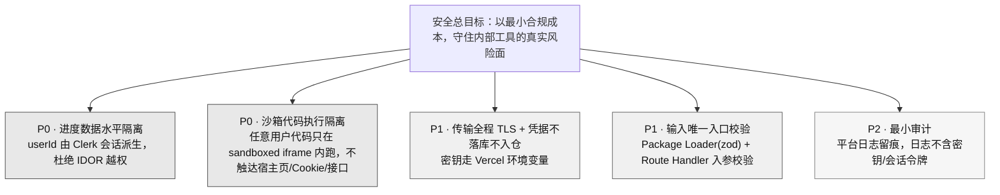
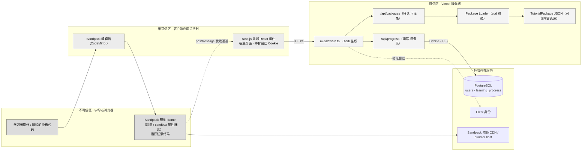
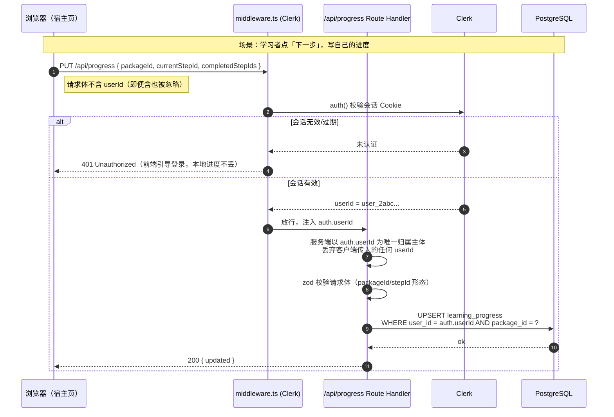
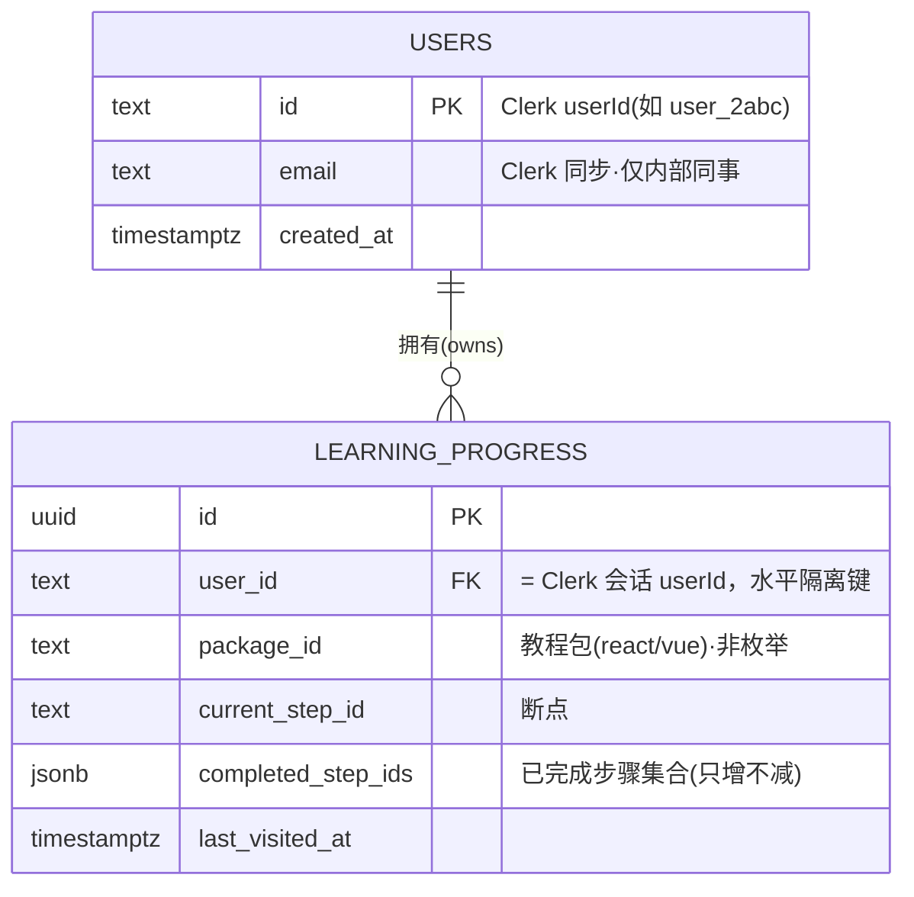
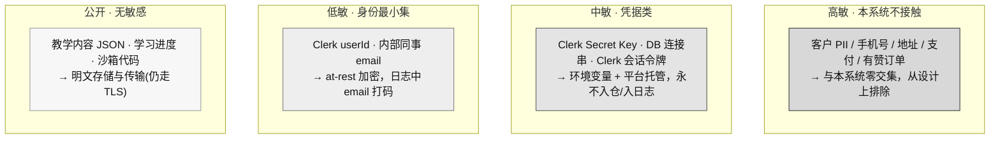
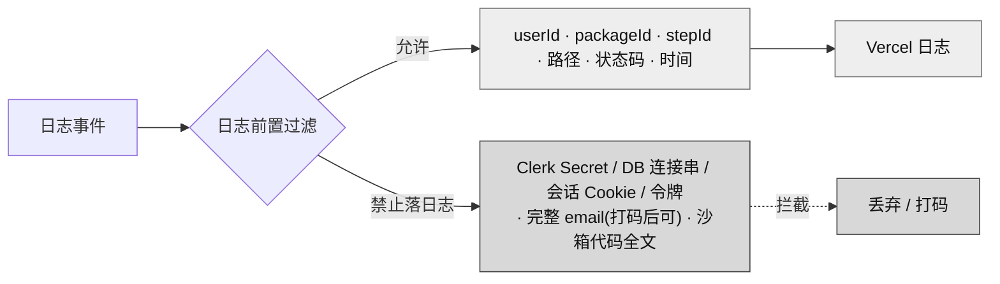
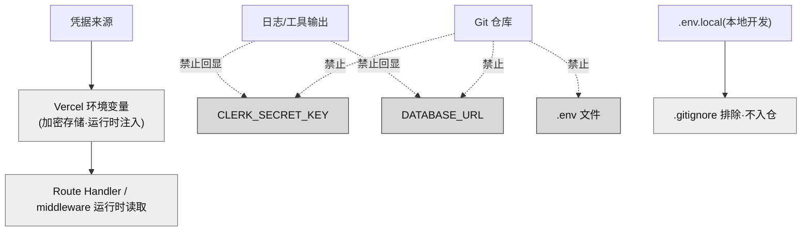

# 安全设计

> 阶段③设计 · 资深安全设计专家产出。上游唯一真源：`00-系统设计总览.md`、`01-architecture.md`（技术基线 §九）、原型 specs（`02-原型-v2/specs/`）、`99-会议与决策/`。
> 产品：**互动式技术教程平台（ITTP）**——内容与引擎分离、以 JSON 配置（`TutorialPackage`）驱动的「左讲解 + 右可运行 Sandpack 沙箱」内部自用自主学习工具。
> 部署：**Vercel 公有云**，内部自用，**无信创 / 无内网 / 无专网 / 无等保定级 / 无数据不出域**。本维度设计严格遵循此合规基线，**下游禁止套用政企内网安全模板**。

---

## 一、安全设计总纲与威胁边界

### 1.1 定位：一个「低敏感、公有云、客户端计算」的内部教具

安全设计的第一性原理必须匹配系统真实画像，否则就是过度设计（违反简洁守则「删 > 加」）：

| 事实 | 对安全设计的含义 |
|---|---|
| **内部自用**，用户是单人/小团队同事 | 无外部攻击者动机，威胁模型以「误操作 / 越权看他人进度 / 依赖投毒」为主，**不是**对抗有组织攻击 |
| **数据低敏感**：仅 `users`（Clerk 托管身份）+ `learning_progress`（断点+完成步骤集合） | **无客户 PII、无支付、无业务机密**；进度数据泄露的最坏后果是「别人知道我 React 学到第几步」，属可接受 |
| **计算重心在客户端**：Sandpack 浏览器内 bundler 运行任意代码 | **最大攻击面在浏览器沙箱侧**（代码执行、iframe 逃逸、依赖投毒），而非服务端 |
| **服务端只做**：页面渲染 + 内容只读 + 进度读写 | 服务端攻击面窄：无文件上传、无代码执行、无复杂查询；主风险是**进度接口水平越权（IDOR）** |
| **内容为可信真源**：`TutorialPackage` JSON 随仓库/构建产物，经 PR 走查入库 | 内容注入风险由**代码评审 + 构建期 zod 校验**前置拦截，运行时不接受匿名用户投稿内容 |
| **无等保 / 无信创 / 数据可出域** | 不做国密算法、不做数据不出域、不做三级等保测评；用平台（Vercel/Clerk/Postgres）默认 TLS 与托管安全能力即满足 |

### 1.2 安全目标（按优先级）

### 1.3 信任边界拓扑

**三条信任边界**：
1. **沙箱 iframe ↔ 宿主页面**：最关键边界。iframe 内运行的代码不可信（用户可任意编辑），必须靠浏览器 `sandbox` 属性 + 跨源隔离，使其无法读取宿主页的会话 Cookie、无法调用本站接口。
2. **浏览器 ↔ 服务端**：全程 HTTPS；进度写操作必须在服务端重新鉴权，**绝不信任客户端传来的 `userId`**。
3. **内容 JSON ↔ 引擎**：内容虽随仓库属「可信」，但仍经 Package Loader 的 zod 校验作为唯一入口收敛，防止畸形配置导致渲染层异常。

---

## 二、身份认证与会话管理

### 2.1 认证模型：Clerk 托管身份，内容匿名 / 进度须登录

严格遵循技术基线：**Clerk 托管身份（MVP/Q5），`userId` 为进度归属主体；`middleware.ts` 保护进度接口，内容接口可匿名**。自建用户体系被 D-G 明确否决。

| 资源 | 认证要求 | 理由 |
|---|---|---|
| 页面：主题库 / 学习工作台 / 沙箱 | **匿名可访问** | 教学内容对内部同事无秘密，登录墙徒增摩擦，违背「打开即学、不拦人」 |
| `GET /api/packages/*`（内容只读） | **匿名可访问** | 内容是公开教材，无鉴权价值 |
| `GET /api/progress`（读自己进度） | **须登录** | 进度归属 `userId`，须先确定「你是谁」 |
| `PUT /api/progress`（写自己进度） | **须登录** | 同上，且写操作需防越权改他人 |
| 未来任何「他人进度 / 全站统计」 | **不提供**（learning-progress spec §0 明确：进度不对外暴露、不导出、不分析） | 无此需求即不建接口，攻击面归零 |

### 2.2 会话机制：完全委托 Clerk

- **会话载体**：Clerk 签发的会话 Cookie（`HttpOnly` + `Secure` + `SameSite`，由 Clerk 默认配置保证），前端 JS 读不到会话令牌。
- **会话校验**：`middleware.ts` 用 Clerk `auth()` 在边缘/服务端校验会话，**不自建 JWT 解析、不自建刷新逻辑**——托管即最省，也最不容易写错。
- **登出 / 过期**：Clerk 托管；会话过期后访问受保护接口返回 401，前端引导重新登录，进度不丢（已在 DB）。
- **原型期 → MVP 差异**：原型期 **无 Clerk、无登录**，进度只在 `localStorage`（learning-progress spec §范围边界）；引入 Clerk 是 MVP 一次性动作，**不做原型 localStorage 与 DB 的长期双写垫片**（D-F）。

### 2.3 受保护接口的认证时序

**认证设计红线**：
- `userId` **只能**来自 Clerk 会话（`auth().userId`），**永不**来自请求体 / 查询参数 / 请求头。这是杜绝水平越权的单点。
- Route Handler 内所有对 `learning_progress` 的读写，`WHERE` 条件**强制**带 `user_id = auth.userId`，无例外分支。

---

## 三、权限模型（RBAC 与数据权限）

### 3.1 角色模型：极简，两个隐式角色

内部工具无复杂组织结构，RBAC 保持最小（三问自检：不做会怎样？→ 无影响；以后好加吗？→ Clerk 支持角色，需要时再加）：

| 角色 | 来源 | 能力 | 说明 |
|---|---|---|---|
| **匿名访客** | 无会话 | 浏览全部教学内容、使用沙箱运行代码 | 内容公开，沙箱是客户端本地计算，无需身份 |
| **登录学习者** | Clerk 会话 | 匿名的一切 + 读写**自己的**进度 | MVP 唯一需要鉴权的角色 |
| ~~管理员 / 内容运营角色~~ | — | **不设** | 内容经 Git PR 维护而非后台 CMS（D-C）；进度不做后台分析（spec §0）。无管理界面即无需管理员角色 |

> 结论：**不引入 RBAC 框架 / 权限表 / 角色表**。角色差异仅体现为「接口是否被 `middleware.ts` 保护」这一布尔判断，落在 `middleware.ts` 的 matcher 配置里。任何提「加个权限管理模块」的需求须**显式立项**（简洁守则）。

### 3.2 数据权限：以 `userId` 为唯一水平隔离维度

进度数据的权限模型是「**行级归属**」——每条 `learning_progress` 归属一个 `userId`，任何用户只能触达 `user_id = 自己会话 userId` 的行。

**数据权限规则表**：

| 操作 | SQL 归属约束 | 越权防护 |
|---|---|---|
| 读进度 `GET /api/progress?packageId=react` | `SELECT ... WHERE user_id = auth.userId AND package_id = ?` | 无 `user_id` 自由查询入口，无法传别人 id |
| 写进度 `PUT /api/progress` | `INSERT ... ON CONFLICT(user_id, package_id) DO UPDATE` 且 `user_id = auth.userId` | `user_id` 由服务端注入，冲突键含 `user_id`，改不到他人行 |
| 唯一约束 | `UNIQUE(user_id, package_id)`（单用户单主题一条断点，对齐 spec） | 防重复行、防串行覆盖歧义 |
| 删除 / 重置进度（对齐 F9「从头开始」） | MVP 语义为「清空自己该 package 的 completed 集合」，仍带 `user_id = auth.userId` | 重置只作用于本人本主题 |

> **内容侧无数据权限概念**：`TutorialPackage` 全站共享只读，不存在「某用户能看某主题、不能看某主题」的分级需求，不做内容 ACL（无场景，不加）。

---

## 四、传输与存储加密

### 4.1 传输加密：全链路 TLS，由平台托管

| 链路 | 加密 | 谁保证 |
|---|---|---|
| 浏览器 ↔ Vercel（页面 + `/api/*`） | **HTTPS / TLS 1.2+**，HSTS | Vercel 平台默认强制，自动签发/续期证书 |
| Route Handler ↔ PostgreSQL | **TLS**（Vercel Postgres / Neon 连接串带 `sslmode=require`） | 连接串配置，Drizzle 透传 |
| 服务端 ↔ Clerk API | **HTTPS** | Clerk SDK 默认 |
| 浏览器 ↔ Sandpack 依赖 CDN | **HTTPS** | Sandpack / CDN 默认 |

- **强制项**：DB 连接串必须 `sslmode=require`（禁止明文连库）；生产禁用任何 `http://` 回退。
- **不做**：无国密 SM2/SM3/SM4（无信创要求）；无自建 mTLS / 双向证书（单体同源部署，无跨服务内网调用，无场景）。

### 4.2 存储加密：低敏感数据 + 平台静态加密即足够

| 数据 | 存储位置 | 加密策略 | 理由 |
|---|---|---|---|
| `users`（Clerk userId、email） | PostgreSQL | **平台静态加密（at-rest）**，不做字段级加密 | email 是内部同事工作邮箱，非高敏 PII；字段级加密对低敏数据是过度设计 |
| `learning_progress`（断点、完成集合） | PostgreSQL | 同上，明文列 | 进度非机密，无脱敏/加密必要 |
| 会话令牌 | Clerk 托管（不落本系统库） | 由 Clerk 加密管理 | 本系统不持有、不存储会话密钥材料 |
| 原型期进度 | 浏览器 `localStorage` | **不加密**（本地明文） | 单机原型级记忆，威胁模型不含本地攻击者（spec §3.5 已接受清缓存丢失） |
| 密钥 / 连接串 | Vercel 环境变量（加密存储） | 平台加密 + 运行时注入 | 见 §八 |

> **明确不做**：不落库客户 PII（本系统根本不接触）、不存支付信息、不缓存敏感数据到 Redis（无 Redis）。存储加密止步于「平台 at-rest 加密」，符合低敏内部工具画像。

---

## 五、敏感数据与脱敏

### 5.1 数据敏感度分级

### 5.2 脱敏规则（仅针对唯一的低敏字段 email）

| 场景 | 处理 |
|---|---|
| 应用日志 / 错误上报 | 只记 `userId`（`user_2abc...`，本身即不可逆标识），**不记 email**；确需关联时 email 打码为 `d***@example.com` |
| 前端展示 | Clerk 组件展示登录者本人信息即可，**不展示他人 email/进度**（无此界面） |
| 数据库导出 / 调试 | 内部工具无对外导出需求（spec §0：进度不导出）；开发调试查库遵守全局规则「PII 不回显到工具输出」 |
| Clerk userId | 视为不可逆技术标识，**不视作需脱敏的 PII**，可正常用于日志关联 |

> **不做**：无需建「脱敏中间件 / 数据分类打标系统」——敏感字段只有 email 一个，一条打码约定即覆盖，建系统属过度设计。

---

## 六、操作审计与日志留痕

### 6.1 审计定位：最小留痕，够排障即止

内部工具、无合规审计义务（无等保、无对外交付），审计目标是**排障与异常回溯**，不是合规取证：

| 审计事件 | 记录内容 | 载体 | 保留 |
|---|---|---|---|
| 进度写入 `PUT /api/progress` | `userId`、`packageId`、`currentStepId`、时间戳、结果码 | Vercel 运行日志（`console` 结构化输出） | Vercel 平台默认保留期 |
| 认证失败（401） | 命中路径、时间戳（**不记令牌、不记会话内容**） | Vercel 日志 | 同上 |
| Package Loader 校验失败 | `packageId`、zod 错误摘要（哪个字段非法） | Vercel 日志 + 构建期 CI 输出 | 同上 |
| 服务端异常（5xx） | 错误堆栈（脱敏后）、路由 | Vercel 日志 | 同上 |
| **不审计** | 匿名内容浏览、沙箱运行/看答案（纯客户端行为，无服务端痕迹且无审计价值） | — | — |

### 6.2 日志安全红线

- **绝不回显 / 落日志**：任何密钥、令牌、会话 Cookie、DB 连接串（对齐全局规则「跑命令不回显密钥」）。
- **不建独立审计库**：无 SIEM、无独立 audit 表——Vercel 平台日志即满足内部排障，独立审计设施是过度设计。若未来有合规需求再显式立项。

---

## 七、攻击面与防护

### 7.1 攻击面全景与防护矩阵

```mermaid
graph TD
    subgraph Client["客户端攻击面（主战场）"]
        A1["沙箱任意代码执行"]
        A2["沙箱依赖投毒（供应链）"]
        A3["宿主页 XSS（内容渲染）"]
    end
    subgraph Server["服务端攻击面（窄）"]
        A4["进度接口水平越权 IDOR"]
        A5["SQL 注入"]
        A6["畸形内容配置注入"]
        A7["接口滥用 / DoS"]
    end
    subgraph Supply["供应链 / 凭据"]
        A8["密钥泄露"]
        A9["npm 依赖漏洞"]
    end

    A1 --> D1["iframe sandbox 属性 + 跨源隔离<br/>Sandpack 默认隔离预览"]
    A2 --> D2["dependencies 白名单来自可信 JSON<br/>非用户自由输入包名"]
    A3 --> D3["内容可信(仓库+PR) · MDX 组件白名单<br/>不渲染匿名用户内容 · CSP"]
    A4 --> D4["userId 只源于 Clerk 会话<br/>SQL 强制 user_id 归属"]
    A5 --> D5["Drizzle 参数化查询<br/>零字符串拼接 SQL"]
    A6 --> D6["Package Loader zod 唯一入口校验"]
    A7 --> D7["Vercel 边缘限流 + Clerk 登录墙<br/>内部低并发无需专门 WAF"]
    A8 --> D8["Vercel 环境变量 · 不入仓 · 轮换"]
    A9 --> D9["Dependabot/CI 审计 · 锁版本"]

    classDef atk fill:#dcdcdc,stroke:#444,color:#111
    classDef def fill:#f4f4f4,stroke:#666,color:#111
    class A1,A2,A3,A4,A5,A6,A7,A8,A9 atk
    class D1,D2,D3,D4,D5,D6,D7,D8,D9 def
```

### 7.2 沙箱代码执行隔离（本系统最大攻击面）

Sandpack 在浏览器内 bundle 并在 **iframe 预览区**运行任意用户可编辑的代码——这是本系统独有且最需重视的攻击面。防护依赖浏览器隔离而非服务端：

| 威胁 | 场景 | 防护 |
|---|---|---|
| 预览代码窃取宿主页会话 | 用户/答案代码里写 `document.cookie` 想读会话 | 预览 iframe 与宿主页**跨源 / `sandbox` 属性隔离**，读不到宿主 `HttpOnly` 会话 Cookie；Sandpack 预览默认在隔离 iframe 运行 |
| 预览代码打本站接口越权 | iframe 内 `fetch('/api/progress')` 冒用会话 | iframe 跨源 → 无同源 Cookie 携带；即便请求也无有效会话，落到 401 |
| 预览代码劫持宿主页 DOM/键盘 | 试图操纵父页面 | `sandbox` 无 `allow-top-navigation`、无 `allow-same-origin`（与宿主同源时才危险），限制 iframe 能力集 |
| 恶意 `postMessage` 注入宿主 | iframe 向父页发消息篡改状态 | 宿主监听 `message` 时**校验 `event.origin`**，只接受 Sandpack 预期源；忽略未知源消息 |
| 死循环 / 内存耗尽 | 代码 `while(true)` 卡死 | 影响仅限该 iframe 与本机浏览器标签页，**不影响服务端**；用户刷新/切步即恢复（沙箱切步完整替换文件，spec §业务规则2/5） |

> 关键结论：因用户代码**只在自己浏览器里跑、不上服务端**（服务端不打包，D-D），代码执行风险被天然约束在「用户害自己的浏览器标签页」范围内，不构成对平台或他人的威胁。防护重点是**确保 iframe 拿不到宿主会话与本站有效凭据**。

### 7.3 注入类防护

| 注入类型 | 本系统是否存在通道 | 防护 |
|---|---|---|
| **SQL 注入** | `/api/progress` 拼 SQL | **Drizzle ORM 参数化查询**，全程无字符串拼接 SQL；`packageId`/`stepId` 均作为绑定参数，不进入 SQL 文本 |
| **XSS（存储型）** | 内容 JSON 的 `description`(MDX) 渲染进宿主页 | 内容为**可信真源**（仓库 + PR 走查，非匿名投稿）；MDX 渲染走**组件白名单**，不允许内容注入任意 `<script>`/事件处理器；配合 CSP 兜底 |
| **XSS（反射型）** | 查询参数回显 | React 默认转义；不使用 `dangerouslySetInnerHTML` 渲染未净化内容 |
| **配置注入 / 原型污染** | 畸形 `TutorialPackage` JSON | **Package Loader zod 唯一入口**：严格 schema，未知字段拒绝/剥离；`files`/`solution` 值须为 string，非法则保留上一步状态并告警（对齐 code-sandbox spec §6） |
| **路径穿越** | `/api/packages/[id]` 读 JSON 文件 | `id` 经 zod 白名单校验（`^[a-z0-9-]+$`），**禁止 `../`**；内容为构建产物按 id 映射，不做用户可控文件系统路径拼接 |
| **命令注入** | 无（服务端不执行代码/shell） | 攻击面不存在 |
| **文件上传** | **无上传功能** | 内部工具无上传需求（内容走 Git，非用户上传），攻击面从设计上归零 |

### 7.4 内容安全策略（CSP）

针对「宿主页 XSS + 沙箱 iframe 隔离」，配置 CSP（Next.js `next.config` / 响应头）：

| 指令 | 值（示意） | 目的 |
|---|---|---|
| `default-src` | `'self'` | 默认只信本源 |
| `frame-src` | Sandpack 预览源（如 `*.codesandbox.io` / `csb.app`） | 仅允许沙箱预览 iframe，白名单外 iframe 拒绝 |
| `connect-src` | `'self'` + Clerk 域 + Postgres 无（服务端调） + Sandpack CDN | 限制前端可发起请求的目标 |
| `script-src` | `'self'` + Clerk + 必要 Sandpack | 收敛脚本源；生产避免 `unsafe-inline`（Next 支持 nonce） |
| `object-src` | `'none'` | 禁插件 |
| `frame-ancestors` | `'self'` | 防本站被第三方 iframe 嵌套（点击劫持） |

> CSP 需与 Sandpack/Clerk 实际域名联调（二者均需若干外域）；原则是**先按 Sandpack/Clerk 官方最小域名集放行，其余默认拒绝**，不图省事写 `*`。

### 7.5 接口滥用与 DoS

| 面向 | 结论 |
|---|---|
| 高并发 DoS | 内部工具并发个位数~两位数（nfrDrivers），**不做专门 WAF / 限流中间件**；Vercel 边缘天然抗突发，够用 |
| 进度接口刷写 | 受 Clerk 登录墙保护，非匿名可刷；写量小、幂等 UPSERT，无放大效应 |
| 内容接口爬取 | 内容本就是公开教材，被内部同事「爬」无损失，不设防 |

---

## 八、密钥与凭据管理

### 8.1 凭据清单与存放

严格遵循全局规则「凭据不裸贴对话、写脚本让服务读」与「不 commit `.env`」：

| 凭据 | 用途 | 存放 | 暴露面 |
|---|---|---|---|
| `CLERK_SECRET_KEY` | 服务端校验会话 | **Vercel 环境变量（Production/Preview 分环境）** | 仅服务端运行时可读 |
| `NEXT_PUBLIC_CLERK_PUBLISHABLE_KEY` | 前端 Clerk SDK | 环境变量（`NEXT_PUBLIC_` 前缀，**设计上即公开**） | 可公开，无秘密价值 |
| `DATABASE_URL`（含密码，`sslmode=require`） | Drizzle 连库 | Vercel 环境变量 | 仅服务端可读 |
| Clerk Webhook Secret（如启用） | 校验 Clerk 回调签名 | Vercel 环境变量 | 仅服务端 |

### 8.2 凭据管理红线

| 规则 | 落地 |
|---|---|
| 密钥**不入仓** | `.env*` 全部进 `.gitignore`；仓库仅留 `.env.example`（键名占位、无值） |
| 密钥**不回显** | 日志、CI 输出、终端均不打印 Secret（对齐全局规则） |
| 分环境隔离 | Vercel Production / Preview / Development 各自独立密钥；Preview 不复用生产库 |
| 泄露即轮换 | 一旦密钥出现在日志/仓库/对话，立即在 Clerk / 数据库控制台**撤销并重签**（对齐全局规则「看到泄露 token → 提醒立刻撤销」） |
| 最小权限连库 | DB 账号仅授予应用所需 DML 权限，不用超级用户连生产库 |
| 依赖供应链 | `package-lock`/lockfile 锁版本；CI 跑 `npm audit` / Dependabot；Sandpack 拉取的示例依赖仅在**用户浏览器 iframe**内，不污染服务端 |

---

## 九、等保 / 合规基线（如实记录 · 反误套声明）

> ⚠️ 本节是**防止下游误套政企模板**的显式声明，与典型信创/等保项目**相反**。

| 合规项 | 本系统结论 | 依据 |
|---|---|---|
| 等级保护定级测评 | **不适用 / 不做** | 内部自用工具、无对外交付、公有云，无定级义务（techConstraints） |
| 信创 / 国产化替代 | **不适用** | 选型锁定 Next.js/React/Postgres/Clerk/Vercel，无国产化要求 |
| 数据不出域 / 数据本地化 | **不适用** | 部署于 Vercel 公有云，数据可出域；无此限制 |
| 内网 / 专网 / 物理隔离 | **不适用** | 公网 SaaS 形态 |
| 国密算法（SM2/3/4） | **不做** | 用平台标准 TLS / at-rest 加密即满足 |
| 个人信息保护（PIPL 视角） | **最小适用**：仅内部同事 email + userId，遵循最小收集、内部使用、不对外共享 | 无客户 PII、无对外数据流转 |
| 流程规范 | 按 **§3.4 简化流程**，Owner 即定义者，无独立评审对象 | techConstraints |

**一句话基线**：本系统安全设计以「**低敏内部工具 + 公有云托管安全能力**」为坐标，**不引入等保/信创/内网任何合规设施**；安全投入集中在 §七 的真实攻击面（沙箱隔离、IDOR、注入、密钥）。

---

## 十、安全需求 → 落点对照（可验收）

| # | 安全需求 | 落点 | 验收方式 |
|---|---|---|---|
| SEC-1 | 进度不可水平越权 | `middleware.ts` + Route Handler `WHERE user_id = auth.userId` | 用 A 会话请求携带 B 的 packageId/构造 userId，只能读写自己数据；自动化测试覆盖 |
| SEC-2 | `userId` 只源于会话 | Route Handler 忽略请求体 userId | 代码评审 + 测试：请求体塞入他人 userId 无效 |
| SEC-3 | 沙箱不触达宿主会话 | iframe 跨源 / sandbox 属性 + `postMessage` origin 校验 | 在沙箱内写 `document.cookie`/`fetch('/api/progress')` 验证拿不到会话、落 401 |
| SEC-4 | 无 SQL 注入 | Drizzle 参数化 | 静态扫描无字符串拼接 SQL；注入用例测试 |
| SEC-5 | 内容配置须过 zod | Package Loader 唯一入口 | 畸形 JSON 被拒并告警，不崩渲染层 |
| SEC-6 | 全链路 TLS | Vercel HTTPS + `sslmode=require` | 生产无 http 回退；连库强制 SSL |
| SEC-7 | 密钥不入仓不回显 | `.gitignore` + 环境变量 | 仓库扫描无 Secret；CI secret-scan 通过 |
| SEC-8 | CSP 生效 | 响应头 CSP + frame-src 白名单 | 浏览器 CSP 报告无违规；白名单外资源被拦 |
| SEC-9 | 路径穿越防护 | `packageId` zod 白名单正则 | `../` 类输入被拒 |
| SEC-10 | 合规基线不误套 | 本文档 §九显式声明 | 评审确认无等保/信创/内网设施混入 |

---

## 十一、刻意不做（简洁守则 · 防下游顺手加）

| 不做项 | 理由 |
|---|---|
| RBAC 权限框架 / 角色表 / 权限表 | 仅两个隐式角色（匿名/学习者），一个布尔（接口是否保护）即覆盖 |
| 独立审计库 / SIEM | Vercel 平台日志满足内部排障；无合规取证义务 |
| 字段级 / 应用层加密 | 数据低敏（无 PII/无支付），at-rest 加密足够 |
| WAF / 专用限流中间件 | 内部低并发 + Clerk 登录墙；Vercel 边缘够用 |
| 国密 / mTLS / 数据不出域 | 无信创/无内网/无等保要求（§九） |
| 文件上传扫描 / 防病毒 | 无上传功能 |
| 服务端沙箱 / 代码执行隔离容器 | 代码只在客户端 iframe 跑，服务端不打包（D-D） |
| 原型 localStorage 与 DB 双写安全垫片 | MVP 一次切换，不留半吊子（D-F） |

> 以上任一项若未来出现真实场景，须**显式立项、拿 Owner 批准**后再加，禁止前端顺手加 / 后端被动兜（全局简洁守则）。
