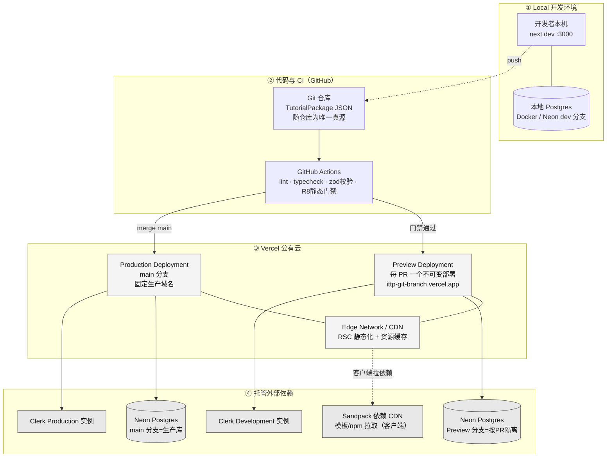
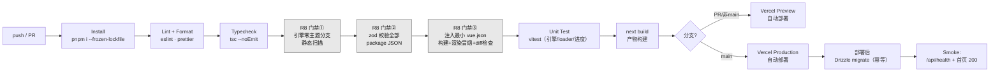
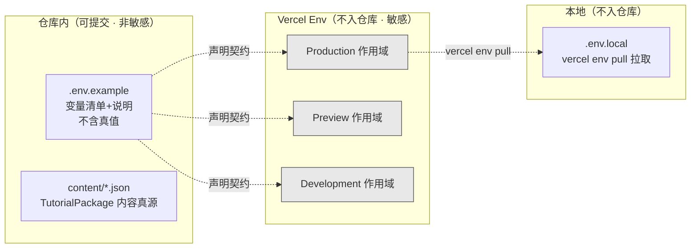
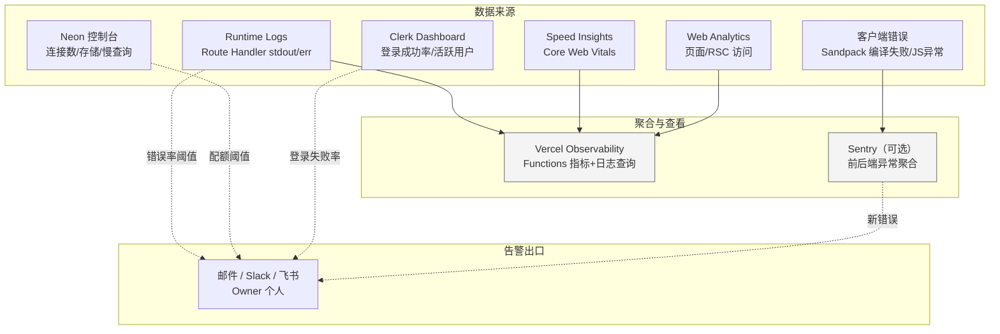
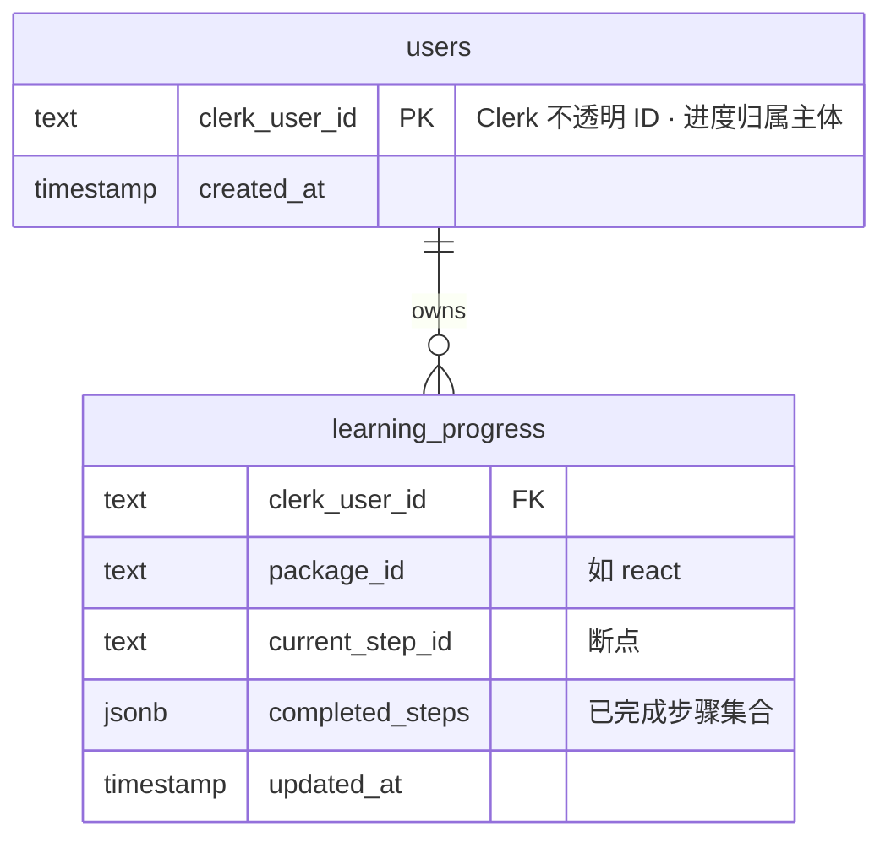
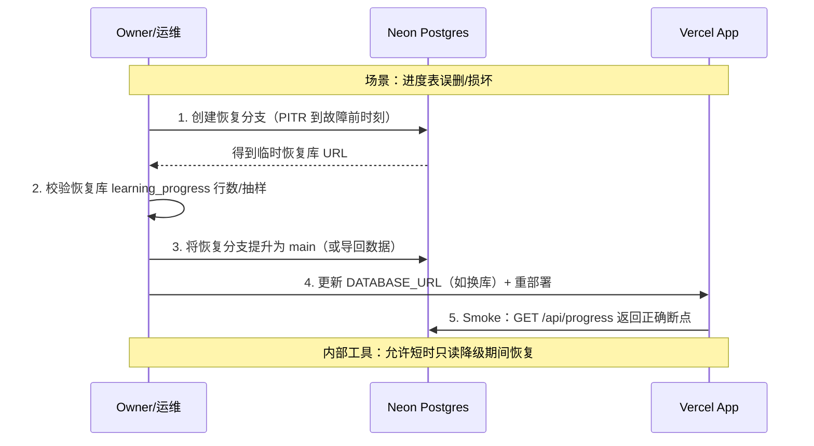
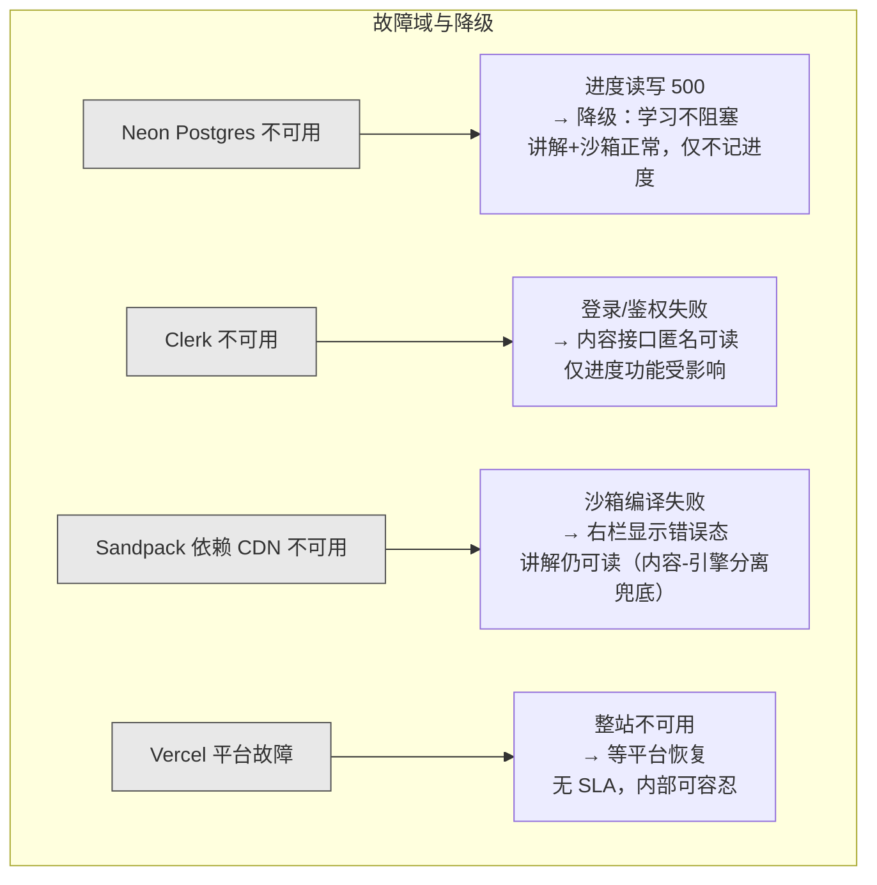
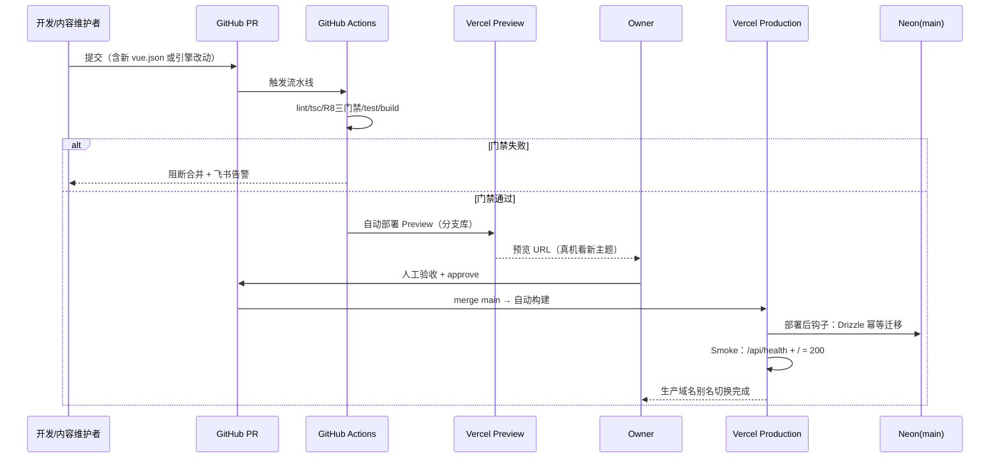
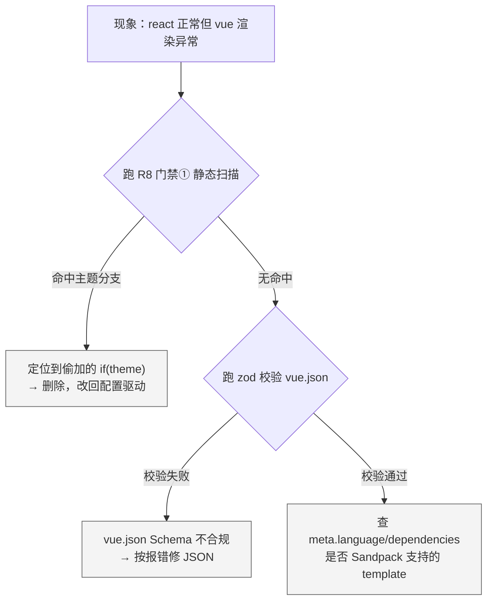

# 运维与部署设计

> 阶段③设计 · SRE/运维产出。上游唯一真源：`01-architecture.md`（技术基线 §九）、`00-系统设计总览.md`、原型 specs（`02-原型-v2/specs/`）。
> 产品：**互动式技术教程平台（ITTP）**——内容与引擎分离、以 `TutorialPackage` JSON 驱动的「左讲解 + 右可运行 Sandpack 沙箱」内部自用自主学习工具。
> 合规如实记录：**公有云 Vercel、内部自用、无信创 / 无内网 / 无专网 / 无等保定级 / 无数据不出域**。本维度**禁止套用政企内网 / 国产化运维模板**（无堡垒机、无内网镜像仓库、无离线部署包、无双机热备柜）。

---

## 〇、运维总纲：按内部小工具的真实体量收敛

本系统是**单人 / 小团队内部教具**（并发个位数~两位数、无 SLA 硬约束、进度数据量可忽略），运维设计的第一性原理是 **「省」而非「稳到极致」**——不引入任何与体量不匹配的运维基础设施。

| 决策 | 结论 | 依据（简洁守则「删 > 加」） |
|---|---|---|
| 是否自建监控栈（Prometheus/Grafana/ELK） | **否**，用 Vercel 平台自带 Observability + Analytics | 并发极低，自建可观测性栈的运维成本 >> 收益 |
| 是否自建日志聚合（ELK/Loki） | **否**，用 Vercel Runtime Logs + Drain（可选） | 服务端逻辑仅进度读写，日志量极小 |
| 是否要多区域 / 多活容灾 | **否**，Vercel 单项目默认多 Region Edge 即足够 | 无 SLA、内部工具，进度短时不可用可接受 |
| 是否要蓝绿 / 金丝雀发布系统 | **否**，用 Vercel 原生 Immutable Deployment + Instant Rollback | 平台原生能力已覆盖，自建发布系统是过度设计 |
| 是否要 APM / 分布式链路（Jaeger/SkyWalking） | **否**，单体单进程无跨服务调用，无链路可追 | 无微服务，「链路」退化为单请求 Trace，用 Vercel Trace 即可 |
| 运维的**真正重点** | **① CI 上守住 R8 门禁；② DB 备份可恢复；③ 三个托管依赖的健康与配额** | R8 是成败判据；进度是唯一有状态数据；外部依赖是唯一真实故障面 |

> 一句话运维哲学：**代码打包在客户端（Vercel 零编译压力），状态只有一张进度表，故障面几乎全在三个托管外部服务（Vercel / Neon-Postgres / Clerk / Sandpack CDN）。运维就是盯住这几个依赖 + 守住 CI 门禁。**

---

## 一、环境划分与部署架构

### 1.1 环境矩阵

内部工具**三环境足矣**，全部构建在 Vercel 原生环境模型（Production / Preview / Development）之上，不自建环境。

| 环境 | 载体 | 触发方式 | 数据库 | Clerk 实例 | 用途 | 域名 |
|---|---|---|---|---|---|---|
| **Local（本地开发）** | `next dev` | 开发者本机 | 本地 Postgres（Docker）或 Neon dev 分支 | Clerk Development 实例 | 日常开发、原型期 localStorage 调试 | `localhost:3000` |
| **Preview（预览）** | Vercel Preview Deployment | 每个 PR / 非 main 分支 push **自动** | Neon **Preview 分支**（按分支隔离） | Clerk Development 实例 | PR 评审、内容维护者预览新 `*.json` 主题效果 | `ittp-git-<branch>.vercel.app`（自动） |
| **Production（生产）** | Vercel Production Deployment | merge 到 `main` **自动** | Neon **main 分支**（生产库） | Clerk **Production 实例** | 学习者实际使用 | 固定生产域名（如 `ittp.internal.vercel.app`） |

**关键点**：
- Preview 环境的**核心价值**是让内容维护者在合并前**真机预览一个新 `vue.json` 主题**——这正是 R8「新增 JSON」工作流的验收现场。
- Preview 用 **Neon 数据库分支**（`git branch` 式的库分叉），进度写入不污染生产库，PR 关闭自动回收。
- 无 Staging/UAT/预生产等额外环境——内部工具无对外交付合同，按流程规范 §3.4 走简化流程，Preview 即承担「合并前验证」职责。

### 1.2 部署架构（环境视角拓扑）



### 1.3 单一部署单元原则

整个应用是**一个 Vercel 项目**（Next.js 15 单体）：前端、SSR/RSC、Route Handler（`/api/packages`、`/api/progress`）、`middleware.ts`（Clerk 鉴权）**同源同部署**，无跨服务网络调用。故不存在「多服务编排 / 服务发现 / 服务间证书」等运维项——这些在分层单体里根本不产生。

---

## 二、CI/CD 流水线

### 2.1 流水线总览

CI 的**灵魂是守住 R8**（引擎零主题分支 + 新增 JSON 零改动 + Schema 契约）。这是成败判据的物理落点，**不是可选质量项**，任何一条不过直接 fail、禁止合并。



### 2.2 CI 阶段职责

| 阶段 | 工具 | 通过判据 | 失败即 |
|---|---|---|---|
| Install | `pnpm i --frozen-lockfile` | lockfile 一致、无幽灵依赖 | fail |
| Lint / Format | ESLint + Prettier | 0 error | fail |
| Typecheck | `tsc --noEmit` | 0 类型错误（含 `TutorialPackage` 类型即 R8 契约） | fail |
| **R8 门禁① 零主题分支** | 自研静态扫描脚本 | 扫 `lib/engine/**`、`components/**` 命中 `/\b(react\|vue\|vanilla)\b/` 主题字面量分支 = **0** | **fail** |
| **R8 门禁② Schema 契约** | zod 批量校验 `content/**/*.json` | 全部 package 通过 `TutorialPackageSchema` | **fail** |
| **R8 门禁③ 新增 JSON 零改动** | fixture `vue.min.json` + build 冒烟 | 放入最小 vue.json → 构建通过 + 主题可渲染 + `git diff` 仅新增 JSON（**无 `.ts/.tsx` 改动**） | **fail** |
| Unit Test | Vitest | Loader/引擎遍历/进度读写用例全绿 | fail |
| Build | `next build` | 产物构建成功 | fail |
| Migrate | Drizzle Kit（部署后钩子） | 幂等迁移执行成功（可重复跑） | 告警 + 阻断放量 |
| Smoke | 部署后 curl | `/api/health`、`/` 返回 200 | 触发回滚决策 |

### 2.3 R8 门禁① 静态扫描器（可指导实现）

这是 R8 从「口头承诺」变为「CI 可验收」的关键脚本，须真实落地：

```
# scripts/check-no-theme-branch.ts（伪代码骨架）
扫描目录 = ["lib/engine", "components"]
禁止模式 = [
  /\bif\s*\(\s*[^)]*\b(theme|language)\b[^)]*===\s*['"](react|vue|vanilla)['"]/,
  /\bswitch\s*\(\s*[^)]*\b(theme|language)\b/,
  /\b(react|vue|vanilla)['"]\s*:\s*/  // 主题字面量做 key 的 map 分支
]
命中 => 打印 file:line + 违规片段 => exit 1
命中数 = 0 => exit 0
```

> 白名单：`meta.language` 作为**数据字段读取**（`template={pkg.meta.language}`）是允许的；被禁止的是**用主题名做代码控制流分支**。扫描器须区分「读数据」与「写分支」，避免误杀。

### 2.4 部署策略

| 项 | 采用 | 说明 |
|---|---|---|
| 部署模型 | **Vercel Immutable Deployment** | 每次构建产出不可变部署，各有唯一 URL；生产域名是「别名指针」指向某个不可变部署 |
| 发布方式 | **原子别名切换** | main 构建成功 → 生产域名别名瞬间指向新部署，无半上线态 |
| 灰度 | **不做金丝雀**（体量不匹配） | 内部工具、并发个位数，全量切换即可；如需谨慎则先在 Preview 人工验收 |
| 数据库迁移 | **幂等 Drizzle 迁移，向前兼容** | 迁移须 `CREATE TABLE IF NOT EXISTS` + 容错 ALTER，可重复跑；先加列不删列，配合部署顺序避免破坏旧部署 |

---

## 三、配置管理

### 3.1 配置来源与优先级

**所有敏感配置走 Vercel Environment Variables**（按 Production / Preview / Development 三作用域隔离），**严禁**将密钥写入仓库或 `TutorialPackage` JSON。



### 3.2 环境变量清单

| 变量 | 作用域 | 敏感 | 说明 |
|---|---|---|---|
| `DATABASE_URL` | 全部（值不同） | 是 | Neon Postgres 连接串；Production=main 分支，Preview=分支库，Local=本地/dev |
| `DATABASE_URL_UNPOOLED` | 全部 | 是 | Drizzle 迁移用的直连（非 pooler）连接串 |
| `NEXT_PUBLIC_CLERK_PUBLISHABLE_KEY` | 全部 | 否（公开 key） | Clerk 前端可发布 key；Prod/Preview 用不同实例 |
| `CLERK_SECRET_KEY` | 全部（值不同） | 是 | Clerk 服务端密钥；Production 用 Production 实例密钥 |
| `NEXT_PUBLIC_APP_ENV` | 全部 | 否 | `production` / `preview` / `development`，前端环境标识 |
| `SENTRY_DSN`（可选） | Production | 否 | 若启用错误上报 |

**约束**：
- 内容-引擎分离硬约束下，**主题差异只能进 `TutorialPackage` JSON**，**绝不进环境变量**。环境变量只承载基础设施凭据，不承载业务/主题配置——防止 R8 出现「第二条注入主题信息的通道」。
- 密钥轮换：Clerk / Neon 密钥在各自平台轮换后，同步更新 Vercel Env 并触发一次重新部署即生效（无需改代码）。
- 本地开发用 `vercel env pull .env.local` 同步，禁止手抄密钥。

---

## 四、监控与告警（指标 / 日志 / 链路）

### 4.1 可观测性总策略

**不自建监控栈**，全部复用 Vercel 平台原生能力 + 托管依赖自带面板。内部工具的可观测性目标是**「出事能看到、能定位」**，不是「全链路 APM」。



### 4.2 指标（Metrics）

| 类别 | 指标 | 来源 | 关注阈值（内部工具宽松） |
|---|---|---|---|
| **可用性** | 生产域名首页 / `/api/health` HTTP 200 率 | Vercel + 外部 uptime（可选 UptimeRobot 免费） | 连续 3 次探测失败告警 |
| **接口** | `/api/progress` P95 延迟、5xx 率 | Vercel Functions 指标 | 5xx 率 > 1% 告警 |
| **前端体验** | LCP / INP / CLS（Core Web Vitals） | Vercel Speed Insights | LCP > 2.5s 关注（沙箱页可放宽） |
| **数据库** | 连接数、存储用量、慢查询 | Neon 控制台 | 免费额度 80% 告警 |
| **鉴权** | 登录成功率、活跃用户 | Clerk Dashboard | 登录失败率异常升高告警 |
| **客户端沙箱** | Sandpack bundler 初始化失败率、依赖 CDN 拉取失败 | 客户端埋点 → Sentry（可选） | 失败率突增关注 |
| **配额（成本护栏）** | Vercel 用量、Neon 存储、Clerk MAU | 各平台账单页 | 免费额度接近上限告警 |

> 注意：本系统**计算重心在客户端**，服务端仅页面渲染 + 进度读写，故**服务端 CPU/内存指标基本无意义**，不设阈值。真正值得盯的是**沙箱在客户端的健康**（Sandpack 编译成功率、CDN 依赖可达性）和**三个托管依赖的配额与可用性**。

### 4.3 日志（Logs）

| 层 | 日志内容 | 载体 | 保留 |
|---|---|---|---|
| Route Handler | 进度读写请求、鉴权拒绝、5xx 异常栈 | Vercel Runtime Logs | Vercel 默认（免费短期，可配置 Log Drain 到 Sentry/外部长存） |
| Middleware | Clerk 鉴权失败、未授权访问 `/api/progress` | Vercel Runtime Logs | 同上 |
| 客户端 | Sandpack 编译错误、React 运行时异常 | 浏览器 console → Sentry（可选） | Sentry 保留期 |
| 迁移 | Drizzle 迁移执行结果 | CI/部署日志 | GitHub Actions 保留 |

**日志规范**：
- 结构化 JSON 日志（`{level, route, userId?, msg, ts}`），便于 Vercel 日志查询过滤。
- **严禁**记录：Clerk session token、`DATABASE_URL`、客户 PII。`userId` 是 Clerk 不透明 ID，可记（非 PII）。
- 进度接口错误日志须带 `userId` + `packageId` + `stepId`，便于定位「某人某主题某步进度写失败」。

### 4.4 链路（Tracing）

**单体单进程、无跨服务调用，「分布式链路」在本架构下退化为「单请求 Trace」**：一次 `PUT /api/progress` 的调用链就是 `middleware(Clerk 验签) → Route Handler → Drizzle → Postgres`，全在一个 Vercel Function 内。

- 用 **Vercel 自带的 Function Trace** 查看单请求内 middleware / handler / DB 耗时分解即可，**不引入 Jaeger/SkyWalking/OpenTelemetry Collector**（无跨服务 span 可串）。
- 若需排查「某进度写为何慢」，看 Neon 慢查询日志 + Vercel Function Trace 两侧即可闭环。

### 4.5 告警

内部工具，告警**只发 Owner 一人**（邮件 / 飞书 / Slack），无值班轮转、无分级升级（PagerDuty 属过度设计）。

| 告警 | 触发 | 出口 | 处置时效 |
|---|---|---|---|
| 生产不可用 | uptime 连续失败 | 飞书 + 邮件 | 尽快（但无 SLA，内部可容忍分钟级） |
| 接口 5xx 突增 | Vercel 阈值 | 飞书 | 工作时间处理 |
| DB / Clerk 配额临界 | 平台阈值 | 邮件 | 从容处理（扩配额） |
| CI R8 门禁失败 | GitHub Actions | PR 状态 + 飞书 | 阻断合并，立即修 |

---

## 五、备份与恢复

### 5.1 需要备份的只有「进度」一张表

内容（`TutorialPackage` JSON）随仓库版本化，**Git 即内容的备份**——无需单独备份内容。真正需要备份的**只有 `learning_progress`（及 `users` 映射）**，且数据量可忽略（每用户每主题一条断点 + 已完成步骤集合）。



### 5.2 备份策略

| 数据 | 备份手段 | 频率 | 保留 | 恢复目标 |
|---|---|---|---|---|
| **内容 `TutorialPackage` JSON** | Git 仓库（GitHub + 本地/Gitee 镜像） | 每次 commit | 永久（版本历史） | 任意历史版本可 checkout |
| **`learning_progress` / `users`** | Neon **PITR（时间点恢复）** + 每日逻辑导出 | Neon 自动 PITR（连续）；`pg_dump` 每日一次落对象存储 | PITR 按 Neon 计划（7~30 天）；dump 保留 30 天 | RPO ≤ 24h（dump），PITR 可到分钟级 |
| **环境变量 / 密钥** | Vercel Env 为真源 + 离线加密记录（1Password/文档） | 变更时 | 长期 | 重建项目时手工恢复 |
| **Schema / 迁移** | Drizzle 迁移文件随仓库 | 每次 schema 变更 | 永久 | 幂等重放迁移即重建结构 |

> 因进度丢失在**原型期本被列为「可接受代价」**（清缓存/换设备即丢），MVP 落库后备份要求也**不必苛刻**：Neon 自带 PITR 已远超内部工具所需，额外每日 `pg_dump` 只是「多一层安心」，非强制 SLA。

### 5.3 恢复演练



**恢复优先级**：进度不可用时，前端可**降级为「本地不阻塞学习」**——即使进度读写 500，学习者仍能阅读讲解、用沙箱（因内容随构建、沙箱在客户端），只是进度不记。这与 D4「全程不拦人」范式天然一致，是最好的容错降级。

---

## 六、容灾与高可用

### 6.1 定级：内部工具，无 HA 硬约束

明确记录：**无 SLA 硬约束、进度短时不可用可接受**。因此**不做多活、不做异地容灾、不做双机热备**——这些是政企内网模板，与本系统体量和公有云托管形态不匹配（下游禁止套用）。

高可用**几乎全部由托管平台默认提供**，我方零建设：

| 组件 | 高可用来源 | 我方动作 |
|---|---|---|
| 前端 / SSR / Route Handler | Vercel Edge Network 多 Region 自动分发、自动扩缩 | 无（平台默认） |
| 内容 JSON | 随构建产物 + CDN 边缘缓存，多点分发 | 无 |
| 数据库 | Neon 托管高可用（自动故障转移、存储冗余） | 选合适计划即可 |
| 鉴权 | Clerk 托管高可用 | 无 |
| 沙箱运行时 | 客户端 Sandpack + CDN，服务端无状态 | 无 |

### 6.2 故障域与降级矩阵（真实故障面在外部依赖）



**核心容灾思想**：**内容与引擎分离 + 计算下沉客户端**天然提供了强降级能力——数据库或鉴权挂了，学习者依然能读讲解、写沙箱代码（因为这些不依赖服务端有状态调用）。这是架构层面「白送」的容灾，比任何双机热备都省。

### 6.3 依赖可用性护栏

| 依赖 | 探测 | 单点失败影响 | 缓解 |
|---|---|---|---|
| Neon | `/api/health` 内含轻量 `SELECT 1` | 进度功能不可用 | 前端进度写失败静默降级、不弹错阻塞学习 |
| Clerk | middleware 侧超时 | 进度接口 401/超时 | 内容接口不经鉴权，学习主流程不受影响 |
| Sandpack CDN | 客户端加载失败回调 | 沙箱不可运行 | 右栏错误态提示 + 重试；讲解侧照常 |
| Vercel | 外部 uptime 监测 | 整站 | 无自建冗余（体量不值当），依赖平台 SLA |

---

## 七、扩容与发布 / 回滚

### 7.1 扩容：几乎不需要「运维扩容」

| 维度 | 扩容方式 | 说明 |
|---|---|---|
| **计算（页面/接口）** | Vercel Functions **自动扩缩** | Serverless 按请求自动伸缩，个位数~两位数并发远未触及任何上限，无需配置 |
| **沙箱算力** | **不占我方资源** | 打包运行在**每个用户自己的浏览器**里，用户越多算力越是「自带」，服务端零压力——这是本架构最省的一点 |
| **数据库** | Neon 计划升配（存储/连接） | 进度数据量可忽略，长期不需升配；配额告警触发时再升 |
| **内容规模（62→更多篇/更多主题）** | **纯内容工作，非运维扩容** | 新增 `vue.json` 走 R8 通道，引擎零改动；内容变多只是仓库/构建产物变大，CDN 承载，无扩容动作 |

> 结论：本系统的「扩容」几乎不是运维命题——**用户增长的算力由客户端自带，内容增长由 R8 配置驱动消化**。运维无需预置容量。

### 7.2 发布流程



### 7.3 回滚策略

| 回滚对象 | 手段 | 时效 | 数据安全 |
|---|---|---|---|
| **代码 / 部署** | Vercel **Instant Rollback**（别名指回上一个不可变部署） | 秒级、零构建 | 部署不可变，回滚无副作用 |
| **数据库迁移** | **只向前不删列**原则规避回滚 | — | 迁移向前兼容，旧部署能读新库；避免「回滚代码但库已变」的撕裂 |
| **内容 JSON 出错** | Git `revert` + 重新部署，或 Instant Rollback | 分钟级 | 内容有版本历史 |
| **配置错误** | Vercel Env 改回 + 重部署 | 分钟级 | — |

**迁移与回滚的黄金约束**：迁移**幂等**（`IF NOT EXISTS`）且**向前兼容**（先加列、不在同一版删列），使得「代码回滚而数据库不回滚」始终安全——这是「不留半吊子、不做双写垫片」的正确落地方式：不靠兼容垫片，靠**迁移向前兼容 + 部署原子回滚**。

---

## 八、运行时排障手段

### 8.1 排障入口速查

| 症状 | 第一落点 | 定位手段 |
|---|---|---|
| 整站打不开 | Vercel 部署状态 + 外部 uptime | 看最近部署是否 Ready、别名指向；必要时 Instant Rollback |
| 进度不保存 / 500 | Vercel Runtime Logs（`/api/progress`） | 查错误栈：Clerk 鉴权？Neon 连接？Drizzle SQL 错？ |
| 登录进不去 | Clerk Dashboard + middleware 日志 | 查 Clerk 实例状态、key 是否对应环境 |
| 沙箱右栏白屏/报错 | 浏览器 console + Sandpack 错误态 | 查 `meta.dependencies` 是否可从 CDN 拉到、`files` 是否合法 |
| **新主题 JSON 不渲染** | CI R8 门禁 + zod 校验输出 | 多半是 Schema 不合规——看 zod 报错定位字段 |
| 某步内容错乱 | 对应 `content/<pkg>.json` | 内容问题非引擎问题（引擎零主题分支，不会针对某主题错） |

### 8.2 关键排障：R8 相关问题的定位法

因引擎零主题分支，**「某个主题坏了但别的主题好」这类问题在正确实现下不应存在**——若出现，说明有人偷偷加了主题分支，违反 R8。排障即：



### 8.3 健康检查接口

须实现一个轻量 `GET /api/health`，供 uptime 探测与部署后 Smoke：

| 字段 | 含义 |
|---|---|
| `status` | `ok` / `degraded` |
| `db` | `SELECT 1` 是否通（Neon 可达性） |
| `commit` | 当前部署 git sha（对齐排障版本） |
| `env` | `production` / `preview` |

> 健康检查**只做轻量探活**（一次 `SELECT 1`），不做重逻辑；Clerk/Sandpack 不纳入健康检查（它们故障时系统按 §6.2 降级而非整体不健康）。

### 8.4 常用排障命令（内部速查）

| 目的 | 手段 |
|---|---|
| 看生产实时日志 | `vercel logs <deployment-url>` / Vercel Observability 面板 |
| 拉取生产环境变量到本地复现 | `vercel env pull .env.local`（不回显密钥） |
| 本地连生产库只读排查 | 用 Neon 只读分支，禁止直连生产 main 写 |
| 重放迁移验证幂等 | `drizzle-kit migrate`（应可重复跑不报错） |
| 回滚生产 | Vercel Dashboard → Deployments → 选上一个 Ready → Promote/Instant Rollback |

---

## 九、运维设计边界声明（防下游误套）

> 以下项在本系统**明确不做**，均因与「公有云 + 内部自用 + 极小体量」不匹配。下游若照搬政企/高并发模板，属过度设计，须显式立项方可加。

| 明确不做 | 原因 |
|---|---|
| 自建 Prometheus/Grafana/ELK/Loki 监控栈 | 用 Vercel 原生可观测性，体量不值当 |
| 分布式链路追踪（Jaeger/SkyWalking/OTel Collector） | 单体单进程无跨服务 span |
| 多活 / 异地容灾 / 双机热备 | 无 SLA、内部工具，托管平台默认 HA 已足够 |
| 金丝雀 / 蓝绿发布系统 | Vercel Immutable Deployment + Instant Rollback 已覆盖 |
| 堡垒机 / 内网镜像仓库 / 离线部署包 / 数据不出域网关 | 公有云、无信创/无内网/无专网要求 |
| Redis / 消息队列 / 独立 API 网关 | 架构基线已定「无」，只读小数据 + 极低并发 |
| PagerDuty 值班轮转 / 告警分级升级 | 告警只发 Owner 一人即可 |
| 长期双写 / 向后兼容垫片 | 进度分期一次做全套；靠迁移向前兼容 + 原子回滚，不靠垫片 |

---

## 十、运维要点总结

1. **运维重心极度收敛**：守住 CI 的 **R8 三门禁**、保住**一张进度表**的备份可恢复、盯住**三个托管依赖**（Vercel/Neon/Clerk + Sandpack CDN）的可用性与配额——除此之外几乎无运维负担。
2. **架构白送容灾**：内容-引擎分离 + 计算下沉客户端，使得数据库/鉴权故障时学习主流程仍可用（讲解可读、沙箱可跑），降级与 D4「不拦人」范式天然一致。
3. **扩容不是命题**：用户增长的算力由客户端自带，内容增长由 R8 配置驱动消化，运维无需预置容量。
4. **发布与回滚靠平台原生**：Vercel Immutable Deployment + Instant Rollback + Neon PITR，配合幂等且向前兼容的迁移，零自建发布系统。
5. **合规如实、拒绝误套**：公有云内部工具，无信创/内网/等保/数据不出域——所有政企内网运维模板一律不套用。
