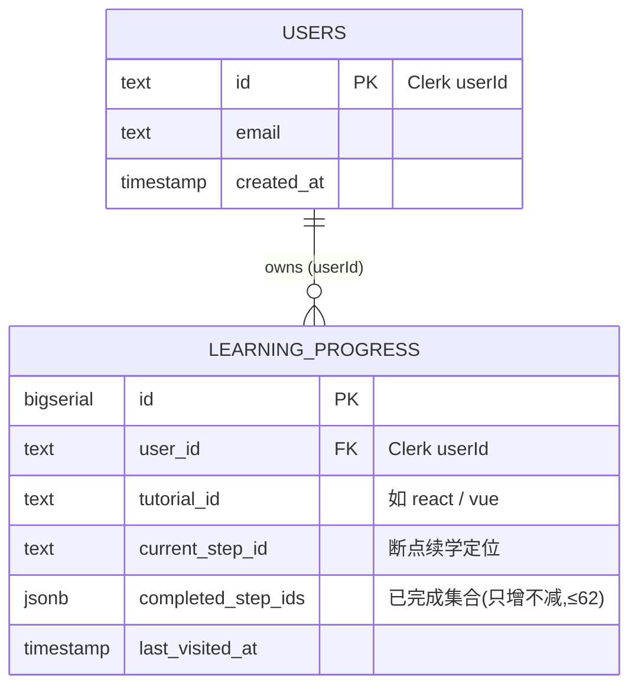
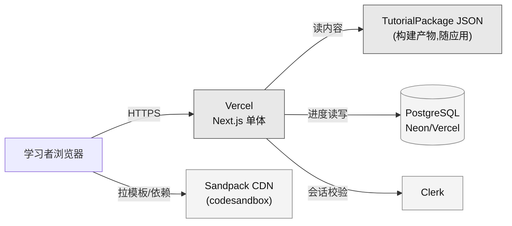
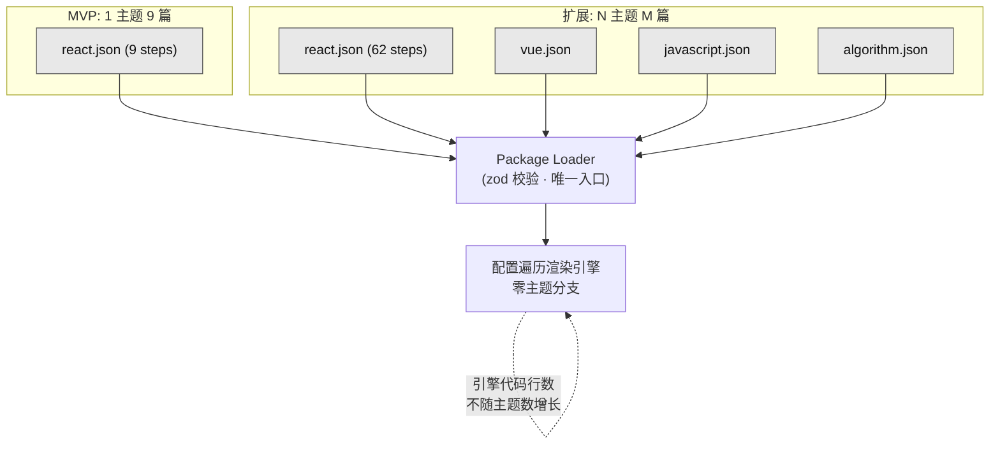
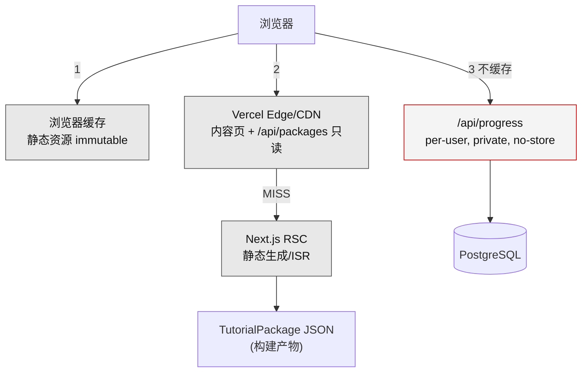
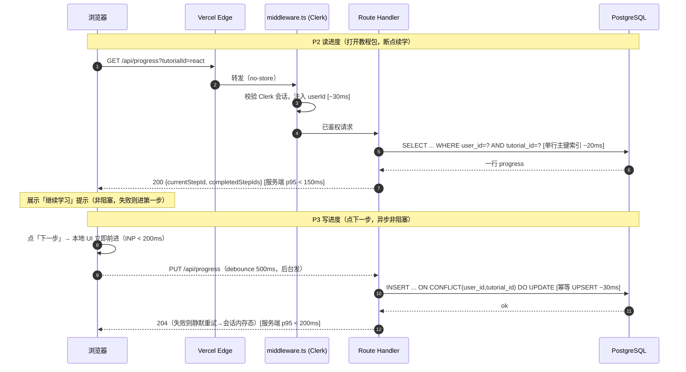

# 非功能性 / 性能与容量设计

> 阶段③设计 · 资深系统设计专家产出。上游唯一真源：`00-系统设计总览.md`（§四 nfrDrivers）、`01-architecture.md`（§九 techBaseline）、原型 specs（`02-原型-v2/specs/`）。
> 产品：**互动式技术教程平台（ITTP）**——内容与引擎分离、以 JSON 配置（`TutorialPackage`）驱动的「左讲解 + 右可运行 Sandpack 沙箱」内部自用自主学习工具。
> 本维度聚焦：性能指标（响应时延/吞吐）、并发与容量估算、可用性 SLA、伸缩性、关键路径性能预算与压测目标、缓存与限流降级策略。

---

## 一、非功能定位：先把「不是什么」讲清楚

本系统的非功能设计有一个**反直觉的前提**，必须在动手前锁死，否则整份文档会被写成一个不存在的高并发系统：

> **本系统的首要非功能目标是「主题可扩展性（R8）」，而不是性能、吞吐或高可用。** 真正的压力在**内容扩展**（新增 `vue.json` 引擎零改动），不在 QPS。

三条硬事实决定了本文档的基调（全部来自 nfrDrivers，如实记录，**下游禁止套用政企/高并发模板**）：

| 事实 | 数量级 | 对性能设计的含义 |
|---|---|---|
| 用户规模 | 内部自用，单人~小团队，并发峰值**个位数~两位数** | 无需负载均衡集群、无需水平分片、无需限流削峰 |
| 数据量级 | 内容侧 62 篇/8 章（MVP 9 篇）；进度侧每用户每主题**一行** | DB 量级可忽略，无需读写分离/缓存中间件 |
| 计算分布 | 代码打包运行是**客户端** Sandpack 浏览器内 bundler | 服务端零编译负载，性能瓶颈（若有）在**浏览器**不在服务器 |

因此本文档的价值不是「怎么扛住高流量」，而是**定义一组克制、可验收的性能预算与容量边界**，防止：

1. 下游开发**过度设计**（凭空加 Redis / 加限流网关 / 加读写分离）——违反简洁守则「删 > 加」。
2. 下游开发**欠设计**（把 `completedStepIds` 全表扫描、把内容页做成每次动态 SSR、把进度写做成同步阻塞学习）——踩到本来不该有的坑。

**刻意不做清单**（对齐 `01-architecture.md` §四「刻意不引入」，本维度再确认一次）：

| 不做项 | 理由（三问：谁在用 / 不做会怎样 / 以后好加吗） |
|---|---|
| Redis / 独立缓存层 | 只读小数据 + HTTP/CDN 缓存已足够；谁都不会因为没有 Redis 卡；未来真需要再加，零迁移成本 |
| 限流网关 / WAF 削峰 | 内部工具无对外流量、无刷量风险；峰值两位数并发离触发限流差 3 个数量级 |
| 读写分离 / 分库分表 | 进度表总行数 <1000（见 §三），单实例绰绰有余 |
| 消息队列 / 异步削峰 | 无异步任务、无写放大，进度写是一次单行 UPSERT |
| 服务端沙箱 / 压测服务端打包 | 打包在客户端，服务端根本不打包，没有可压的对象 |
| 多区域容灾 / 异地多活 | 无 SLA 硬约束，进度丢失在原型级都可接受，MVP 单区域够用 |

---

## 二、性能指标（响应时延 / 吞吐）

### 2.1 关键路径清单与延迟预算

系统的关键路径只有四条（对应四类真实用户动作）。每条给出**服务端预算**（我们可控）与**端到端 UX 预算**（含客户端与第三方 CDN，仅可影响、不完全可控）：

| # | 关键路径 | 触发动作 | 计算位置 | 服务端预算 (p95) | 端到端 UX 预算 (p95) | 预算依据 |
|---|---|---|---|---|---|---|
| P1 | **打开教程内容页** | 进入某主题某步骤 | 服务端 RSC + Edge/CDN | TTFB < 200ms（缓存 HIT）/ < 500ms（MISS 冷渲染） | LCP < 2.5s | 内容静态化，多数走 CDN；Core Web Vitals「good」阈值 |
| P2 | **读进度**（断点续学） | 打开教程包时拉 `GET /api/progress` | 服务端单行索引读 | < 150ms | < 400ms（含 Clerk 会话校验） | 单行主键查询，无 JOIN |
| P3 | **写进度**（点下一步） | `PUT /api/progress` 一次 UPSERT | 服务端单行写 | < 200ms | < 500ms（**异步非阻塞**，不卡学习） | 单行 UPSERT + 索引；写失败降级见 §六 |
| P4 | **沙箱首次打包运行** | 进入步骤 / 点 Run | **客户端** Sandpack bundler | **N/A（服务端不参与）** | 首次冷打包 2~5s；热重跑 < 500ms | 浏览器内 bundler + CodeSandbox CDN 拉依赖，服务端无预算 |

> **P4 是全系统最慢的一环，但它不消耗服务端资源。** 这条路径的「性能」优化手段是内容工程（`meta.dependencies` 尽量精简）与 UX（打包时给出 loading 态），不是服务端调优。切勿把它算进服务端容量。

### 2.2 前端 Web Vitals 预算（对齐 D5 视觉基线）

内容页以 RSC 优先、纯灰阶 shadcn，天然轻量。目标锁在 Google CWV「good」档：

| 指标 | 目标 (p75) | 落地手段 |
|---|---|---|
| **LCP** 最大内容绘制 | < 2.5s | RSC 静态化内容页 + 首屏不阻塞加载 Sandpack（懒加载 Client Component） |
| **INP** 交互到下一次绘制 | < 200ms | 步骤导航为纯客户端状态切换，不发请求；进度写异步 |
| **CLS** 累积布局偏移 | < 0.1 | 三段式布局固定骨架 + 沙箱容器预留占位，避免加载抖动 |
| **TBT / 首屏 JS** | Sandpack 代码分割、动态 import | 沙箱是最大 JS 依赖，须 `next/dynamic` 懒加载，不进内容页首屏包 |

### 2.3 吞吐目标

吞吐不是本系统的约束项，但给出**设计裕量目标**作为压测基线（见 §七），确保代码没写出反常低效实现：

| 端点 | 峰值真实吞吐（估算） | 设计裕量目标 | 裕量倍数 |
|---|---|---|---|
| 内容页（P1） | < 2 req/s（多数 CDN 命中，不回源） | 回源 SSR ≥ 50 req/s | ~25× |
| `GET /api/progress`（P2） | < 1 req/s | ≥ 100 req/s | ~100× |
| `PUT /api/progress`（P3） | < 0.5 req/s（见 §三推算） | ≥ 100 req/s | ~200× |

裕量倍数刻意留大，因为 Vercel Serverless + Neon 单实例天然能给到，**不需要为此做任何额外工程**——这正是「规模极小」的红利。

---

## 三、并发与容量估算

### 3.1 用户与并发推算

以内部团队真实规模为基准，向上留一档增长裕量：

| 维度 | MVP 现实值 | 设计上限（留裕量） | 推算说明 |
|---|---|---|---|
| 注册用户总数 | ≤ 20 | 100 | 单团队 + 少量跨团队旁听 |
| 日活 DAU | ≤ 10 | 50 | 自主学习工具，非每日必用 |
| 峰值同时在线 | 3~5 | 20 | nfrDrivers 明确「个位数~两位数」 |
| 单用户步进频率 | 1 步 / 1~3 分钟 | 1 步 / 60s | 读一段讲解 + 动手改沙箱代码的自然节奏 |

**峰值写 QPS 推算**（P3）：

```
峰值写 QPS = 峰值同时在线 × 步进频率
           = 20 用户 × (1 次写 / 60s)
           ≈ 0.33 req/s
```

**峰值读 QPS 推算**（P2，仅打开教程包时读一次）：

```
峰值读 QPS ≈ 20 用户 × (1 次读 / 会话，会话按 5 分钟计)
           ≈ 20 / 300s ≈ 0.07 req/s
```

> 峰值写 QPS **不到 0.5**，设计裕量目标 100 QPS，**留了 200 倍余量**。这不是保守，是「小到根本不构成约束」。

### 3.2 数据量容量估算

#### 内容侧（TutorialPackage JSON，随仓库/构建产物）

以 9 篇样板真实 step 形态外推 62 篇（`files` + `solution` 多文件 + MDX 讲解）：

| 项 | 单位估算 | 62 篇合计 | 说明 |
|---|---|---|---|
| 单 step `files`（初始代码，2~3 文件） | ~2 KB | — | 如 `App.js` + `styles.css` + `index.js` |
| 单 step `solution`（答案代码） | ~2 KB | — | 与 files 同量级 |
| 单 step `description`（MDX 讲解） | ~2 KB | — | 一屏讲解文本 |
| **单 step 合计** | **~6 KB** | — | — |
| **react.json 单包** | ~6 KB × 62 | **~370 KB** | 加 meta/chapter 结构约 400 KB |
| 4 主题（React/Vue/JS/算法）内容总量 | ~400 KB × 4 | **~1.6 MB** | 全部主题内容 |

**结论**：全部内容量级 **< 2 MB**，是构建产物级的静态资源，**无需内容数据库、无需分页、无需 CDN 分片**。单个包 400 KB 走一次 RSC 渲染 + CDN 缓存即可。

#### 进度侧（PostgreSQL `learning_progress`）

每用户每主题**一行**，`completedStepIds` 存 step id 数组（62 个以内的整型/短字符串）：

| 项 | 估算 | 说明 |
|---|---|---|
| 单行大小 | ~0.5~1 KB | userId + tutorialId + currentStepId + completedStepIds[≤62] + lastVisitedAt |
| 总行数（设计上限） | 100 用户 × 4 主题 = **400 行** | 稀疏，实际远低于此 |
| 表总大小 | 400 × 1 KB ≈ **< 1 MB** | 含索引也在个位数 MB |

**结论**：进度表终生大小 **< 10 MB**，单 PostgreSQL 实例、单主键索引，永远不需要分表/归档/冷热分离。

### 3.3 容量数据模型（ER 视角）



> 容量红线（不是性能红线，是「什么时候该重新设计」的信号）：
> - 进度表行数 > 100 万（当前预期 400），或单行 `completed_step_ids` > 10 万元素 → 才需要考虑拆表。**MVP 到这条线差 3~4 个数量级，明确不做预留。**
> - 唯一约束 `UNIQUE(user_id, tutorial_id)` 保证一用户一主题一行，UPSERT 幂等。

---

## 四、可用性 SLA

### 4.1 SLA 定位：无硬约束，尽力而为

nfrDrivers 明确「**可用性无 SLA 硬约束**——内部工具，Vercel 默认可用性即可满足；进度丢失在原型级属可接受代价」。因此本系统**不承诺**、**不定义**对外 SLA，只声明一个**内部尽力目标**用于自查：

| 项 | 目标 | 性质 |
|---|---|---|
| 内部尽力可用性 | 工作时段 **99.5%/月**（≈ 每月允许 3.6 小时不可用） | 尽力，非合同承诺 |
| 依赖底座可用性 | 继承 Vercel（~99.99% 平台）、Neon/Vercel Postgres、Clerk 各自的托管 SLA | 平台默认，不自建冗余 |
| RTO（恢复时间目标） | < 4 小时（重部署 / 联系托管方） | 内部工具可接受 |
| RPO（恢复点目标） | 进度数据 ≤ 24 小时（依赖托管 DB 自带备份） | 进度丢失原型级可接受 |

### 4.2 关键依赖与故障影响面

系统对四个托管依赖有运行时耦合，各自失效的**影响面必须是「局部降级」而非「整体不可用」**（对齐 D4「不拦人」）：



| 依赖失效 | 影响面 | 降级行为（保证「继续能学」） |
|---|---|---|
| **PostgreSQL 不可用** | 仅进度读写失败 | 前端回退**会话内内存态**（对齐 progress spec §3.5）；学习流程不中断、不报错阻断 |
| **Clerk 不可用** | 仅进度归属/登录失败 | 内容接口**可匿名**（techBaseline），内容页照常渲染；进度功能临时禁用 |
| **Sandpack CDN 不可用** | 仅沙箱预览失败 | 编辑器仍可看/改代码；预览区展示「网络异常，无法加载运行环境」（对齐 code-sandbox spec） |
| **内容 JSON 缺失/损坏** | 该主题渲染失败 | Package Loader zod 校验拦截，返回该主题不可用，**不影响其他主题** |
| **Vercel 平台故障** | 整体不可用 | 无自建冗余（无 SLA 硬约束），等平台恢复；内部工具可接受 |

> 核心不变量：**任何后端/第三方依赖挂掉，都不能阻断「读讲解 + 改代码」这一核心学习动作。** 这是 D4 范式在可用性维度的落点——进度、登录、预览都是增强，不是学习的前置门禁。

---

## 五、伸缩性

### 5.1 两条正交的伸缩轴

本系统的伸缩性讨论必须区分两条轴，且**只有第二条是真需求**：

| 伸缩轴 | 是否本系统真需求 | 结论 |
|---|---|---|
| **负载伸缩**（更多用户/更高 QPS） | ❌ 不是（规模极小、峰值两位数） | Vercel Serverless 自动伸缩已覆盖，**无需任何工程** |
| **内容伸缩**（更多主题/更多步骤，R8） | ✅ **首要非功能目标** | 引擎零改动扩展是架构必须扛住的核心指标 |

### 5.2 负载伸缩（够用即止，不做工程）

- **无状态服务端**：Route Handler 无本地会话状态，Vercel 按请求自动横向拉起函数实例，天然可伸缩。
- **DB 连接**：Serverless 环境下用 Neon serverless driver / 连接池（PgBouncer 风格）避免连接爆炸；峰值 20 并发离连接上限差得远，**用托管默认池即可**。
- **不做**：负载均衡集群、自建自动扩缩容策略、多实例会话粘滞——峰值 QPS < 1，这些全是过度设计。

### 5.3 内容伸缩（R8 —— 这才是伸缩性的主战场）

「伸缩」在本系统的真实含义是：**内容规模增长时，引擎侧成本是否恒定（O(1) 改动）**。



| 内容伸缩指标 | 目标 | 验收手段（对齐 01-architecture §三 CI 门禁） |
|---|---|---|
| 新增 1 主题的引擎改动量 | **0 行 `.ts/.tsx`** | CI：放入最小 `vue.json`，git diff 仅新增 JSON，构建通过 |
| 引擎代码随主题数增长 | **恒定（O(1)）** | CI 静态扫描 `lib/engine/**`、`components/**` 主题字面量分支 = 0 |
| 单主题步骤数上限 | 无硬上限（62 → 数百皆可） | 遍历渲染 + 目录树虚拟化（步骤数 > 200 时按需引入，当前不做） |

> **性能与内容伸缩的交点**：单包 JSON 增大到 62 篇（~400 KB）时，RSC 渲染是否变慢？——内容页按**步骤**而非整包渲染，且经 CDN 静态缓存，单步渲染成本与总步骤数无关。若未来单包 > 数百步导致构建期静态生成变慢，再引入按章分包，**MVP 不预留**。

---

## 六、缓存、限流与降级策略

### 6.1 缓存分层（只用 HTTP/CDN + RSC 静态化，无 Redis）



| 缓存层 | 对象 | 策略 | 失效方式 |
|---|---|---|---|
| L0 浏览器 | 哈希指纹静态资源（JS/CSS/字体） | `Cache-Control: public, max-age=31536000, immutable` | 内容变更 → 文件名 hash 变更 |
| L1 Edge/CDN | 内容页（P1）、`GET /api/packages/*`（只读内容） | RSC 静态化 / ISR：`s-maxage=3600, stale-while-revalidate=86400` | 重新部署 / ISR 重验证 |
| L2 RSC 静态生成 | 主题/章节/步骤内容页 | 构建期 `generateStaticParams` 预渲染 | 内容随代码提交，构建即更新 |
| **不缓存** | `GET/PUT /api/progress`（per-user） | `Cache-Control: private, no-store` | 每次实时读写 DB |

**为什么内容可以激进缓存**：`TutorialPackage` JSON 是构建产物、随仓库版本化，一次部署内**内容不可变**，因此可安全长缓存 + SWR。进度是 per-user 可变数据，绝不进共享缓存。

### 6.2 限流：内部工具不做业务限流，仅留一层防跑飞

- **不做**面向业务的限流/配额——内部工具无刷量、无对外流量，峰值离任何阈值差 2~3 个数量级。
- **仅保留**一层轻量「防呆」保护（防止客户端 bug 死循环打爆 DB），作为 defense-in-depth：

| 保护点 | 手段 | 阈值 | 性质 |
|---|---|---|---|
| 进度写防抖 | 客户端点「下一步」debounce | 合并 500ms 内重复写 | UX + 减写，**首选** |
| API 兜底限流 | Vercel 平台层 / middleware 简单计数 | 单用户 60 req/min | 防跑飞，非业务限流 |

> 兜底限流是「防御性预留」，按简洁守则应警惕。此处保留的理由：进度写走 UPSERT 直连 DB，一旦前端逻辑 bug 死循环，60/min 的软顶能挡住打爆 Neon 连接。**若 middleware 实现成本 > 收益，可仅保留客户端 debounce，当场标为可省技术债，不默默扩大。**

### 6.3 降级矩阵（对齐 D4「不拦人」—— 降级也绝不阻断学习）

| 场景 | 触发条件 | 降级行为 | 是否阻断学习 |
|---|---|---|---|
| 进度写失败 | DB 超时/不可用 | 静默重试 1 次 → 仍失败则落会话内存态，下次成功再同步 | **否** |
| 进度读失败 | DB 超时/不可用 | 不展示续学提示，按「首次访问」进第一步 | **否** |
| localStorage 不可用（原型期） | 隐私模式/禁用 | 降级为当次会话内存态（progress spec §3.5） | **否** |
| 沙箱依赖加载失败 | Sandpack CDN 故障/离线 | 编辑区可用，预览区提示网络异常 | 否（可读改代码） |
| `solution` 缺失 | 内容未补答案 | 「给我看答案」按钮置灰，不报错 | 否 |
| 内容 JSON 校验失败 | zod 校验不过 | 该主题标记不可用，其余主题正常 | 否（其他主题） |

---

## 七、性能预算落地与压测目标

### 7.1 压测的真实意义：回归护栏，不是容量发现

因为峰值负载 < 1 QPS，**压测不是为了发现容量上限**（上限远高于需求），而是作为**回归护栏**——确保开发过程中没有引入反常低效实现（如进度接口里全表扫、内容页每次动态 SSR 不缓存、Sandpack 进了首屏包）。

### 7.2 压测场景与通过判据

| 场景 | 工具 | 负载模型 | 通过判据 |
|---|---|---|---|
| **进度接口负载**（P2/P3） | k6 / autocannon | 50 VU 持续 1 min，读写 3:1 | p95 < 200ms，错误率 < 0.1%，DB 连接不耗尽 |
| **内容页性能**（P1） | Lighthouse CI | 单页冷/热各一次 | Perf ≥ 90，LCP < 2.5s，CLS < 0.1 |
| **首屏 JS 体积** | `next build` 分析 | 内容页首屏 bundle | Sandpack **不在**内容页首屏包（须动态 import） |
| **沙箱冷打包**（P4，UX 观测非服务端压测） | 手动 / Playwright 计时 | 首次进入含依赖步骤 | 冷打包有 loading 态，热重跑 < 500ms |
| **R8 内容伸缩门禁** | CI 静态扫描 + 冒烟 | 注入最小 `vue.json` | 引擎主题字面量分支 = 0，git diff 仅新增 JSON |

### 7.3 关键路径时序 + 延迟预算（P2/P3 进度读写）



> 关键设计点：**P3 写进度绝不阻塞 UI**。点「下一步」时本地状态立即前进（保证 INP），进度写在后台异步发出、失败降级——用户永远感觉不到 DB 延迟。这是「服务端负载轻」在交互层的落点。

---

## 八、监控指标与告警阈值

内部工具不做重量级 APM，只用 **Vercel Analytics + 平台日志** 看几个关键信号（够用即止）：

| 指标 | 数据源 | 观测目标 | 告警阈值（尽力，非 SLA） |
|---|---|---|---|
| 内容页 LCP p75 | Vercel Speed Insights | < 2.5s | > 4s 连续 1 天 → 查静态化是否失效 |
| `/api/progress` 错误率 | Vercel 函数日志 | < 0.1% | > 1% 持续 10 min → 查 DB 连接 |
| `/api/progress` p95 延迟 | Vercel 函数日志 | < 200ms | > 1s → 查是否漏索引/连接池耗尽 |
| DB 连接数 | Neon/Vercel Postgres 面板 | 远低于池上限 | 接近上限 → 查是否连接泄漏 |
| Clerk / DB 依赖可用性 | 各托管方状态页 | 可用 | 依赖故障 → 确认降级生效、不阻断学习 |

> 不做：分布式追踪、自定义 Prometheus、SLO burn-rate 告警——这些对峰值 20 并发的内部工具是纯负担。

---

## 九、性能与容量基线总表（供下游开发直接引用）

| 类别 | 指标 | 基线值 | 备注 |
|---|---|---|---|
| **并发** | 峰值同时在线 | 20（设计上限） | 现实 3~5 |
| **并发** | 峰值写 QPS | < 0.5 | 裕量目标 100 QPS |
| **容量** | 全部内容 JSON 总量 | < 2 MB | 4 主题，构建产物 |
| **容量** | 进度表终生大小 | < 10 MB | ≤ 400 行 |
| **时延** | 内容页 TTFB p95 | < 200ms(HIT)/500ms(MISS) | CDN + RSC 静态化 |
| **时延** | `GET /api/progress` p95 | < 150ms（服务端） | 单行索引读 |
| **时延** | `PUT /api/progress` p95 | < 200ms（服务端，异步） | 幂等 UPSERT |
| **时延** | 内容页 LCP p75 | < 2.5s | CWV good |
| **时延** | 沙箱冷打包 | 2~5s（客户端，非服务端预算） | 加 loading 态 |
| **可用性** | 内部尽力目标 | 99.5%/月（工作时段） | 无 SLA 硬约束 |
| **可用性** | RPO / RTO | 24h / 4h | 进度丢失原型级可接受 |
| **伸缩** | 新增主题引擎改动 | 0 行 `.ts/.tsx`（R8） | CI 门禁强制 |
| **缓存** | 内容页/内容接口 | `s-maxage=3600, SWR=86400` | 无 Redis |
| **缓存** | 进度接口 | `private, no-store` | per-user 不共享 |
| **限流** | 兜底软顶 | 60 req/min/user | 防跑飞，非业务限流 |

---

## 十、与技术基线一致性自检

| techBaseline 约束 | 本维度落地 | 是否一致 |
|---|---|---|
| 非功能首要目标是可扩展性（R8）非性能 | §五 内容伸缩为主战场；性能仅设克制预算 | ✅ |
| 计算重心在客户端，服务端负载轻 | §二 P4 客户端打包不占服务端预算；§七 写进度异步不阻塞 | ✅ |
| 无 Redis，仅 HTTP/CDN + RSC 静态化 | §六 缓存分层无独立缓存中间件 | ✅ |
| 无消息队列 | 无异步削峰设计，进度写为同步单行 UPSERT | ✅ |
| 无独立 API 网关，Vercel Edge/CDN + Clerk middleware | §六/§七 限流走平台层，鉴权走 middleware | ✅ |
| PostgreSQL 仅 users/learning_progress，量级可忽略 | §三 进度表 < 10 MB，不分表 | ✅ |
| Vercel 默认可用性即满足，无 SLA 硬约束 | §四 尽力目标 99.5%，不自建冗余 | ✅ |
| 无信创/无内网/无等保/无数据不出域 | 全文无政企内网/容灾/削峰模板 | ✅ |
| 简洁守则「删 > 加」 | §一 刻意不做清单；§六 兜底限流标注可省技术债 | ✅ |
| D4 不拦人 | §四/§六 任何降级都不阻断「读讲解 + 改代码」 | ✅ |
