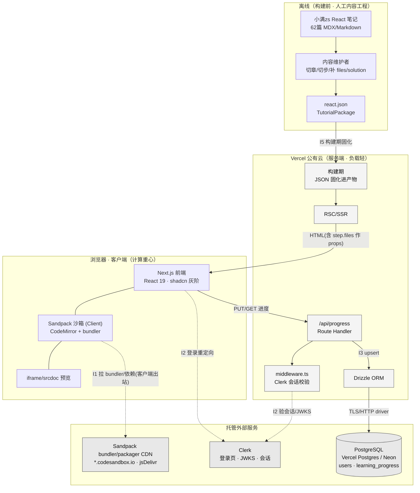
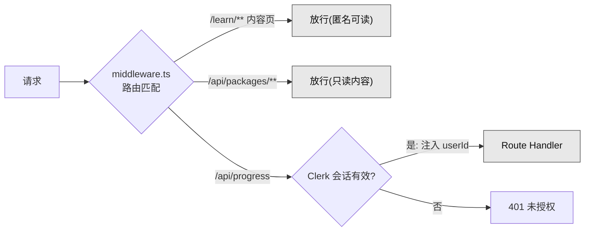
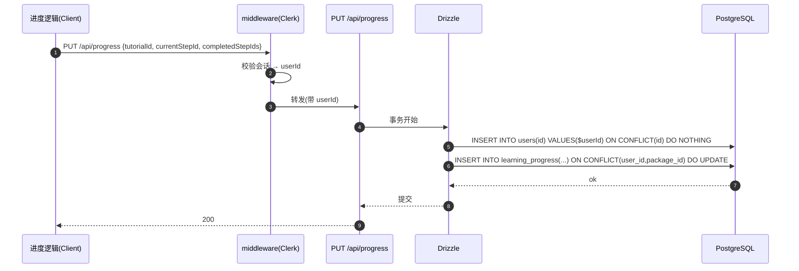
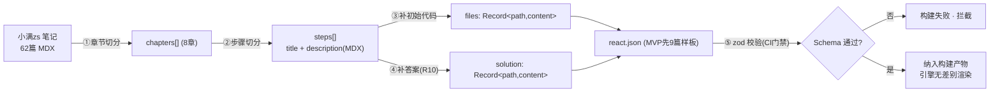

# 集成 / 对接设计

> 阶段③设计 · 资深系统设计专家产出。上游唯一真源：`00-系统设计总览.md`、`01-architecture.md`、`02-dataflow.md`、原型 specs（`02-原型-v2/specs/`）、`manifest.proto.json`、`99-会议与决策/`。
> 产品：**互动式技术教程平台（ITTP）**——内容与引擎分离、以 JSON 配置（`TutorialPackage`）驱动的「左讲解 + 右可运行 Sandpack 沙箱」内部自用自主学习工具。
> 基线：严格遵循 `01-architecture.md` 第九节 techBaseline。分层单体（Next.js 15 全栈）、公有云 Vercel、**无信创/无内网/无专网/无等保/无数据不出域**——下游禁止套用政企内网对接模板。

---

## 零、本维度边界与一句话结论

本系统是内部自用小工具，**没有企业级系统间对接**（无 ESB/无中台/无第三方业务系统/无 IoT 硬件/无支付/无短信）。所谓「集成」全部是**平台级托管依赖**与**离线内容管道**两类：

> ITTP 只对接四个托管外部服务（Sandpack 客户端 bundler、Clerk 托管身份、PostgreSQL 托管库、Vercel 托管平台）+ 一条离线内容工程管道（小满zs 笔记 → JSON）。**没有任何运行时的第三方业务 API 调用、没有服务端出站编译、没有消息队列、没有 IoT。** 计算重心在客户端，服务端的对接面窄到只剩「验一次 Clerk 会话 + 读写一张进度表」。

因此本设计的重点不是「协议兼容/字段映射矩阵」那套政企集成套路，而是把这几个托管依赖的**协议、鉴权、配额、失败降级、幂等**讲清楚，确保：① 依赖挂了系统优雅降级不白屏；② 进度写入幂等；③ 内容管道产出的 JSON 能过 Schema 门禁。

---

## 一、对接清单总览

### 1.1 对接清单

| # | 对接对象 | 类别 | 运行时/离线 | 位置（谁发起） | 协议 | 同步/异步 | 关键作用 | 挂掉的后果 |
|---|---|---|---|---|---|---|---|---|
| I1 | **Sandpack**（`@codesandbox/sandpack-react`）+ 其 bundler/packager CDN | 客户端运行时库 | 运行时 | **浏览器**（客户端出站） | HTTPS / npm 包解析 | 同步（用户点 Run 触发） | 浏览器内多文件打包运行、CodeMirror 编辑、iframe 预览、R10 看答案 | 预览区提示「无法加载运行环境」，讲解与编辑仍可用（降级见 §2.5） |
| I2 | **Clerk**（托管身份） | 托管鉴权服务 | 运行时 | 浏览器（登录 UI）+ **Vercel 服务端**（会话校验） | HTTPS / OIDC 会话 JWT / JWKS | 同步 | 登录、`userId` 归属主体、`middleware.ts` 保护 `/api/progress` | 进度接口 401 → 保留本地乐观态、静默降级，学习不中断（§3.5） |
| I3 | **PostgreSQL**（Vercel Postgres / Neon 兼容）+ Drizzle ORM | 托管数据库 | 运行时 | Vercel 服务端（Route Handler） | Postgres 线协议 / TLS（或 Neon HTTP driver） | 同步 | 持久化 `users` / `learning_progress`（MVP） | 进度落库失败 → 保留本地乐观态、有界重试，不阻塞 UI（§8） |
| I4 | **Vercel** 平台 | 托管部署平台 | 构建期 + 运行时 | 平台自身 | Git 集成 / 环境变量 / Edge CDN | 构建期批处理 + 运行期边缘 | 构建、SSR/RSC、Route Handler 托管、Edge/CDN 缓存、Env 注入 | 平台级不可用无 SLA 兜底（内部工具可接受） |
| I5 | **内容源**：小满zs React 笔记（MDX/Markdown） | 离线内容输入 | **离线（构建前）** | 内容维护者（人工） | 文件/文本（非网络协议） | 离线批处理 | 62 篇笔记 → `react.json`（`TutorialPackage`） | 不影响运行时；产出的 JSON 过不了 zod 门禁 → 构建失败（§6） |

**刻意不对接**（按简洁守则「删 > 加」明确记录，防止下游顺手加）：

| 被否对接 | 理由 |
|---|---|
| 消息队列（Kafka/RabbitMQ/MQ） | 无异步/事件解耦需求，进度写是「单人每分钟几次点击」，同步直写即可 |
| Redis / 独立缓存中间件 | 内容只读且量小、并发个位数，HTTP/CDN 缓存 + RSC 静态化足够 |
| 独立 API 网关 | Vercel Edge/CDN + Next.js 路由即网关角色 |
| 第三方业务系统 / 短信 / 邮件 / 支付 / 有赞 / 飞书 | 教具工具无此场景，全局基础设施与本项目无关 |
| Clerk Webhook 用户同步 | 用 JIT 懒建用户行替代（§3.4），不引入 webhook 端点与验签基础设施 |
| 服务端沙箱 / WebContainer 自建 bundler | Sandpack 客户端 bundler 已足够，服务端零编译负载 |
| 内容 CMS / Headless CMS | JSON 文件随仓库即真源，天然版本化 |

### 1.2 对接拓扑



**拓扑三条铁律**：
1. **Sandpack 出站在客户端**（浏览器 → Sandpack CDN），**不经 Vercel 服务端**——服务端零编译压力。
2. **服务端出站只有两条**：Clerk 会话校验、PostgreSQL 读写。除此之外 Route Handler 无任何第三方 API 调用。
3. **内容源是离线的**，不是运行时集成——运行期绝不动态从笔记生成内容。

---

## 二、I1 · Sandpack 集成（客户端浏览器内 bundler）

### 2.1 定位与依赖包

沙箱是 R6/R10 的物理载体，基于 `@codesandbox/sandpack-react`（内含 CodeMirror 编辑器 + 客户端 bundler + iframe 预览）。**它是唯一在客户端发起出站请求的集成**：Sandpack 首次运行时向 CodeSandbox 托管的 bundler/packager 与 npm CDN（jsDelivr 等）拉取运行时与依赖，随后在浏览器内完成打包。

| 项 | 值 |
|---|---|
| npm 包 | `@codesandbox/sandpack-react`（latest），仅前端依赖 |
| 组件形态 | **Client Component**（`"use client"`），RSC 之外单独水合 |
| 出站方向 | **浏览器 → Sandpack bundler/packager CDN**（服务端不参与） |
| 触发时机 | 进入步骤水合后初始化 + 用户点 **Run**（手动，非逐字符自动编译） |

### 2.2 配置全部来自 JSON（R8 落点 · 零主题字面量）

Sandpack 的两个关键入参**恒等于**教程包字段，组件内**不允许**出现 `react`/`vue`/`vanilla` 字面量分支：

| Sandpack 入参 | 取值来源 | 说明 |
|---|---|---|
| `template` | `TutorialPackage.meta.language` | 决定运行时模板（`react`/`vanilla`/未来 `vue`）。**R8 硬绑定**：新增主题只改 JSON |
| `files` | `step.files`（缺失用 `meta.defaultCode` 兜底） | 多文件初始代码，进入步骤时**完整替换** |
| `customSetup.dependencies` | `meta.dependencies`（可选） | npm 依赖 `{包名: 版本}`，无则不加载额外包 |
| `theme` | 平台明暗主题（`light`/`dark`） | 编辑器/预览配色联动，无独立开关（F10） |

> **CI 静态门禁**（对齐 `01-architecture.md` §3）：扫描 `components/**`、`lib/engine/**` 命中 `react|vue|vanilla` 字面量分支数必须为 0。Sandpack 的 `template` 只能来自 `meta.language` 变量，不能写 `template="react"`。

### 2.3 数据格式：`files` / `solution` → Sandpack files

`step.files` / `step.solution` 的 `Record<filePath, content>` 结构与 Sandpack `files` 入参**同构**，直接透传，无字段映射转换：

```jsonc
// step.files（TutorialPackage） —— 直接作为 Sandpack files
{
  "/App.js":    "import { useState } from 'react';\n...",
  "/styles.css": "button{padding:8px 16px;font-size:16px}"
}
```

| TutorialPackage 字段 | Sandpack files 键 | 映射规则 |
|---|---|---|
| `files` 的 key（如 `/App.js`） | Sandpack `files` 的路径键 | **原样透传**（路径以 `/` 开头） |
| `files` 的 value（代码字符串） | Sandpack `files[path].code` 或直接字符串 | 原样透传 |
| `solution`（同构结构） | 看答案时替换 `files` | R10：快照 → 填 solution → 自动 Run → 切回（§2.4） |

### 2.4 R10 看答案时序（客户端闭环 · 服务端零参与）

```mermaid
sequenceDiagram
    autonumber
    participant U as 学习者
    participant SB as 沙箱组件(Client)
    participant SP as Sandpack bundler(浏览器内)
    participant CDN as Sandpack/jsDelivr CDN
    participant IF as iframe 预览

    Note over SB: 进入步骤: files=step.files, isShowingAnswer=false
    U->>SB: 编辑代码 → 点 Run
    SB->>SP: 用 currentFiles 触发打包
    SP->>CDN: 首次拉 bundler 运行时 + meta.dependencies
    CDN-->>SP: 运行时/依赖(命中浏览器缓存则跳过)
    SP->>IF: 打包产物 → 刷新预览
    U->>SB: 点「给我看答案」
    alt step.solution 未声明
        SB-->>U: 按钮置灰(正常态, 不报错)
    else solution 存在
        SB->>SB: ownCodeSnapshot={...currentFiles}
        SB->>SB: currentFiles={...step.solution}; isShowingAnswer=true
        SB->>SP: 用 solution 重新打包 → 自动 Run
        SP->>IF: 刷新为答案效果
    end
    U->>SB: 点「切回我的代码」
    SB->>SB: currentFiles=ownCodeSnapshot; isShowingAnswer=false; 清空快照
    SB->>SP: 重新打包 → 自动 Run
    SP->>IF: 回到用户代码
```

### 2.5 失败、降级与配额

Sandpack 是**第三方托管 bundler CDN**，必须假设它会慢/会挂。降级原则：**沙箱挂了不能白屏，讲解与编辑必须仍可用**。

| 场景 | 处理 | 依据 |
|---|---|---|
| bundler/依赖 CDN 加载失败 / 离线 | 预览区提示「无法加载运行环境」，**编辑区仍可编辑**、讲解区正常 | code-sandbox 降级 |
| 编译报错（用户代码错） | iframe 展示 **Sandpack 原生错误堆栈，不吞错**，Run 可重试 | F11 |
| `files`/`solution` 格式非法 | 保留上一步状态，控制台告警，**不弹用户错误** | dataflow §5.3 |
| 依赖版本拉不到 | Sandpack 原生错误透传；建议 `meta.dependencies` 锁定确切版本（非 `^`/`latest`）以稳定缓存 | 见下配额 |
| 首次加载慢 | Run 期间展示 loading 态（F11）；bundler 运行时命中浏览器缓存后二次极快 | — |

**配额 / 限流**：Sandpack 默认使用 CodeSandbox 托管 bundler，无账号、无 API Key、无显式配额；出站是**每个学习者浏览器各自发起**，天然分散，不存在服务端聚合限流风险。

> **可选加固（记为技术债，MVP 不做）**：若未来对 CodeSandbox CDN 可用性/隐私有顾虑，可自托管 Sandpack bundler（`bundlerURL` 指向自建静态 bundler）。当前内部工具、公有云无数据不出域要求，**不引入自托管**，避免过度设计。

---

## 三、I2 · Clerk 集成（托管身份 · MVP/Q5）

### 3.1 定位与集成面

Clerk 托管全部身份逻辑（注册/登录/会话/多设备）。ITTP **不自建用户体系**，只消费 `userId` 作为进度归属主体。集成面三处：

| 集成面 | 位置 | 作用 |
|---|---|---|
| 前端登录 UI | 客户端（`<ClerkProvider>` + Clerk 组件/重定向） | 登录/登出/会话状态 |
| 路由守卫 | `middleware.ts`（Vercel Edge/Node） | 保护 `/api/progress`；`/api/packages` 与内容页**放行匿名** |
| 会话校验 | Route Handler 内 `auth()` | 取 `userId`，作为进度写入的归属键 |

### 3.2 协议与鉴权

| 项 | 值 |
|---|---|
| 协议 | HTTPS；会话为 Clerk 签发的 JWT（存于 `__session` cookie），服务端用 Clerk JWKS 公钥校验 |
| SDK | `@clerk/nextjs`（App Router 版），`clerkMiddleware()` |
| 校验方式 | `middleware.ts` 拦截 → `auth.protect()`；Route Handler 内 `const { userId } = auth()` |
| 凭据（Env） | `NEXT_PUBLIC_CLERK_PUBLISHABLE_KEY`（前端）、`CLERK_SECRET_KEY`（服务端，Vercel 加密 Env） |
| 内容接口 | **可匿名**——`/api/packages/*` 与学习页不要求登录，仅进度相关接口要求会话 |

### 3.3 受保护路由划分



> 匿名可读内容是刻意设计：教程正文与沙箱不需要登录即可学，**登录只为跨端同步进度**。这降低对 Clerk 的运行时依赖面——Clerk 挂了，读教程/跑沙箱不受影响，只是进度不落库。

### 3.4 用户行 provisioning：JIT 懒建（不用 Webhook）

`learning_progress.user_id` 需引用一个用户主体。**不引入 Clerk Webhook（`user.created`）+ 验签端点**这套基础设施，改用 **JIT（Just-In-Time）懒建**：首次写进度时若 `users` 无该 `userId` 行，则同一事务内 upsert 一行。



| 取舍 | 结论 |
|---|---|
| Webhook 同步 users | **否决**——需公开端点 + Svix 验签 + 幂等消费，对「个位数用户内部工具」是过度设计 |
| JIT 懒建 | **采用**——`ON CONFLICT DO NOTHING` 天然幂等，零额外基础设施，用户信息只需 `userId` 引用（画像/邮箱等按需再从 Clerk 取，不冗余落库） |

### 3.5 失败与降级

| 场景 | 处理 |
|---|---|
| 未登录访问进度接口 | `middleware` 返回 401；前端**保留本地乐观态**，静默处理，学习不中断（dataflow §8） |
| Clerk 会话过期 | 同上 401；前端可触发静默续期/引导登录，但**不阻断当前学习** |
| Clerk 服务不可用 | 内容页/沙箱不受影响（匿名可读）；进度暂不落库，恢复后再写 |

**配额**：Clerk 免费/团队档对「个位数~两位数」内部用户绰绰有余，无 MAU 压力；JWKS 校验在边缘完成，无服务端 QPS 瓶颈。

---

## 四、I3 · PostgreSQL + Drizzle 集成（进度持久化 · MVP）

### 4.1 定位与驱动选择

进度是**全系统唯一的持久化写数据**。Vercel Serverless 函数是短生命周期，**不能用长连接池**直连 Postgres，须用无服务器友好的驱动：

| 项 | 值 |
|---|---|
| 库 | PostgreSQL（Vercel Postgres 或 Neon，二者兼容） |
| ORM | Drizzle ORM（类型安全、迁移可控，契合幂等迁移偏好） |
| 驱动 | **Neon HTTP driver（`@neondatabase/serverless`）** 或 `@vercel/postgres`——单请求 HTTP 化查询，规避 Serverless 连接耗尽 |
| 协议 | Postgres 线协议 over TLS；Neon HTTP driver 走 HTTPS |
| 凭据（Env） | `DATABASE_URL`（含 TLS `sslmode=require`），Vercel 加密 Env 注入，**不入库、不回显** |
| 连接策略 | 无自建连接池；依赖 Neon/Vercel 平台侧 pooler（PgBouncer 兼容端点） |

> **不引入 Prisma / 自建连接池 / Redis 会话缓存**——Drizzle + 平台 pooler 对个位数并发足够。

### 4.2 表结构与幂等 upsert

（详见 `02-dataflow.md` §6.4，此处给对接侧的写契约）

| 表 | 关键列 | 约束 |
|---|---|---|
| `users` | `id`（Clerk userId, PK）、`created_at` | 仅归属引用，JIT 懒建 |
| `learning_progress` | `user_id`、`package_id`、`current_step_id`、`completed_step_ids`（`jsonb`/`text[]`）、`last_visited_at` | **唯一约束 `(user_id, package_id)`** 支撑 upsert |

写操作恒为幂等 upsert（同一 `(user_id, package_id)` 反复写不产生重复行）：

```sql
INSERT INTO learning_progress (user_id, package_id, current_step_id, completed_step_ids, last_visited_at)
VALUES ($1, $2, $3, $4, now())
ON CONFLICT (user_id, package_id)
DO UPDATE SET current_step_id     = EXCLUDED.current_step_id,
              completed_step_ids  = EXCLUDED.completed_step_ids,
              last_visited_at     = EXCLUDED.last_visited_at;
```

### 4.3 迁移幂等（可重复跑）

对齐工程偏好「幂等迁移」：Drizzle migration 用 `CREATE TABLE IF NOT EXISTS` + 容错 `ALTER`，同一迁移重复执行结果一致。CI/部署钩子跑 `drizzle-kit migrate`，失败即阻断上线。

### 4.4 一致性与并发

| 议题 | 策略 | 依据 |
|---|---|---|
| 进度写一致性 | **乐观更新**：本地先打勾，异步落库，不阻塞 UI | 内部工具、并发个位数 |
| 多标签/多端并发写同一进度 | **最后写入者生效（LWW）**，不加锁 | 轻量竞争可接受，加锁属过度设计 |
| `completed_step_ids` 合并 | 客户端整集合覆盖写（只增不减语义由客户端保证），非服务端增量 merge | 保持服务端无状态、逻辑简单 |
| 失效 stepId（教程结构变更） | 落库照存，读时不参与完成率/续学，**静默忽略** | 不报错、不阻断 |

---

## 五、I4 · Vercel 平台集成（构建期 + 边缘运行时）

| 集成面 | 机制 | 说明 |
|---|---|---|
| 源码/部署 | Git 集成（push 触发构建） | 单一 Vercel 项目，前端+SSR+Route Handler 同源同部署 |
| 内容固化 | 构建期把 `TutorialPackage` JSON 打进产物 | 运行期只读、可静态化、可 CDN 缓存 |
| 环境变量 | Vercel 加密 Env | `CLERK_SECRET_KEY`、`DATABASE_URL`、`NEXT_PUBLIC_CLERK_PUBLISHABLE_KEY` 等，**不进仓库** |
| 边缘缓存 | Edge Network / CDN + RSC 静态化 | 内容读取走缓存；`Cache-Control` 由 RSC/Route Handler 声明 |
| 定时任务 | **无 Vercel Cron** | 非调度类系统，无定时对接需求 |
| 出站 | 服务端仅出站 Clerk + PostgreSQL | 无其他第三方出站 |

> 合规如实记录：Vercel 公有云、**数据可出域、无等保定级、无内网/专网**。下游运维/安全设计不得据此套用政企内网对接模板（如国产化中间件、专线对接、加密机等一律不适用）。

---

## 六、I5 · 内容源集成（离线内容工程 · 非运行时）

### 6.1 性质：这是构建前的人工管道，不是运行时集成

小满zs 的 62 篇 React 笔记（MDX/Markdown）是**内容工程的离线输入**，经人工切分产出 `react.json`。**运行期系统绝不访问笔记源、绝不动态生成内容**——JSON 是「编译进系统的常量」。



### 6.2 数据映射：笔记 → TutorialPackage（内容维护者操作手册）

| 笔记侧元素 | TutorialPackage 目标字段 | 映射规则 / 注意 |
|---|---|---|
| 一篇笔记的大主题 | `chapters[].title` | 8 章结构；`chapters` 数组序即顺序（无独立 `order` 依赖） |
| 笔记内一个知识点小节 | `steps[].title` + `steps[].description` | `description` 为 MDX 正文，含代码块语法高亮 |
| 小节示例代码 | `steps[].files`（`/App.js` 等） | 多文件，路径以 `/` 开头；缺失则用 `meta.defaultCode` 兜底 |
| 小节「正确写法」 | `steps[].solution`（R10） | **可选**——未补则「看答案」按钮置灰（正常态，非缺陷） |
| 主题语言 | `meta.language`（`react`） | 决定 Sandpack `template`，R8 硬绑定 |
| 示例所需 npm 包 | `meta.dependencies`（可选） | 建议锁确切版本，稳定 Sandpack CDN 缓存 |
| `step.id` | 稳定唯一键 | **进度归属键**，一旦发布尽量不改；改了旧进度该步失效被静默忽略 |

### 6.3 内容一致性契约

| 契约 | 保证手段 |
|---|---|
| 新增主题零改引擎（R8） | `vue.json` 走同一条 zod 校验通道进入；CI 门禁：放最小 `vue.json` 跑构建冒烟，`git diff` 仅新增 JSON |
| Schema 唯一真源 | zod Schema 依据 `TutorialPackage`（已删 `selector`/`waitFor`，`codeSnippet`→`files`，新增 `solution`）；不符即构建失败 |
| `step.id` 稳定性 | 内容维护者约定：发布后 `id` 不改；重构走「新增+下线」而非改键 |
| 主题下线 | 删 JSON 文件 or `status=maintenance` 软置灰（课程库卡片禁用点击） |

---

## 七、鉴权与配额汇总

| 对接 | 鉴权方式 | 凭据存放 | 配额 / 限流 | 是否服务端出站 |
|---|---|---|---|---|
| Sandpack CDN | 无（公开 CDN） | — | 无显式配额；各浏览器分散出站 | 否（客户端出站） |
| Clerk | 会话 JWT + JWKS 校验；`CLERK_SECRET_KEY` | Vercel 加密 Env | 个位数 MAU，远低于任何档位上限 | 是（会话校验） |
| PostgreSQL | 连接串 + TLS（`sslmode=require`） | Vercel 加密 Env（`DATABASE_URL`） | Neon/Vercel 平台侧配额；数据量与 QPS 可忽略 | 是（读写） |
| Vercel | 平台账号 / Git 集成 | 平台侧 | 平台档位额度 | — |
| 内容源 | 无（离线文件） | — | 无 | 否 |

**凭据纪律**：所有 secret 走 Vercel 加密 Env，**不入仓库、不回显 stdout、不写进 JSON/日志**。看到泄露立即在对应平台（Clerk/Neon）撤销并轮换。

---

## 八、失败重试与幂等策略汇总

进度写是唯一需要重试语义的对接。原则：**乐观更新兜底 + 有界重试 + 天然幂等，不做无限重试、不做本地写队列（过度设计）**。

```mermaid
sequenceDiagram
    autonumber
    participant PR as 进度逻辑(Client)
    participant API as PUT /api/progress
    participant PG as PostgreSQL

    PR->>PR: 本地乐观更新(先打勾, 立即反馈)
    PR->>API: PUT(幂等 upsert)
    alt 200 成功
        API-->>PR: ok(本地态=已落库)
    else 5xx / 网络错误
        API-->>PR: 失败
        PR->>PR: 有界重试(最多2次, 指数退避 0.5s/1s)
        alt 重试后仍失败
            PR->>PR: 保留本地乐观态; 下次导航时随最新全量再写
            Note over PR: 不弹错误, 不阻塞学习; 完整集合覆盖写→天然自愈
        end
    else 401 未授权
        API-->>PR: 401
        PR->>PR: 保留本地态, 静默(引导登录但不阻断)
    end
```

| 对接/操作 | 幂等性 | 重试策略 | 兜底 |
|---|---|---|---|
| `PUT /api/progress` | **幂等**（`ON CONFLICT DO UPDATE`，全量覆盖写） | 有界重试 2 次 + 指数退避 | 保留本地乐观态，下次导航全量再写自愈 |
| `users` 懒建 | **幂等**（`ON CONFLICT DO NOTHING`） | 随进度写事务，不单独重试 | — |
| `GET /api/progress` | 只读，天然幂等 | 失败即用本地态/无进度渲染 | 不阻断进入教程 |
| Sandpack Run | 客户端可无限手动重试 | 用户点 Run 即重试 | 报错展示原生堆栈，不吞错 |
| DB 迁移 | **幂等**（`IF NOT EXISTS`） | 部署钩子跑一次，失败阻断上线 | 修复后重跑 |

> **不做**：本地 IndexedDB 写队列 / 离线同步 / 冲突合并算法 / MQ 重投。理由：进度是「只增不减 + LWW + 全量覆盖」的低价值数据，清缓存/换设备丢失属**已接受代价**（原型级口径延续）。

---

## 九、数据映射与一致性总表

| 数据流 | 源结构 | 目标结构 | 映射方式 | 一致性口径 |
|---|---|---|---|---|
| 内容渲染 | `TutorialPackage` JSON | 引擎入参（强类型） | Package Loader + zod 校验，**唯一注入通道** | Schema 即契约；过校验即可无差别渲染 |
| 沙箱初始化 | `step.files` `Record<path,content>` | Sandpack `files` | **同构透传**，零转换 | 进入步骤完整替换，不跨步合并 |
| 看答案（R10） | `step.solution` | Sandpack `files`（临时） | 快照→替换→自动 Run→切回还原 | 纯前端内存态，切步即弃 |
| 进度写 | 客户端 `{currentStepId, completedStepIds}` | `learning_progress` 行 | upsert（唯一键 `user_id,package_id`） | 乐观更新 + LWW + 幂等 |
| 用户归属 | Clerk `userId` | `users.id` / `learning_progress.user_id` | JIT 懒建引用 | `ON CONFLICT DO NOTHING` 幂等 |
| 笔记→JSON | 小满zs MDX | `TutorialPackage` | 人工离线切分 + 补 files/solution | 构建期一次性固化，运行期只读 |

**一致性收口**：本系统**没有跨系统分布式事务、没有最终一致性补偿链、没有对账**。唯一的写域（进度）用「幂等 upsert + 客户端全量覆盖 + LWW」即达成足够一致；内容域只读、沙箱域瞬态，皆无一致性议题。这种「窄对接面」正是内部小工具应有的克制形态——把对接复杂度控制在四个托管依赖 + 一条离线管道，不给下游留任何「政企级集成」的想象空间。

---

## 十、集成契约速查（供开发直接落地）

### 10.1 环境变量清单

| 变量 | 用途 | 侧 | 敏感 |
|---|---|---|---|
| `NEXT_PUBLIC_CLERK_PUBLISHABLE_KEY` | Clerk 前端 | 客户端 | 否（公开键） |
| `CLERK_SECRET_KEY` | Clerk 服务端会话校验 | 服务端 | **是** |
| `DATABASE_URL` | Postgres 连接串（含 TLS） | 服务端 | **是** |
| （无 Sandpack Key） | — | — | — |
| （无 MQ/Redis/网关配置） | — | — | — |

### 10.2 对接接口契约

| 接口 | 方法 | 鉴权 | 入参 | 出参 | 幂等 |
|---|---|---|---|---|---|
| `/api/packages/:id` | GET | 匿名 | `id`（主题） | `TutorialPackage`（zod 校验后） | 只读 |
| `/api/progress` | GET | Clerk | `?tutorialId=react` | `{currentStepId, completedStepIds, lastVisitedAt}` | 只读 |
| `/api/progress` | PUT | Clerk | `{tutorialId, currentStepId, completedStepIds}` | `200/401/5xx` | **是**（upsert） |

### 10.3 上线前对接校验清单（CI + 人工）

- [ ] CI 静态门禁：引擎目录 0 处 `react|vue|vanilla` 字面量分支（Sandpack `template` 只来自 `meta.language`）。
- [ ] CI：全部 `*.json` 过 zod Schema 校验。
- [ ] CI：放入最小 `vue.json` 跑构建冒烟，`git diff` 仅新增 JSON、无 `.ts/.tsx` 改动（R8）。
- [ ] DB 迁移可重复跑（幂等），`(user_id, package_id)` 唯一约束存在。
- [ ] `middleware.ts`：`/api/progress` 受保护、`/api/packages` 与学习页放行匿名。
- [ ] 断网演练：断 Sandpack CDN → 讲解/编辑仍可用；断 DB → 进度乐观态保留不白屏；未登录 → 进度 401 静默降级。
- [ ] 所有 secret 仅在 Vercel Env，仓库/日志/JSON 零泄露。
